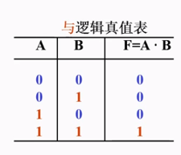
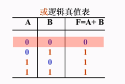
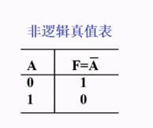
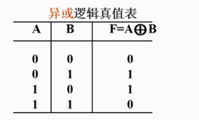

## 数制

### 概念

**数制**，也称为计数值。是一组由数字符号和统一的规则来表示数值的方法。任何一个数制都包含两个基本要素：基数和权。

数制的固定符号: 数字符号(0-9)，字母(A-F)等。

数制的统一规则:

1. **十进制（Decimal）：** 在十进制中，每个位置的权值都是 10 的幂次方。例如，数值 4567 表示为 4 * 10^3 + 5 * 10^2 + 6 * 10^1 + 7 * 10^0。
2. **二进制（Binary）：** 在二进制中，每个位置的权值都是 2 的幂次方。例如，数值 1011 表示为 1 * 2^3 + 0 * 2^2 + 1 * 2^1 + 1 * 2^0。
3. **八进制（Octal）：** 在八进制中，每个位置的权值都是 8 的幂次方。例如，数值 123 表示为 1 * 8^2 + 2 * 8^1 + 3 * 8^0。
4. **十六进制（Hexadecimal）：** 在十六进制中，除了数字 0-9 外，还使用字母 A-F 来表示 10-15。每个位置的权值都是 16 的幂次方。例如，数值 1A3 表示为 1 * 16^2 + 10 * 16^1 + 3 * 16^0。

**基数**:

就是逢几进位，二进制逢二进位，所以二进制的基数是2，十进制逢十进位，所以十进制的基数是10。

**权**:

数制中某个数值位置的价值。

比如十进制的123,1所在位置是百位，权是100,2所在位置是十位，权是10，3所在位置是个位，所在权是1。

比如二进制的1011，第一个1的权是8，第一个0的权是4，第二个1的权是2，第三个3的权是1。


### 常用的数制

#### 十进制


##### 计数符号

0,1,2,3,4,5,6,7,8,9


##### 进位规则

逢十进一


##### 采用的位置计数法


上面的累加表达式含义:

由于整数位个数为4，小数位个数为2，所以上述表达式对 i 的范围是从 -2 到 3。

在这个表达式中，`d(i)` 代表当指数为 i 时，系数的值。例如，当 i 为 -2 时，系数的值为 5。因此，这个表达式展开后就是上面所描述的表示法。


十进制中的权值分配：

在十进制中，数值的每一位的权值是基数 10 的整数次幂。对于整数部分，权值为 10 的正次幂，而对于小数部分，权值为 10 的负次幂。

权值从右向左递增。

因此，任何一个十进制数 d 可以表示为加权系数之和，其中 n 为整数位个数，m 为小数位个数，$d(i)$ 为第 i 位的基数符号，也称之为系数。


#### 二进制


##### 计数符号

0,1


##### 进位规则

逢二进一


##### 采用的位置计数法


在二进制数中，不同位置的 1 代表的值是不同的。从左到右的每个 1 所代表的十进制值如下：

- 第 1 个 1 代表的是 2^2
- 第 2 个 1 代表的是 2^0
- 第 3 个 1 代表的是 2^-1
- 第 4 个 1 代表的是 2^-2

在二进制中，我们为每一个计数符号位分配一个权值。权值为 2 的整数次幂，整数的权值为 2 的正次幂，负数的权值为 2 的负次幂。从 0 开始，0 的左边，从右往左递增。

因此，任何一个二进制数 b 可以表示为加权系数之和，其中 n 为整数位个数，m 为小数位个数，b(i) 为第 i 位的计数符号，也称之为系数。


##### 注意

二进制在计算机中通常会加0b前缀，比如0b10,代表十进制2


#### 十六进制


##### 计数符号

0,1,2...7,8,9,A,B,C,D,E,F


##### 进位规则

逢十六进一


##### 采用的位置计数法


##### 注意

在计算机中，十六进制通常会在前面加0x,比如0x1，代表十进制1,0xf代表十进制15，

0x10代表十进制16

注意: 十六进制还可以有另一种表现形式

0x 12 34 56 78

#### 八进制

##### 计数符号

0,1,2,3,4,5,6,7


##### 进位规则

逢八进一


##### 采用的位置计数法


##### 注意

计算机中，8进制数通常会在前面加0，比如010其实代表十进制的8


* 八进制对比十进制

​	八进制数:0,1,2,3,4,5,6,7,10,11,12,13,14,15,16,17,20

​	十进制数:...8 9 10 11 12 13 14 15 16


#### 代码

##### Java

```java
    public static void main(String[] args) {
        int binary = 0b10; //将二进制放到变量中，输出是以十进制输出
        System.out.println(binary); //2
        int decimal = 2;//将十进制放到变量中
        System.out.println(decimal);
        int octal = 010;//将八进制放到变量中，以十进制输出
        System.out.println(octal);//8
        int hex = 0x10;//将十六进制放到变量中，以十进制输出
        System.out.println(hex);//16
    }
```


##### Python

```python
>>> 10 #十进制
10
>>> 0b10 #二进制
2
>>> 0x10 #十六进制
16
>>> 0o10 #八进制
8
```


## 进制转换

### 二进制转十进制

不管整数还是小数，都可以用这个方法

按权展开法


### 十进制转二进制

> 短除法，连乘法

#### 整数部分短除法


#### 小数部分连乘法


十进制转二进制的小数部分采用练乘法

即将小数部分一直乘以2，直到等于0或者达到规定的位数，然后把每次所得的整数按序排列就可以得到等值的二进制数

**注意:**

在进行二进制和十进制之间的转换时，我们常常需要保持精度不变。当某个十进制小数连续乘以2，最终导致小数部分等于0时，就需要采用等精度的有效位数表示法。根据该方法，可以推导出一个公式：对于一个 m 位的十进制小数，需要选择 3m+1 位二进制小数来保持等精度。

举例来说，考虑十进制数 0.37，其对应的二进制数0.010111101011100001010001111010111000010100011110101111…原本包含了很多位数。然而，根据等精度的有效位数表示法，二进制的小数部分有两位，所以m为2，我们只需取 3*2+1 = 7 位二进制数来表示。因此，0.37 对应的二进制数可以简化为 0.0101111。


### 二进制转十六进制

> 四个为一组直接转

1. 将二进制数从右向左以每 4 位一组进行分组。
2. 每组二进制数对应一个十六进制数的位。
3. 将每组二进制数转换为对应的十六进制数。

例如，考虑二进制数 `1101101011101011`：

1. 将二进制数分组为 `1101` `1010` `1110` `1011`。
2. 将每组二进制数分别转换为对应的十六进制数。
3. 得到十六进制数 `D` `A` `E` `B`。

因此，二进制数 `1101101011101011` 对应的十六进制数为 `DAEB`。


### 十六进制转二进制

> 每位十六进制直接转

将十六进制数转换为二进制数通常是通过将每个十六进制数字转换为对应的四位二进制数来实现的。具体步骤如下：

1. 将十六进制数中的每个十六进制数字转换为对应的四位二进制数。
2. 将得到的每组四位二进制数连接起来，得到最终的二进制数。

例如，考虑十六进制数 `3A7F`：

1. 将十六进制数字 `3` 转换为二进制数 `0011`，`A` 转换为 `1010`，`7` 转换为 `0111`，`F` 转换为 `1111`。
2. 连接得到的二进制数为 `001110100111111`。

因此，十六进制数 `3A7F` 对应的二进制数为 `001110100111111`。


### 十进制转十六进制

> 短除法

将十进制数转换为十六进制数通常是通过连续地进行除法和取余操作来实现的。具体步骤如下：

1. 用十六进制数的基数 16 连续地除以要转换的十进制数，直到商为 0 为止。
2. 每次除法操作的余数即为要转换的十进制数的对应十六进制位。
3. 将得到的余数按照相反的顺序排列，即可得到转换后的十六进制数。

例如，考虑十进制数 231：

1. 231 除以 16 商为 14，余数为 7。
2. 继续将商 14 除以 16，商为 0，余数为 14。
3. 得到的余数按照相反的顺序排列，即得到十六进制数 `E7`。

因此，十进制数 231 对应的十六进制数为 `E7`。


### 十六进制转八进制

>先转二进制
>
>再三位为一组转八进制

要将十六进制数转换为八进制数，通常可以通过先将十六进制数转换为二进制数，然后再将二进制数转换为八进制数来实现。具体步骤如下：

1. 将每个十六进制数字转换为对应的四位二进制数。
2. 将得到的每组四位二进制数以每三位一组进行分组。
3. 每组三位二进制数对应一个八进制数的位。
4. 将每组三位二进制数转换为对应的八进制数。

举例来说，考虑十六进制数 `2F5`：

1. 将十六进制数字 `2` 转换为二进制数 `0010`，`F` 转换为 `1111`，`5` 转换为 `0101`。
2. 得到二进制数 `001011111101`。
3. 将二进制数分组为 `001` `011` `111` `101`。
4. 将每组三位二进制数分别转换为对应的八进制数，得到八进制数 `13575`。

因此，十六进制数 `2F5` 对应的八进制数为 `13575`。


### 八进制转十六进制

> 先转二进制
>
> 再四位为一组转成十六进制


要将八进制数转换为十六进制数，可以先将八进制数转换为二进制数，然后再将二进制数转换为十六进制数。具体步骤如下：

1. 将八进制数的每一位转换为对应的三位二进制数。
2. 将得到的二进制数分组为四位一组。
3. 每组四位二进制数转换为对应的十六进制数。

举例来说，考虑八进制数 `5732`：

1. 将八进制数的每一位转换为对应的三位二进制数：`5` 转换为 `101`，`7` 转换为 `111`，`3` 转换为 `011`，`2` 转换为 `010`。
2. 得到二进制数 `101111011010`。
3. 将二进制数分组为四位一组：`1011` `1101` `1010`。
4. 将每组四位二进制数转换为对应的十六进制数：`B` `D` `A`。

因此，八进制数 `5732` 对应的十六进制数为 `BDA`。


### 总结

如果是

小进制转大进制：

​	转成十进制，统一用按权展开法。

​	转成八，十六进制，统一先转二进制，然后分组直接转换

大进制转小进制:

​	十进制转其它进制，统一用短除法或者连乘法

​	十六进制转八进制，统一先转二进制，然后直接分组转换

​	十六进制转二进制，每位直接转换


### 代码

#### Java

```java
    /**
     * 十进制转其它进制
     */
    public static void decimalToOrder() {
        Byte decimalByte = 2;
        //Byte没有转换的方法
        Short decimalShort = 2;
        //Short没有转换方法

        String binaryString = Integer.toBinaryString(2); //10进制转2进制
        System.out.println(binaryString);//10

        String octalString = Integer.toOctalString(8);//10进制转8进制
        System.out.println(octalString);//10

        String hexString = Integer.toHexString(16);//10进制转16进制
        System.out.println(hexString);//10


        String longBinaryString = Long.toBinaryString(2L); //10进制转2进制
        System.out.println(longBinaryString);//10

        String longOctalString = Long.toOctalString(8L); //10进制转2进制
        System.out.println(longOctalString);//10

        String longHexString = Long.toHexString(16L); //16进制转2进制
        System.out.println(longHexString);//10


        long f = Double.doubleToLongBits(0.3125d);//将小数转换成2进制形式的long值
        String fBinaryString = Long.toBinaryString(f);
        System.out.println(fBinaryString);
    }

    /**
     * 其它进制互转
     */
    public static void otherToOther() {
        int decimal = Integer.parseInt("10", 2);//2进制转10进制
        System.out.println(decimal);//2
        int oct = Integer.parseInt("10", 8);//8进制转10进制
        System.out.println(oct);//8
        int hex = Integer.parseInt("10", 16);//16进制转10进制
        System.out.println(hex);//16

        /**
         * 16进制转8进制
         * 16进制先转10进制，再转8进制
         */
        int decimal1 = Integer.parseInt("1A", 16);
        System.out.println(decimal1);//26
        String octNum = Integer.toOctalString(decimal1);
        System.out.println(octNum);//32

    }
```


#### Python

```python
```


## 不同进制的 计算

### 十进制加法计算

```text
10+10=20
```


### 二进制加法计算

```text
0b1101+0b1101010=0b1110111
         1 1 0 1
+  1 1 0 1 0 1 0
------------------
   1 1 1 0 1 1 1
```

二进制做运算时，符号位是会参与运算的


### 八进制加法计算

```text
0127+0765= 01114
       1 2 7
    +  7 6 5
-------------
     1 1 1 4
```


### 十六进制加法计算

```text
0x1ab+0x99a=0xb45
a:10 b:11 c:12 d:13  e:14 f:15 
      1 a b
  +   9 9 a
  -----------
      b 4 5
```


## 数字编码方案(码制)

### 无符号编码

#### BCD码

##### 概念

用四位二进制码来表示一位十进制数字，最出名的方案有8421码


**有权码与无权码**

权的概念和数制概念中全的概念一致，代表二进制每个位置都有价值。

比如8421码1001，第一个1的权是8，第二个1的权是1，所以1001的十进制是9。

其中8421,5421,2421为有权码，有权码中，8421码是最常用的


所以有权码就是有每个位置都有价值的编码方案，无权码就是每个位置都没有价值的编码方案


##### BCD码方案


###### 有权码(8421,5421,2421)

**8421码**

就是将一个十进制数每位都分组表示。


*用8421BCD码表示十进制数(73.5)10*


*把8421BCD码01100111.01011000转换为十进制数*


**5421码**


**2421码**


###### 无权码(余3码)
**余3码**

余3码属于无权码，不能用单纯从展开的方法来求它所表示的十进制数，余3码的每种编码，是在对应的**8421码基础上加上十进制数3，或者二进制0011**得到的。


##### 总结

​	8421 码是一种通用的数字编码方案，可以用于各种数字表示和控制的应用中。但在某些特定的情况下，选择其他码可能更经济，因为其他码可能更适合特定的硬件结构或应用场景，能够降低成本和复杂性。例如，对于数字显示设备驱动来说，5421 码可能更适合七段数码管的控制，而对于数字键盘输入数据处理来说，2421 码可能更简单有效。因此，在实际应用中，需要根据具体情况和需求选择合适的编码方案。


#### 格雷码

##### 概念

格雷码是一种无权码，可以弥补普通二进制加1时，改变的位数太多的问题，比如011的后面那位是010


例如，十进制数1变成2，格雷码从001，变成了011，只有G1位置发生了变化。而二进制数从001变成了010，有两位发生了变化。


##### 二进制转格雷码


##### 格雷码转二进制


#### ASCII码

##### 定义

ASCII码是7位二进制码，有128种组合，表示128个符号

​	除了数字以为，数字系统还需要处理字母，标点符号，控制命令等，我们把这种表示数字，字母和其他控制符号的编码叫做字母数字码。在字母数字码中，最常见的是ASCII码。

​	ASCII码是美国信息交换标准代码：ASCII码

​	ASCII码通常用在计算机和电子设备上，当你在计算机键盘上输入一个数字，字母或者控制命令时，键盘里的数字电路或者微处理器会产生响应的ASCII码送到计算机。


##### 部分ASCII码表


##### 扩展ASCII码

ASCII码也可以表示为8位 ，最高位为0，方便起见，可以用十六进制表示，范围从00到7F.

如果把8位的最高位用1表示，则又可以表示另外的128种符号，把这种编码叫做扩展ASCII码，用十六进制表示时，范围从80到FF，可以用来表示希腊字母，数学符号等。


##### 代码

###### Java

```java
    public static void main(String[] args) {
        char c = '[';
        int ascii = c;//输出字符的十进制ascii码
        System.out.println(ascii); //91
    }
```


#### 检错码和纠错码

##### 定义

在数字系统中经常要进行二进制信息的传输和存取，在信息的传输或者存取过程中，会由于受到某种干扰而发生错误，因此需要对接收到的信息或者读取的信息进行检查甚至纠错，从而出现了检错编码和纠错编码。


##### 奇偶校验码

奇偶校验码是具有检错能力的代码

它是在原码组的基础上增加一个比特，使码组中含1的个数为偶数或者奇数，如果为奇数则是奇校验，用1表示，如果为偶数则是偶校验，用0表示

###### 8421码加入奇偶校验码


​	以8421BCD码的0000，由于里面有0个1,0是偶数，则偶校验码为0，代表总的含1个数为偶数，第二个码组0001，由于含1的个数为1，1为非偶数，则偶校验码为1.最后一个码组1001，1的个数为2，为偶数，则偶校验码为0。在接收端，检测偶校验码码组中1的个数，如果1的个数为偶数，则偶校验码应该为0，如果发送过来的偶校验码也为0，则代表传输没有错误。


###### 注意

在一个给定的系统中，要么采用偶校验，要么采用奇校验，不能两者同时使用

注意，奇偶校验不能检验两位同时出错的情形，即不能检测偶数个比特发生错误的情形。比如本来应该发送 0 0000，如果右边第一个0出现了错误，变成了 0 0001，则接收端可以发现错误，但是如果右边第二位也发生了错误，变成了 0 0011，则接收端不能发现错误。因此，奇偶校验码仅适用于传输出错率很低，而且成对出现错误的概率几乎为0的情况。


### 有符号编码
**机器数**

一个数在计算机中的二进制表示形式，叫做这个数的机器数。

机器数是带符号的，在计算机用机器数的最高位存放符号，正数为0，负数为1。

比如，十进制中的数 +3 ，计算机字长为8位，转换成二进制就是0000 0011。如果是 -3 ，就是 100 00011 。

那么，这里的 0000 0011 和 1000 0011 就是机器数。


**真值**

因为第一位是符号位，所以机器数的形式值就不等于真正的数值。

例如上面的有符号数 1000 0011，其最高位1代表负，其真正数值是 -3，而不是形式值131（1000 0011转换成十进制等于131）。所以，为区别起见，将带符号位的机器数对应的真正数值称为机器数的真值。

例：0000 0001的真值 = +000 0001 = +1，1000 0001的真值 = –000 0001 = –1


#### 原码

原码就是符号位加上真值的绝对值，即用第一位表示符号，其余位表示值。比如：如果是8位二进制：

[+1]原= 0000 0001

[-1]原= 1000 0001

第一位是符号位，因为第一位是符号位，所以8位二进制数的取值范围就是：（即第一位不表示值，只表示正负。）

[1111 1111 , 0111 1111]

即

[-127 , 127]

原码是人脑最容易理解和计算的表示方式。

#### 反码

反码的表示方法是：

正数的反码是其本身；

负数的反码是在其原码的基础上，符号位不变，其余各个位取反。

[+1] = [0000 0001]原= [0000 0001]反

[-1] = [1000 0001]原= [1111 1110]反

可见如果一个反码表示的是负数，人脑无法直观的看出来它的数值。通常要将其转换成原码再计算。

#### 补码

补码的表示方法是：

正数的补码就是其本身；

负数的补码是在其原码的基础上，符号位不变，其余各位取反，最后+1。(也即在反码的基础上+1)

也可以是原码的绝对值取反+1


[+1] = [0000 0001]原= [0000 0001]反= [0000 0001]补

[-1] = [1000 0001]原= [1111 1110]反= [1111 1111]补

对于负数，补码表示方式也是人脑无法直观看出其数值的。通常也需要转换成原码再计算其数值。

#### 为什么要使用原码反码补码

现在我们知道了计算机可以有三种编码方式表示一个数，对于正数因为三种编码方式的结果都相同：

[+1] = [0000 0001]原= [0000 0001]反= [0000 0001]补

所以不需要过多解释，但是对于负数：

[-1] = [10000001]原= [11111110]反= [11111111]补

可见原码，反码和补码是完全不同的。

既然原码才是被人脑直接识别并用于计算表示方式，为何还会有反码和补码呢？

首先, 因为人脑可以知道第一位是符号位，在计算的时候我们会根据符号位，选择对真值区域的加减。

但是对于计算机，加减乘数已经是最基础的运算，要设计的尽量简单，计算机辨别"符号位"显然会让计算机的基础电路设计变得十分复杂！

于是人们想出了将符号位也参与运算的方法。我们知道，根据运算法则减去一个正数等于加上一个负数，即：1-1 = 1 + (-1) = 0， 所以机器可以只有加法而没有减法，这样计算机运算的设计就更简单了。

**于是人们开始探索将符号位参与运算，并且只保留加法的方法。**

首先来看原码：

计算十进制的表达式：1 - 1 = 0

1 - 1 = 1 + (-1) = [0000 0001]原+ [1000 0001]原= [1000 0010]原= -2

如果用原码表示，让符号位也参与计算，显然对于减法来说，结果是不正确的。这也就是为何计算机内部不使用原码表示一个数。

**为了解决原码做减法的问题， 出现了反码：**

计算十进制的表达式：1 - 1 = 0

1 - 1 = 1 + (-1) = [0000 0001]原+ [1000 0001]原= [0000 0001]反+ [1111 1110]反= [1111 1111]反= [1000 0000]原= -0

发现用反码计算减法，结果的真值部分是正确的。而唯一的问题其实就出现在"0"这个特殊的数值上，虽然人们理解上+0和-0是一样的，但是0带符号是没有任何意义的，而且会有[0000 0000]原和[1000 0000]原两个编码表示0。


**于是补码的出现，解决了0的符号问题以及0的两个编码问题：**

1-1 = 1 + (-1) = [0000 0001]原+ [1000 0001]原= [0000 0001]补+ [1111 1111]补= [1 0000 0000]补=[0000 0000]补=[0000 0000]原注意：进位1不在计算机字长里。

**这样0用[0000 0000]表示，而以前出现问题的-0则不存在了。而且可以用[1000 0000]表示-128：-128的由来如下(也就是说-0就是-128)：**


(-1) + (-127) = [1000 0001]原+ [1111 1111]原= [1111 1111]补+ [1000 0001]补= [1000 0000]补

-1-127的结果应该是-128，在用补码运算的结果中，[1000 0000]补就是-128，但是注意因为实际上是使用以前的-0的补码来表示-128，所以-128并没有原码和反码表示。(对-128的补码表示[1000 0000]补，算出来的原码是[0000 0000]原，这是不正确的)

使用补码，不仅仅修复了0的符号以及存在两个编码的问题，而且还能够多表示一个最低数。这就是为什么8位二进制，使用原码或反码表示的范围为[-127, +127]，而使用补码表示的范围为[-128, 127]。

因为机器使用补码，所以对于编程中常用到的有符号的32位int类型，可以表示范围是: [-2^31-1, 2^31] 因为第一位表示的是符号位，而使用补码表示时又可以多保存一个最小值。


#### 总结

**为什么byte的范围是[-128,127]？**

换算成原码则范围是 1 111,1111 -> 0 111,1111 其中 1 111,1111为-127, 0 111,1111为127

但是原码 0有两种表示方式 +0和-0

正0为 0000 0000

负0为 1000 0000

所以这里有个规则，把1000 0000定义为-128了，所以byte的访问是-128


原码: 符号位加真值

反码: 正数的反码不变，负数的反码符号不变，其他取反 

补码: 正数的补码不变，负数的补码为反码加1 ，

移码: 正数的移码不变，负数的移码为补码符号位取反

即在负数的情况下:

反码 = 补码-1

补码 = 反码+1 也可以是原码的绝对值取反+1

移码 = 补码符号位取反

#### 移码

移码为补码符号位取反


## 计算机存储单位的换算


计算机最小的信号单位是bit，而最小信息单位是byte

1个 bit有两种状态，也就是两个数--1和0

因为一个bit能表现出的状态(信息)太少，其中英文字母就有26个，还有标点符号，所以国际化标准组织就规定了8个bit为一组，用来表示一个信息单位

我们知道

一个二进制可以表示两种状态--0和1

两个二进制可以表示4种状态--00、01、10、11

三个二进制可以表示8种状态--  就是10进制的1到7

...

八个二进制原则上则可以表示2的八次方(256)种状态，就是0到255

所以基本的ASCII码是占一个byte的


## 位运算

位指的就是bit

也就是二进制运算

计算机中所有的计算到计算机底层都会变成位运算。位运算可以提高程序效率！

也就是说位运算操作的二进制，简单来说，就是位运算就是二进制运算


### 位运算的种类

*位运算连接的操作数*

位运算连接的操作数是数值(二进制)

*位运算操作的结果*

位运算操作的结果是数值


#### & 与

  按位与：双目运算符，两个都为1，结果才为1


##### 表达式

> F = A*B


##### 真值表




##### 二进制运算


  > 计算：3&4=？
  >
  > ​        [00000000000000000000000000000011]原
  >
  > &     [00000000000000000000000000000100]原
  >
  > ------------------------------------------------------------------
  >
  > ​        [00000000000000000000000000000000] -->0
  >
  > 计算：-3&-4=？
  >
  > ​        [11111111111111111111111111111101]补
  >
  > &     [11111111111111111111111111111100]补
  >
  > ------------------------------------------------------------------
  >
  > ​        [11111111111111111111111111111100]补
  >
  > ​        [11111111111111111111111111111011]反
  >
  > ​        [10000000000000000000000000000100]原 -->-4


##### 特性

对于正数，按位与运算的结果一定会小于等于更小的数


##### 代码


```java
        int r1 = 3 & 4;
        System.out.println(r1); //0
        int r2 = -3 & -4;
        System.out.println(r2); //-4
```


#### | 或

  按位或：双目运算符，只要有一个为1就为1

##### 表达式

> F = A+B

##### 真值表




##### 二进制运算


  > 计算：3|4=？
  >
  > ​        [00000000000000000000000000000011]原
  >
  > |      [00000000000000000000000000000100]原
  >
  > ------------------------------------------------------------------
  >
  > ​        [00000000000000000000000000000111] -->7
  >
  > 计算：-3&-4=？
  >
  > ​        [11111111111111111111111111111101]补
  >
  > |      [11111111111111111111111111111100]补
  >
  > ------------------------------------------------------------------
  >
  > ​        [11111111111111111111111111111101]补
  >
  > ​        [11111111111111111111111111111100]反
  >
  > ​        [10000000000000000000000000000011]原 -->-3


##### 代码


```java
        int r3 = 3 | 4;
        System.out.println(r3); //7
        int r4 = -3 | -4;
        System.out.println(r4); //-3
```

##### 特性

正数按位或运算，生成的结果一定介于或等于大操作数与和之间


#### ~ 非

  按位取反：单目运算符，0变1,1变0


##### 表达式

> F =Ā
>
> 


##### 真值表




##### 二进制运算


> 计算：~3
>
> ~      [00000000000000000000000000000011]原
>
> ------------------------------------------------------------------
>
> ​        [11111111111111111111111111111100]补
>
> ​        [11111111111111111111111111111011]反
>
> ​        [10000000000000000000000000000100]原-->-4
>
> 计算：~-3
>
> ~       [11111111111111111111111111111101]补
>
> ------------------------------------------------------------------
>
> ​         [00000000000000000000000000000010]原-->2


##### 代码


```
int r7 = ~3;
System.out.println(r7); //-4

int r8 = ~-3;
System.out.println(r8);//2
```


#### ^ 异或

按位异或：双目运算符，不一样为1，一样为0

a^b==b^a

##### 表达式

> F=A⊕B=ĀB+AB̄


##### 真值表




##### 二进制运算

> 计算：3^4=？
>
> ​        [00000000000000000000000000000011]原
>
> ^      [00000000000000000000000000000100]原
>
> ------------------------------------------------------------------
>
> ​        [00000000000000000000000000000111] -->7
>
> 计算：-3^-4=？
>
> ​        [11111111111111111111111111111101]补
>
> ^      [11111111111111111111111111111100]补
>
> ------------------------------------------------------------------
>
> ​        [00000000000000000000000000000001]补
>
> ​        [00000000000000000000000000000001]反
>
> ​        [00000000000000000000000000000001]原 -->1
>

##### 代码


```java
        int r5 = 3 ^ 4;
        System.out.println(r5); //7

        int _r5 = 4 ^ 3;
        System.out.println(_r5);//7

        int r6 = -3 ^ -4;
        System.out.println(r6); //1

        int _r6 = -4 ^ -3;
        System.out.println(_r6);//1
```


#### << 左移

左移：让操作数乘以2的n次幂

左移就是整个二进制向左移动多少位，n就是移动的位数

>计算: 3<<2
>
><<           [   00000000000000000000000000000011] -->3
>
>​               [00000000000000000000000000000011xx]-->整个二进制向左移动2位
>
>​               [0000000000000000000000000000001100]-->右边有空位的地方用0补充
>
>​                   [00000000000000000000000000001100]-->左边多出的两个0删除，因为int只有32位


代码

```java

        int r9 = 3 << 2; //12*4
        System.out.println(r9);//12

```


#### >> 右移
右移动：让操作数除以2的n次幂

右移就是整个二进制向右移动多少位，n就是移动的位数，左边空出的值用符号位补充


>计算: 12>>2
>
><<           [   00000000000000000000000000001100] -->12
>
>​               [    xx000000000000000000000000000011]-->整个二进制向右移动2位，右边的数据删除
>
>​               [    00000000000000000000000000000011]-->左边有空位的地方用符号位0补充，则值为3
>
>计算: -12>>2
>
><<           [11111111111111111111111111110100] 补
>
>​               [xx111111111111111111111111111101]补, 右移2位
>
>​               [11111111111111111111111111111101]补-->->左边有空位的地方用符号位1补充
>
>​               [11111111111111111111111111111100]反
>
>​               [10000000000000000000000000000011]原 -->则值为-3


代码

```java
        int r10 = 12 >> 2;
        System.out.println(r10);//3

        int r11 = -12 >> 2;
        System.out.println(r11);//-3
```


#### >>> 无符号右移
无符号右移：如果是正数，则是让操作数除以2的n次幂，如果是负数，则会变成一个很大的正数

右移就是整个二进制向右移动多少位，n就是移动的位数，左边空出的值用0补充


>计算: 12>>2
>
>*>>>*         [   00000000000000000000000000001100] -->12
>
>​               [    xx000000000000000000000000000011]-->整个二进制向右移动2位，右边的数据删除
>
>​               [    00000000000000000000000000000011]-->左边有空位的地方用0补充，则值为3
>
>计算: -12>>2
>
>*>>>*         [11111111111111111111111111110100] 补
>
>​               [xx111111111111111111111111111101]补, 右移2位
>
>​               [00111111111111111111111111111101]补-->->左边有空位的地方用符号位0补充
>
>​               [00111111111111111111111111111101]反
>
>​               [00111111111111111111111111111101]原 -->则值为1073741821


代码

```java
        int r12 = 12 >>> 2;
        System.out.println(r12);//3

        int r13 = -12 >>> 2;
        System.out.println(r13);//1073741821
```


### 应用

#### 异或对数据的加密

>
>
>计算：3^4^4=？
>
>​        [00000000000000000000000000000011]原
>
>^      [00000000000000000000000000000100]原
>
>--------------------------------------------------------------------------
>
>​        [00000000000000000000000000000111]原-->7
>
>^      [00000000000000000000000000000100]原
>
>-----
>
>​        [00000000000000000000000000000011]原-->3


也就是说a^b^b=a,所以b可以当做a的密钥


代码:

```java
        int a=-2;
        int b=-3;
        System.out.println(a^b^b);//-2
```


现在的音乐平台几乎都是用异或加密


#### 变量交换

如果按照原来的，需要创建个临时变量，这种方式不需要创建临时变量


```java
  			int c = -2;
        int d = -3;

        c = c ^ d;
        d = c ^ d; //c^d^d -->c
        c = c ^ d; //(c^d)^(c^d^d) --> c^d^c --> d^c^c -->d
        System.out.println(c);//-3
        System.out.println(d);//-2

        char e = 'e';
        char f = 'f';

        e = (char) (e ^ f);
        f = (char) (e ^ f);
        e = (char) (e ^ f);
        System.out.println(e);//f
        System.out.println(f);//e
```

 

#### 判断奇偶

虽然 `(number & 1) == 0` 稍微快一些，但在实践中，它们之间的性能差异通常是微不足道的，因此可以根据代码的可读性和清晰度来选择使用哪个


```java
if ((number & 1) == 0) {
    // 偶数
} else {
    // 奇数
}
```


#### 快速乘除2的次方

```java
        System.out.println(8 >> 2); // 8 /4 = 2
        System.out.println(8 << 2); // 8 * 4 =32
```


#### 按位与的特性

大的正数和小的正数做按位与运算，结果都在小的正数范围内。这个操作就是**掩码**操作

```text
计算123&15
    0111 1011
 &  0000 1111
--------------
    0000 1011 --> 11

```


###  总结

& 是都为1才为1

| 是有1出1，无1出0

~ 是1出0,0出1

^ 是相同出0，不同出1

*<<*左移是乘2的n次，右边补0

*>>*右移是除以2的n次，左边补符号位

*>>>*也是右移，左边符号补0


