# 红黑树


## 2-3-4树

### 定义

2-3-4树是四阶的 B树(Balance Tree)，他属于一种多路查找树，它的结构有以下限制:

* 所有叶子节点都拥有**相同的深度**。 节点只能是 2-节点、3-节点、4-节点之一。

	* 2-节点:包含 1 个元素的节点，必须要有 2 个子节点，如果没有，则子节点内容用null表示;
	
	* 3-节点:包含 2 个元素的节点，必须要有 3 个子节点，如果没有，则子节点内容用null表示;
	
	* 4-节点:包含 3 个元素的节点，必须要有4 个子节点，如果没有，则子节点内容用null表示;
	
	* 所有节点必须至少包含1个元素，如果没有，则子节点内容用null表示;
	
	* 元素始终保持排序顺序，整体上保持二叉查找树的性质，即父结点大于左子结点，小于右子结点;
	
	   而且结点有多个元素时，每个元素必须大于它左边的和它的左子树中元素。


下图是一个典型的 2-3-4树(来自维基百科):

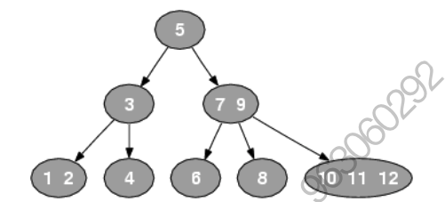

根据上面的定义

* 2-节点有:

	[5] ,[3] ,[4] ,[6] ,[8]

	其中[4] ,[6] ,[8]中每个节点都指向两个空的子节点

* 3-节点有:

	[1,2] ,[7,9]

	其中[1,2]会指向3个空的子节点

* 4-节点有:

	[10,11,12]

	它会指向4个空的子节点


234树同一节点不同元素内部其实是有指针的，但是这个指针没有严格规定谁指向谁。

2-3-4树的查询操作像普通的二叉搜索树一样，非常简单，但由于其结点元素数不确定，在一些编程语 言中实现起来并不方便，实现一般使用它的等同-->红黑树


### 234树与二叉树的等价关系

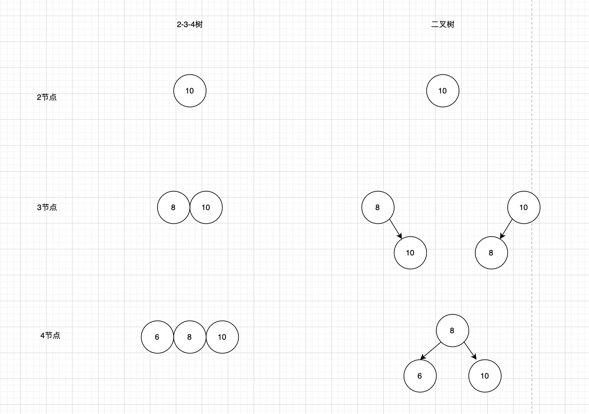


### 将234树转二叉树

根据上面的等价关系可知

1. 如果234树是2节点，则转二叉树时，无需转换

   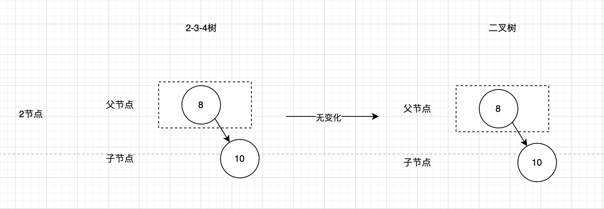

2. 如果234树是3节点，则转二叉树时，有两种转换方案

   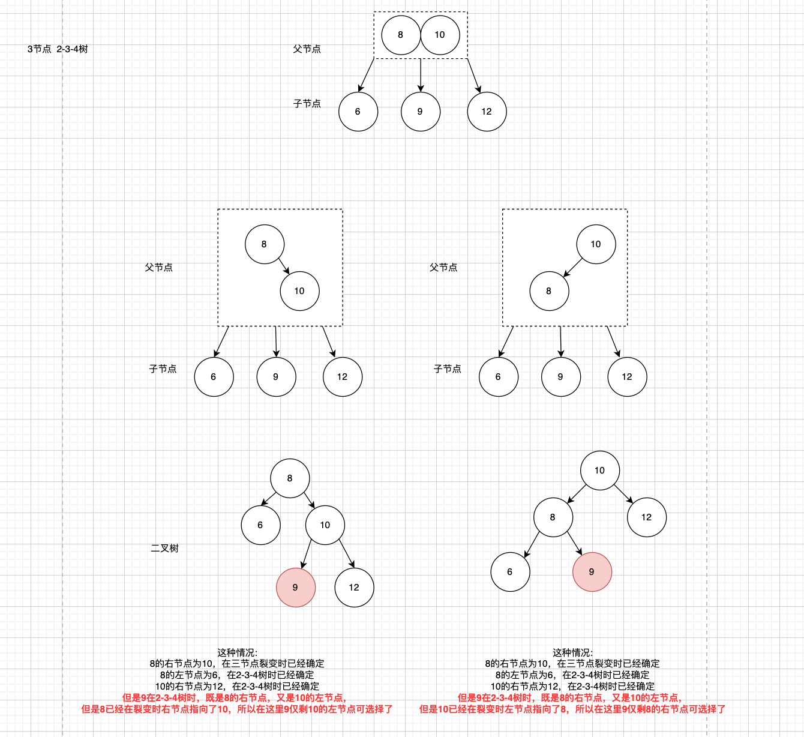

   方案1:

   ```text
   8的右节点为10，在三节点裂变时已经确定
   8的左节点为6，在2-3-4树时已经确定
   10的右节点为12，在2-3-4树时已经确定
   但是9在2-3-4树时，既是8的右节点，又是10的左节点，
   但是8已经在裂变时右节点指向了10，所以在这里9仅剩10的左节点可选择了
   ```

   方案2:

   ```text
   这种情况:
   8的右节点为10，在三节点裂变时已经确定
   8的左节点为6，在2-3-4树时已经确定
   10的右节点为12，在2-3-4树时已经确定
   但是9在2-3-4树时，既是8的右节点，又是10的左节点，
   但是10已经在裂变时左节点指向了8，所以在这里9仅剩8的右节点可选择了
   ```

   

3. 如果234树是4节点，则转二叉树时，有一种转换方案

   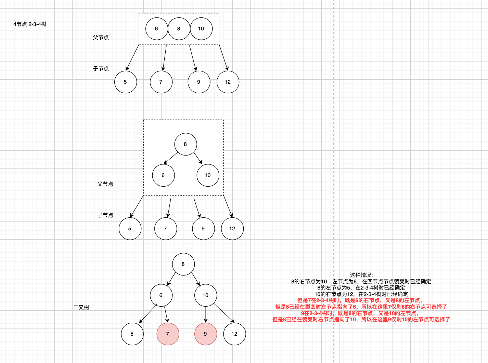

   转换方案:

   ```text
   8的右节点为10，左节点为6，在四节点节点裂变时已经确定
   6的左节点为5，在2-3-4树时已经确定
   10的右节点为12，在2-3-4树时已经确定
   但是7在2-3-4树时，既是6的右节点，又是8的左节点，
   但是8已经在裂变时左节点指向了6，所以在这里7仅剩6的右节点可选择了
   9在2-3-4树时，既是8的右节点，又是10的左节点，
   但是8已经在裂变时右节点指向了10，所以在这里9仅剩10的左节点可选择了
   ```

   

### 234树与红黑树的等价关系

2节点黑色

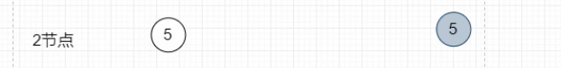

3节点上黑下红

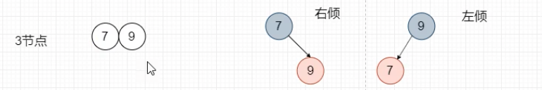


4节点中间黑两边红

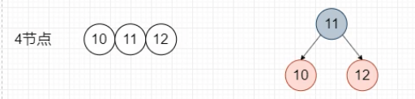


红黑树新增，一定是红色新增进来

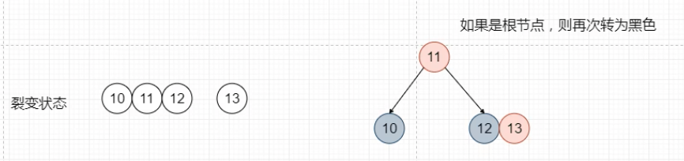


红黑树转2-3-4树，就是红色上去找黑色即可


2-3-4树

一个2节点，必须要有两个子节点

一个3节点，必须要有三个子节点

一个4节点，必须要有四个子节点


## 红黑树

### 概念

红黑树来源于234树，红黑树的本质就是234树，234树与红黑树是一对多的关系。

红黑树是一种节点带有颜色属性的平衡二叉树，但他在平衡二叉树之外，还有以下5大性质

* 节点是红色或黑色

* 根是黑色

  *因为234树只有2节点，3节点，4节点，其对应红黑树的关系肯定是上黑下红，根结点在最上，所以肯定是黑色*

* 所有叶子节点都是黑色(叶子肯定是NIL节点(也就是空节点)，这类节点不可以忽视，否则代码会看不懂)

  *叶子结点肯定是NIL节点，NIL节点肯定是黑色*

* 每个红色节点必须有两个黑色的子节点。(从每个叶子到根的所有路径上不能有两个连续的红色节点)

  ```text
上面已经说过，红黑树和234树等价，则一个节点下面的子树即是红黑树，也是234树
  假设，取红节点下面的子树，我们先把这个子树等价的看成234树
如果这个子树对应的234树是:
  2节点: 2节点转红黑树肯定是黑色
3节点: 3节点转红黑树不管是左倾还是右倾上面的节点肯定是黑色
  4节点: 4节点转红黑树上面的节点肯定是黑色
所以，红节点下面的234树不管是哪种类型，变成红黑树后，肯定上面是黑节点，也就是说红节点下面的肯定是黑节点
  ```

* 从任一 节点到其每个叶子的所有简单路径都包含相同数目的黑色节点(黑色平衡)。

  ```text
  由于红黑树和234树等价，由于234树具有相同的深度，而在234树的节点中，节点转红黑树，肯定有且仅有一个黑色结点，则从234树的特点可以看出，每条路径的黑色节点个数都为234树的深度+1，所以不管怎么转红黑树，每条路径的黑色节点都是234树的深度+1,则黑色平衡成立
  ```


根据上面的概念我们还可以推导出

所有234树转红黑树时，如果有右子节点，红黑树的右子节点肯定是红色


红黑树的左右子树在最极端的情况下，高度相差1/2

比如左边全部是黑节点

右边每个黑节点间隔一个红节点


一棵红黑树，倒数第一层，倒数第二层可能出现没有左节点或者右节点

但是其他层，由于红黑平衡的关系，是一定会有左节点和右节点的

如果其他层出现没有左节点或者右节点，则代表当前红黑树不是一个平衡的红黑树


### 为什么会有红黑树

因为AVL树的插入和删除都要经过非常多的旋转，而红黑树旋转次数则相对较少。

Java8中HashMap的实现因为用红黑树代替链表(链表长度大于8时)，性能有所提升


### 红黑树的操作

**变色**: 节点的颜色由黑变红或者由红变黑

**左旋**: 与平衡二叉树的旋转一致，要旋转的节点以右子节点作为支点向左旋转，左旋时冲突的左孩变右孩

**右旋**: 与平衡二叉树的旋转一致，要旋转的节点以左子节点作为支点向右旋转，右旋时冲突的右孩变左孩


#### 左旋

##### 思路

红黑树的节点由于有parent指针，则可以不使用创建新node，移动支点 值的方式，这里可以使用改变指针的方式。

步骤:

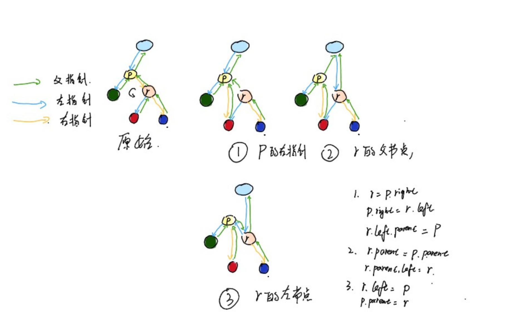


1. 确定支点r

   ```java
   r = p.right
   ```

2. 确定p的右节点

   ```java
   p.right = r.left
   r.left.parent = p
   ```

3. 确定r的父节点

   ```java
   r.parent = p.parent
   r.parent.left或者r.parent.right = r
   ```

4. 确定r的左节点

   ```java
   r.left = p
   p.parent = r
   ```


##### 代码

###### Java

```java
        /**
         * 左旋
         */
        public void leftRotate(RBNode p) {
            if (p != null) {
                //1. 确定p.right为支点r
                RBNode r = p.right;

                //2. 处理p的右指针(冲突的左孩变友右孩)
                p.right = r.left;
                if (r.left != null) {
                    r.left.parent = p;
                }
                //3. 处理r的父节点
                r.parent = p.parent;
                if (p.parent == null) {
                    root = r;
                } else if (p.parent.left == p) {
                    p.parent.left = r;
                } else {
                    p.parent.right = r;
                }
                //4. 处理r的左指针
                r.left = p;
                p.parent = r;
            }
        }
```

###### Python

```python
```

#### 右旋
##### 思路

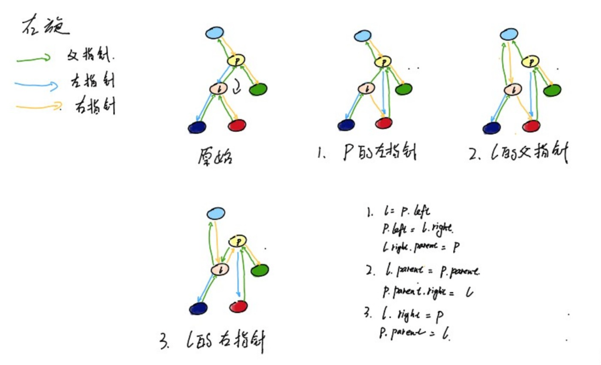

1. 确定支点l

   ```java
   l = p.left		
   ```

   

2. 确定p的左节点

   ```java
   p.left = l.right
   l.right.parent = p
   ```

   

3. 确定l的父节点

   ```java
   l.parent = p.parent
   p.parent.right或p.parent.left = l
   ```

   

4. 确定l的右节点

   ```java
   l.right = p
   p.parent = l
   ```

   

##### 代码

###### Java

```java
        /**
         * 右旋
         */
        public void rightRotate(RBNode p) {
            if (p != null) {
                //1. 确定p.left为支点l
                RBNode l = p.left;
                //2. 处理p的左节点
                p.left = l.right;
                if (l.right != null) {
                    l.right.parent = p;
                }
                //3. 处理l的父节点
                l.parent = p.parent;
                if (p.parent == null) {
                    root = l;
                } else if (p.parent.left == p) {
                    p.parent.left = l;
                } else {
                    p.parent.right = l;
                }
                //4.处理l的右节点
                l.right = p;
                p.parent = l;
            }
        }
    }
```


###### Python

```python
```


#### 二叉树的插入

##### 思路

和 二叉排序树插入思路其实是一样的

通过递归的方式，如果当前节点没有左节点，则直接加到左节点，否则左节点递归加入

插入后再循环进行红黑树平衡调整

##### 代码
###### Java
```java
        /**
         * 新增节点
         *
         * @param key
         * @param value
         */
        public void put(K key, V value) {
            RBNode t = this.root;

            if (key == null) {
                throw new NullPointerException("Empty key");
            }
            if (value == null) {
                value = value == null ? (V) key : value;
            }
            /**
             * 判断是否加入的是根节点
             */
            if (t == null) {
                this.root = new RBNode(key, value, null);
                return;
            }
            /**
             * 判断加入的节点的位置
             * 如果有一个已知节点key相同，则替换value
             */
            RBNode parent;
            int cpr;
            do {
                parent = t;
                cpr = key.compareTo((K) t.key);
                if (cpr < 0) {
                    t = t.left;
                } else if (cpr > 0) {
                    t = t.right;
                } else {
                    //存在key
                    t.setValue(value);
                    return;
                }
            } while (t != null);
            RBNode<K, V> e = new RBNode<>(key, value, parent);
            if (cpr < 0) {
                parent.left = e;
            } else {
                parent.right = e;
            }
            fixAfterPut(e);
        }
```

###### Python
```python

```


#### 插入后调整节点

##### 思路

```text
红黑树规则
1. 红黑树插入时，如果节点还没有插入到树中，一定是红色的。
2. 红黑树插入时，如果父节点是黑色，则不需要调整，直接插入，也就是说父节点是红色，一定要调整
   因为新加入的节点一定是红色节点，而红黑树同一路线不能出现两个连续红色节点，则父节点是红色一定要调整
3. 红黑树插入时变色，一定是参考234树与红黑树等价关系变色
```


红黑树的来源是根据 2-3-4 树，其中 2-3-4 树的节点可分为 2 节点、3 节点和 4 节点。因此，红黑树的父节点可以等价于 2 节点、3 节点和 4 节点，其中2节点加入新节点后转红黑树是没有爷爷节点的，3节点和4节点加入新节点转红黑树是有爷爷节点的。

当**父节点是 2 节点**时，此时没有爷爷节点，父节点等价于一个节点的平衡的红黑树。根据 2-3-4 树与红黑树的关系，父节点只能有一种情况，加入子节点后有两种情况：

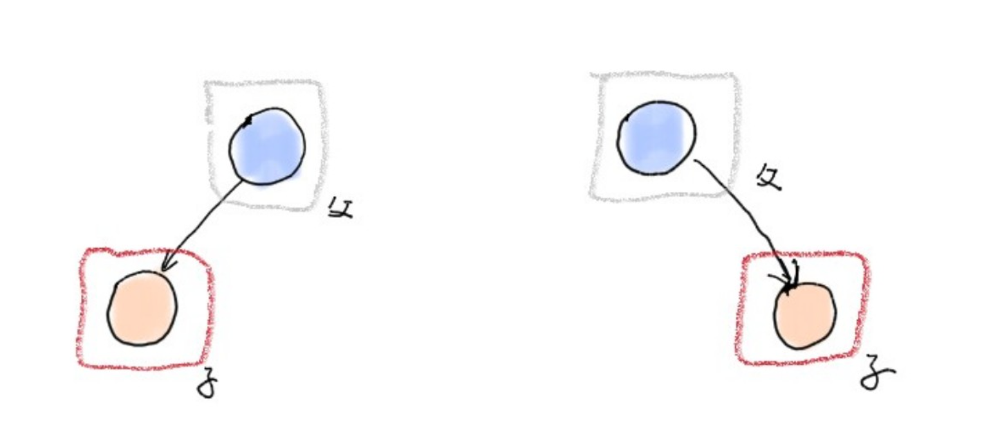

这两种情况属于无爷爷的情况，按照红黑树规则无需调整，所以数据插入后，无需考虑这两种情况

下面我们开始讨论有爷爷节点的情况。

先讨论父节点是爷爷的左节点情况，然后再讨论父节点是爷爷右节点的情况。


**父节点是爷爷左节点:**

当**父节点是 3 节点**时，父节点等价于平衡的两个节点的红黑树。根据 2-3-4 树与红黑树的关系，在父节点是爷爷左节点时，父节点(2节点)可分为一种情况，插入情况分两种：

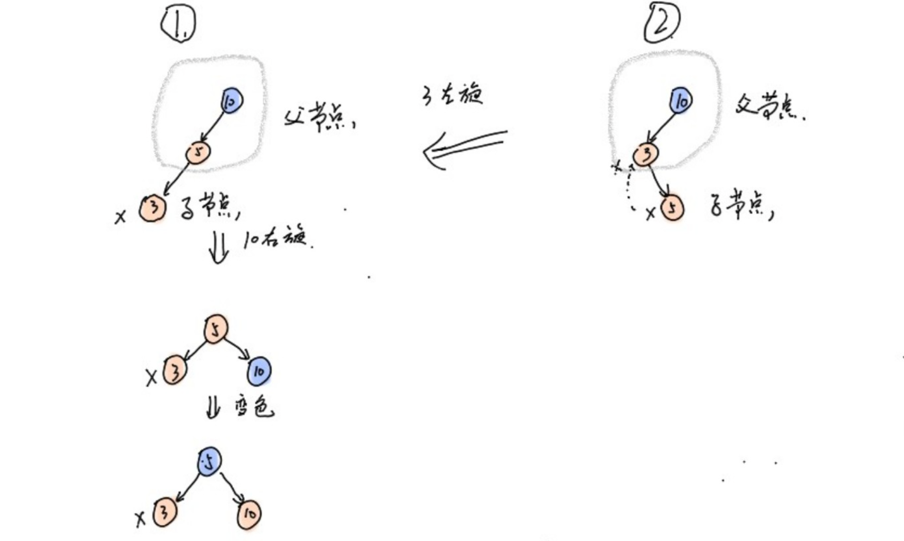


  这种情况按照红黑树规则：

* 情况 a：需要进行爷爷节点的右旋操作，然后按照等价关系变色，将父节点变为黑色，兄弟节点变为红色。

  				也可以先变色，父节点变为黑色，爷爷节点变色红色，再右旋。

* 情况 b：需要先对父节点进行左旋操作，并将原父节点变为子节点。然后按照情况 a 的操作，进行爷爷节点的右旋操作，最后按照等价关系变色，将父节点变为黑色，兄弟节点变为红色。

当**父节点是 4 节点**时，父节点等价于平衡的三个节点的红黑树。根据 2-3-4 树与红黑树的关系，在父节点是爷爷的左节点时，父节点(3节点)可分为一种情况，插入情况分两种：

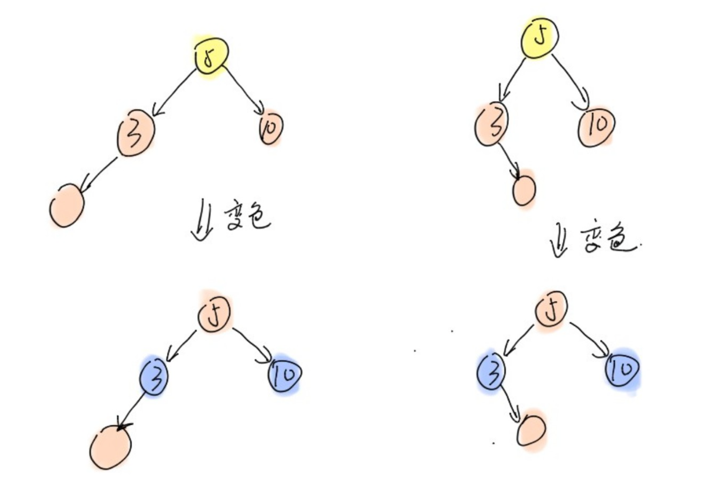

这种情况，按照红黑树规则

* 情况c:不管上面哪种添加方式，都是父节点叔叔节点变黑，爷爷节点变红


**父节点是爷爷右节点:**

当**父节点是 3 节点**时，父节点等价于平衡的两个节点的红黑树。根据 2-3-4 树与红黑树的关系，在父节点是爷爷右节点时，父节点(2节点)可分为一种情况，插入情况分两种：

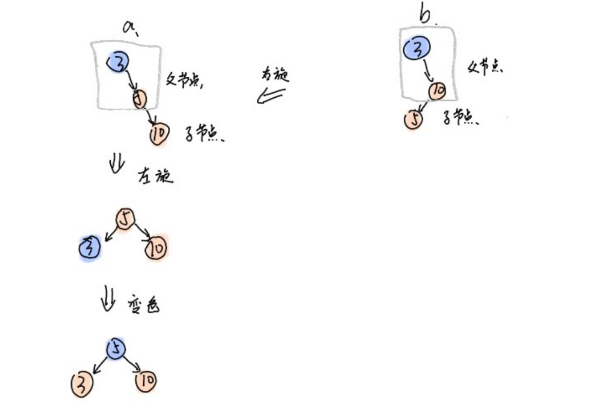

- 情况 a：需要进行爷爷节点的左旋操作，然后按照等价关系变色，将父节点变为黑色，兄弟节点变为红色。
- 情况 b：需要先对父节点进行右旋操作，并将原父节点变为子节点。然后按照情况 a 的操作，进行爷爷节点的左旋操作，最后按照等价关系变色，将父节点变为黑色，兄弟节点变为红色。

当**父节点是 4 节点**时，父节点等价于平衡的三个节点的红黑树。根据 2-3-4 树与红黑树的关系，在父节点是爷爷的左节点时，父节点(3节点)可分为一种情况，插入情况分两种：

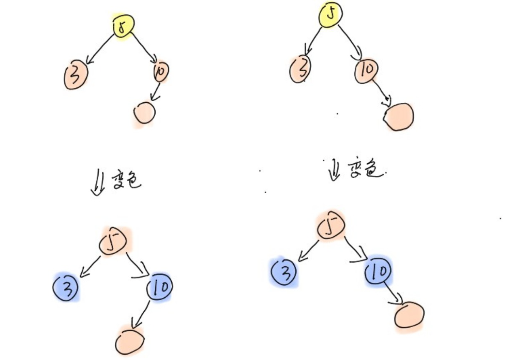


这种情况，按照红黑树规则

* 情况c:不管情况上面哪种添加方式，都是父节点变黑，爷爷节点变红


**循环调整条件**

由于父节点是2节点属于没有爷爷的节点，不需要调整

所以插入节点的父节点值可能是3节点和4节点。

如果插入节点的父节点是3节点，插入后会变成4节点，4节点等价的红黑树顶点一定是黑色，所以这个顶点肯定不会和顶点的父亲节点冲突，则不需要循环调整

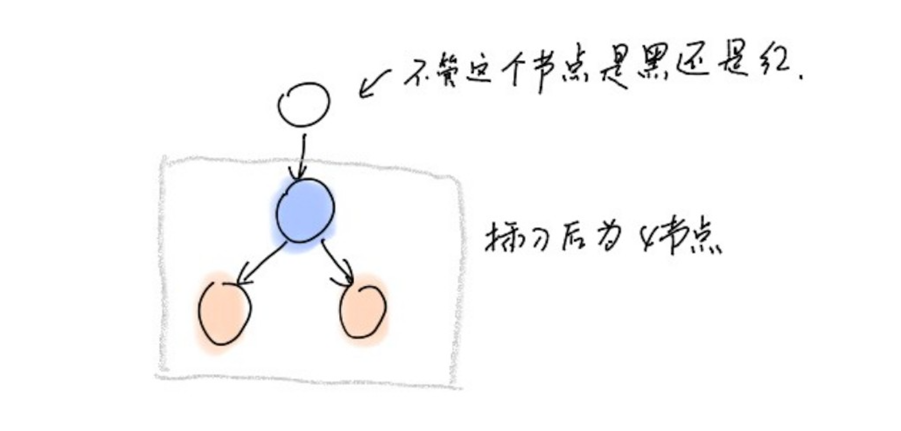


如果插入节点的父节点是4节点，插入后会裂变，裂变的红黑树顶点一定是红色，但是我们无法保证这个顶点的父节点是否是红色，所以这种情况要循环调整

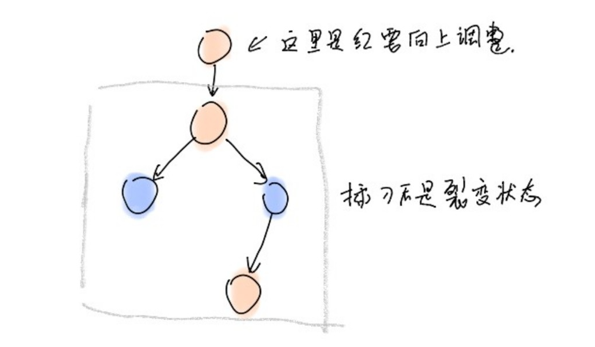


**根节点是黑色**

由于循环调整时，会把顶点设置为红色，如果顶点是根节点，按照红黑树性质，根节点要变成黑色。


##### 代码

###### 代码思路

  - 当没有爷爷节点时，不需要调整。

  - 当父节点是红节点时，需要按照红黑树规则调整二叉树，要调整的有三节点和四节点共a,b,c三种情况。

  - 父节点是红节点时有下面两种情况：
    - 父节点是爷爷的左节点 
      - 叔叔(爷爷的右节点)是红色(4节点)
        
         按照四节点插入规则变色
         
         再将爷爷节点设置为要调整的节点进行循环操作(4节点插入时要循环)
         
         ```java
         x.parent.color = BLACK;
         x.parent.parent.color = RED;
         x.parent.parent.right.color = BLACK;
         x = x.parent.parent
         ```
         
      - 叔叔是黑色或者空(3节点)
        
         * 如果插入的是父亲的右节点，则当前节点换成父亲，当前节点左旋
         
           ```text
           x = x.parent
           leftRotate(x)
           ```
         
         根据红黑树规则变色，爷爷节点右旋
         
         ```text
         x.color = RED;
         x.parent.color = BLACK;
         x.parent.parent.color = RED;
         rightRotate(x.parent.parent);
         ```
      
    - 父节点是爷爷的右节点
    
    - - 叔叔(爷爷的左节点)是红色(4节点)
    
        按照四节点插入规则变色
    
        再将爷爷节点设置为要调整的节点进行循环操作(4节点插入时要循环)
      
        ```java
        x.parent.color = BLACK;
        x.parent.parent.color = RED;
        x.parent.parent.left.color = BLACK;
        x = x.parent.parent
        ```
      
      - 叔叔是黑色或者空(3节点)
      
        * 如果插入的是父亲的左节点，则当前节点换成父亲，当前节点左旋
      
          ```text
          x = x.parent
          rightRotate(x)
          ```
      
        根据红黑树规则变色，爷爷节点左旋
      
        ```text
        x.color = RED;
        x.parent.color = BLACK;
        x.parent.parent.color = RED;
        leftRotate(x.parent.parent);
        ```
    


###### Java

```java
        /**
         * 按照红黑树规则调整
         * 包括旋转和变色
         *
         * @param x 要调整的节点
         */
        private void fixAfterPut(RBNode<K, V> x) {
            x.color = RED;
            /**
             * 当前节点为空，当前节点是根节点，当前节点的父节点为黑色时不需要调整
             */
            while (x != null && x != root && parentOf(x).color == RED) {
                /**
                 * 当前节点是红色,爷爷节点肯定存在
                 */
                if (parentOf(x) == leftOf(parentOf(parentOf(x)))) {
                    //当前父亲是左节点
                    RBNode y = rightOf(parentOf(parentOf(x)));//叔叔节点
                    if (colorOf(y) == RED) {
                        //4节点
                        setColor(parentOf(x), BLACK);
                        setColor(y, BLACK);
                        setColor(parentOf(parentOf(x)), RED);
                        //爷爷是红的,爷爷的爸爸也可能是红的，则要向上递归操作
                        x = parentOf(parentOf(x));
                    } else {
                        //3结点
                        if (parentOf(x).right == x) {
                            x = parentOf(x);
                            leftRotate(x);
                        }
                        setColor(parentOf(x), BLACK);
                        setColor(parentOf(parentOf(x)), RED);
                        rightRotate(parentOf(parentOf(x)));
                    }
                } else {
                    //当前父亲是右节点
                    RBNode y = leftOf(parentOf(parentOf(x)));//叔叔节点
                    if (colorOf(y) == RED) {
                        //4节点
                        setColor(parentOf(x), BLACK);
                        setColor(y, BLACK);
                        setColor(parentOf(parentOf(x)), RED);
                        //爷爷是红的,爷爷的爸爸也可能是红的，则要向上递归操作
                        x = parentOf(parentOf(x));
                    } else {
                        //3结点
                        if (parentOf(x).left == x) {
                            x = parentOf(x);
                            rightRotate(x);
                        }

                        setColor(parentOf(x), BLACK);
                        setColor(parentOf(parentOf(x)), RED);
                        leftRotate(parentOf(parentOf(x)));
                    }
                }
            }
            /**
             * 到这里就到根节点了，根节点一定是黑的
             */
            this.root.color = BLACK;
        }
```


###### Python

```python
```


##### 总结

插入时，如果父节点是红色，就去看叔叔节点是不是红色。

叔叔节点是红色，则直接父节点叔叔节点变黑，爷爷节点变红，再以爷爷节点为插入节点循环往上调整

叔叔节点是黑色或者Null，则要旋转变色再旋转

根节点一定要设置成黑色


#### 查找前驱节点和后继节点

##### 思路

方法和二叉排序树章节的查找并删除二叉树右子树的最小节点一样，但是这里并不是去左子树或右子树中找，而是直接找一个节点的中序前驱节点，一个节点的中序后继节点

这里只是查找，并不涉及删除，找到之后直接返回即可


右子树的最小节点，要么是当前节点的右节点，要么是右子树最左边的节点

* 查找前驱节点

  如果这个节点有左子树

  	如果左子树有右子节点，则循环的找到最右边的节点，这个节点就是前驱节点
		
  	如果左子树没有右子节点，当前节点就是前驱节点

  如果这个节点没有左子树

  	在当前节点的直系祖先节点中，找到离自己最近且其右子节点是当前节点的祖先节点的祖先节点，这个祖先节点就是当前节点的前驱节点。

  

* 查找后继节点

  如果这个节点有右子树

  	如果右子树有左子节点，则循环的找到最左边的节点，这个节点就是后继节点
  	
  	如果右子树没有左子节点，则当前节点就是前驱节点

  如果这个节点没有右子树

  	在当前节点的直系祖先节点中，找到离自己最近且其左子结点是当前节点的祖先节点的组件节点，这个祖先节点就是当前节点的后继节点

  

##### 代码

###### Java

```java
        /**
         * 获取当前节点的前驱节点
         *
         * @return
         */
        private RBNode<K, V> predecessor(RBNode<K, V> node) {
            if (node == null) {
                return null;
            }
            if (node.left != null) {
                RBNode<K, V> childrenNode = node.left;
                while (childrenNode.right != null) {
                    childrenNode = childrenNode.right;
                }
                return childrenNode;
            } else {
                /**
                 * 	在当前节点的直系祖先节点中，找到离自
                 * 	己最近且其右子节点是当前节点的祖先节点的祖先节点，这个祖先节点就是当前节点的前驱节点。
                 */
                RBNode<K, V> parentNode = node.parent;
                RBNode<K, V> currentNode = node;
                while (parentNode != null && parentNode.left == currentNode) {
                    currentNode = parentNode;
                    parentNode = currentNode.parent;
                }
                return parentNode;
            }
        }

        /**
         * 获取当前节点的后继节点
         *
         * @return
         */
        private RBNode<K, V> successor(RBNode<K, V> node) {
            if (node == null) {
                return null;
            }
            if (node.right != null) {
                RBNode<K, V> currentNode = node.right;
                while (currentNode.left != null) {
                    currentNode = currentNode.left;
                }
                return currentNode;
            } else {
                RBNode<K, V> parentNode = node.parent;
                RBNode<K, V> currentNode = node;
                while (parentNode != null && parentNode.right == currentNode) {
                    currentNode = parentNode;
                    parentNode = currentNode.parent;
                }
                return parentNode;
            }

        }
```


###### Python

```python
```


##### 总结

查找前驱节点，就两种情况，一种是去左子树找比他小的最大值，一种是去直系祖先找比他小的最大值

查找后继节点，也就两种情况，一种是去右子树找比他大的最小值，一种是去直系祖先找比他大的最小值


#### 删除

##### 思路

在红黑树中，删除节点的思路其实和二叉排序树删除节点是一样的

如果被删除的节点有两个子节点，则删除后要用前驱节点或者后继节点代替该节点

如果被删除的节点有一个子节点，那需要把该节点的父节点指向子节点，这样当前节点会被GC回收

如果被删除的节点没有子节点，则直接把父节点对应的指针指向null即可

在这里和普通二叉排序树有点区别的是，如果被删除的节点有两个子节点，那只要将当前节点的内容设置为前驱节点或者后继节点的内容即可，然后再把前驱或后继节点删除，这样做的好处是可以少一些指针处理。


代码思路:

如果被删除的节点有两个子节点，则找到当前节点的后继节点，用当前节点的后继节点内容替代当前节点的内容，不删除当前节点，把当前节点指向后继节点

*(这样做了后，依旧删除当前节点，但是在这种情况下，当前节点其实就是后继节点了)*

*(后继节点只可能是叶子节点或者只有一个子节点的节点)*

如果当前节点是根节点(当前节点的父节点为null)，则直接把当前节点的值设置为null

否则

```
如果当前节点是只有一个子节点的节点，则将当前节点的父节点指向自己仅存的子节点(爷爷直接 指向孙子)

	如果当前被删节点是黑色节点，则要做红黑树平衡调整

如果当前节点是叶子节点(当前节点没有子节点)，则将当前节点的父节点对应指针指向null
```


​	


##### 代码

###### Java

```java
        /**
         * 从红黑树中删除指定节点
         *
         * @param node
         */
        private void deleteNode(RBNode<K, V> node) {
            if (node.left != null && node.right != null) {
                RBNode<K, V> successor = successor(node);
                node.key = successor.key;
                node.value = successor.value;
                node = successor;
                /**
                 * 如果进入了这个方法，那node一定不可能有两个子节点了
                 */
            }

            RBNode<K, V> replaceNode = node.left != null ? node.left : node.right;
            if (replaceNode != null) {
                /**
                 * 仅有一个子节点的节点
                 * 1. 当前节点有右子节点(右子树)
                 * 2. 当前节点有左子节点(左子节点可能还会有右子树，但是不可能有左子树了)
                 */
                RBNode<K, V> parent = node.parent;
                if (parent.right == node) {
                    //有右子接地那
                    parent.right = replaceNode;
                } else {
                    //有左子节点
                    parent.left = replaceNode;
                }
                replaceNode.parent = parent;

                node.left = node.right = node.parent = null;
                if (node.color == BLACK) {
                    fixAfterDeletion(node);
                }
            } else if (node.parent == null) {
                //根节点
                root = null;
            } else {
                //叶子节点
                if (node.color == BLACK) {
                    fixAfterDeletion(node);
                }
                if (node.parent != null) {
                    //这里还要判断node是否是根节点的原因，是因为上面调整完，当前节点有可能变成根节点
                    //叶子节点
                    if (node == node.parent.left) {
                        node.parent.left = null;
                    } else {
                        node.parent.right = null;
                    }
                    node.parent = null;
                }
            }
        }
```


###### Python

```python
```


#### 删除后调整节点

##### 思路


由删除的逻辑可知删除后，要调整的节点位置一定在红黑树的倒数1、2层，这个位置等价与2-3-4树的叶子节点。

由2-3-4树性质可知，被删的节点可能是2-3-4树中的2节点中的元素，3节点中的元素，4节点中的元素，本文将对这几种节点元素的删除分开讨论。

(注意:当删除2节点时，由于2节点的特性，其删除操作相对于3、4节点更为复杂。因为2节点中只有一个元素，没有兄弟元素可供借位，与3、4节点不同。而且，2节点等价于红黑树中的一个黑色节点，因此，为了保持红黑树的平衡，在删除2节点时需要进行旋转调整。因此，删除2节点是最为复杂的情况。因此，我们在介绍删除操作时，先处理4节点中的元素，然后是3节点，最后是2节点。)

在2-3-4树叶子结点中删除元素:

* 删除4节点中的元素

  **4节点**：有三个元素，中间黑，两边红。

  - 删除两个红色节点：直接删除，无需调整。
  - 删除黑色节点：需要借位，此时自身有两个红色兄弟节点，可以选择其中一个红色兄弟节点（前驱或后继）顶替自身的位置，并将当前节点由红变为黑。

  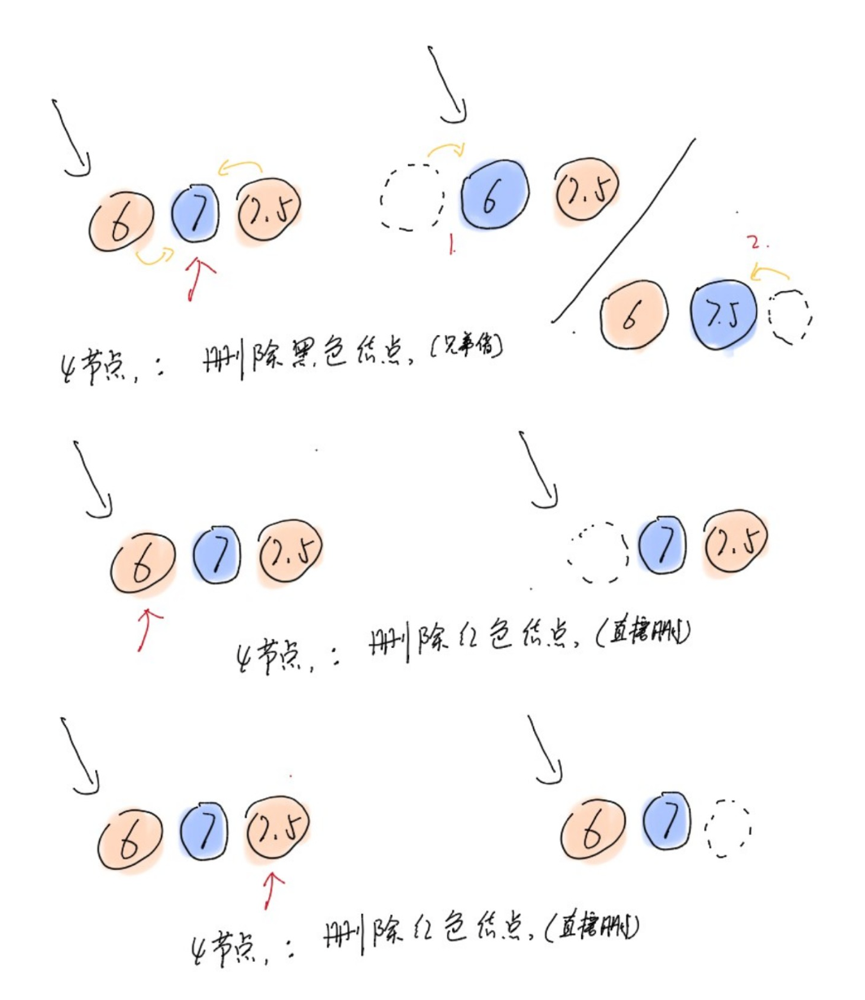

* 删除3节点中的元素

  **3节点**：有两个元素，上黑下红。

  - 删除红色节点：不需要调整。

  - 删除黑色节点（由兄弟替代）：需要调整，此时自身有一个红色兄弟节点，兄弟节点将占据自身位置并变成黑色。

    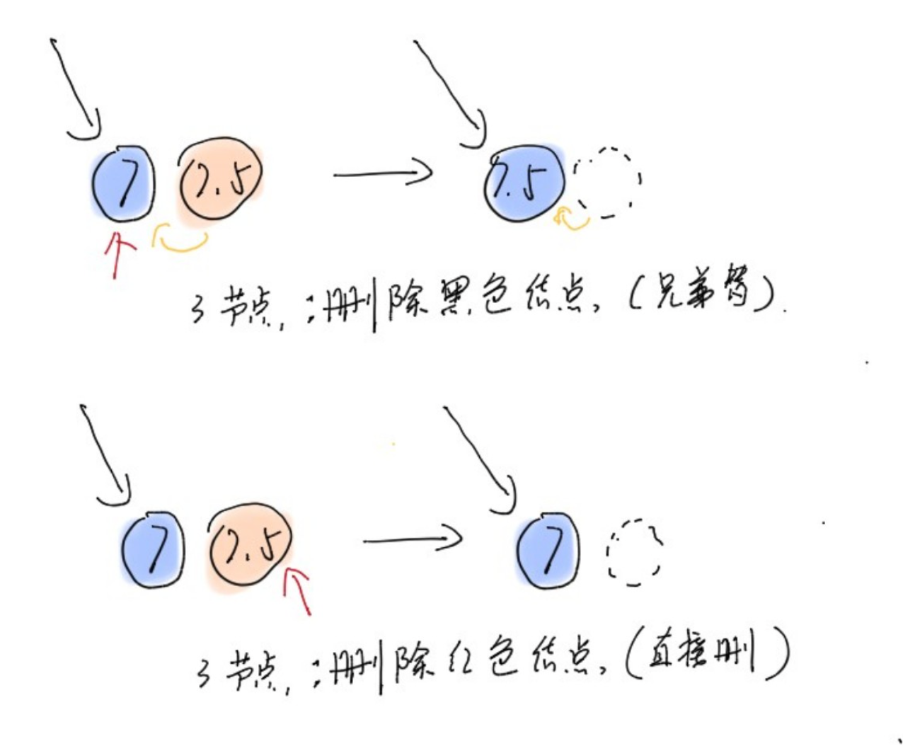

* 删除2节点中的元素

  **2节点**：只有一个元素，为黑色。

  - 删除黑色节点：

    **兄弟可借**:由于自身只有一个黑色元素，无法自行调整，需要父节点下来，兄弟节点上去顶替父节点的位置。

  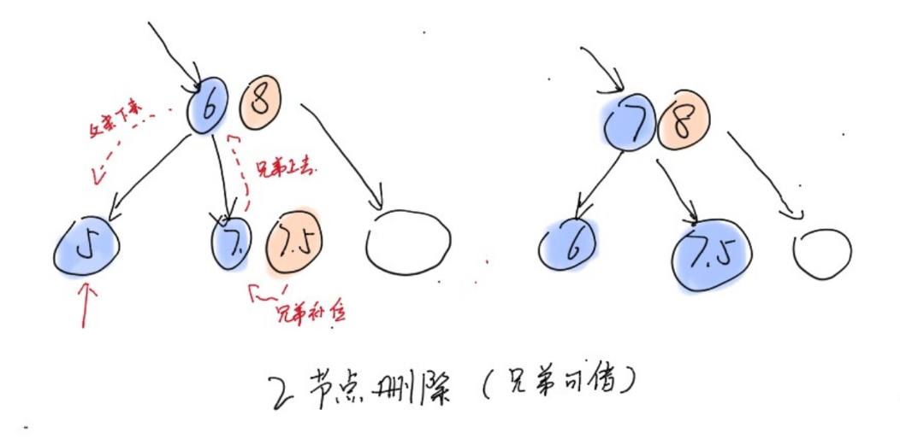

    **兄弟不可借**: 这种情况相当于所有不可借的节点都上去找父亲

  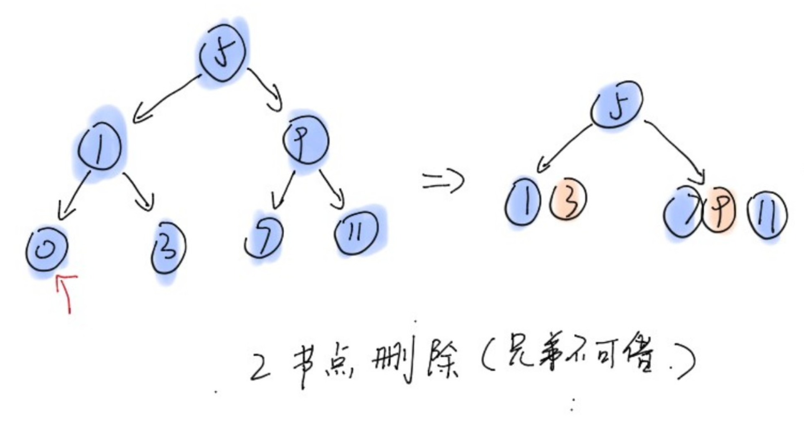


等价的在红黑树倒数1、2层中删除节点:

* 删除4节点中的元素

  4节点，上面黑两边红:

  删除红色节点：直接删除即可平衡

  删除黑色节点:  删除时会用红色叶子右节点(后继节点)的内容代替当前节点的内容，实际删除的是红色叶子右节点(后继节点)，所以只要直接删除红色叶子节点即可平衡

  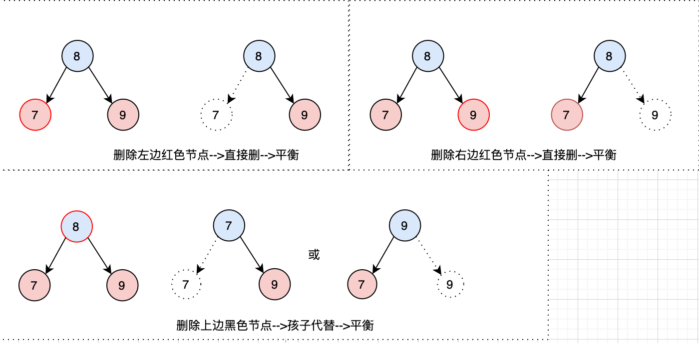

* 删除3节点中的元素

  - 删除红色节点：不需要调整。
  - 删除黑色节点（由兄弟替代）：需要调整，此时自身有一个红色兄弟节点，兄弟节点将占据自身位置并变成黑色。

  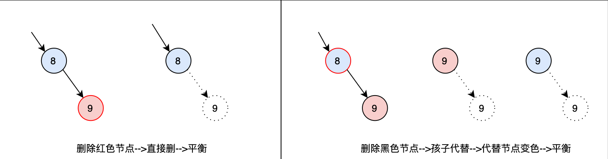

  

* 删除2节点中的元素

  如果2节点是左节点，则按照下面的逻辑处理，如果2节点是右节点，则按照下面的逻辑反之

  * 兄弟可借的情况:

    有两种情况:

    1. 兄弟为红色

       如果兄弟为红色，则要进行调整，调整后兄弟就为黑色，然后按照 下一步兄弟为黑色进行处理

       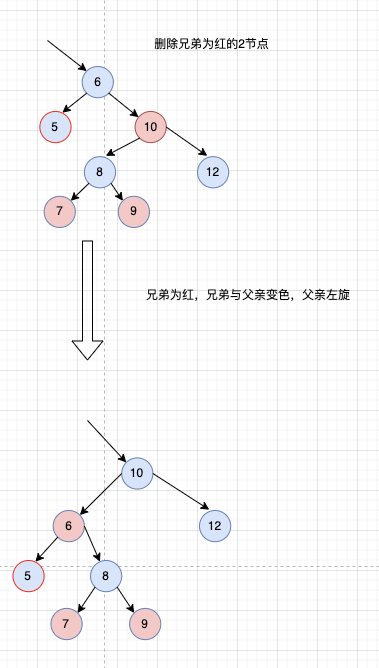

       

    2. 兄弟为黑色

       可分为兄弟有两个孩子，兄弟有左孩子，兄弟有右孩子

       * 有两个孩子

       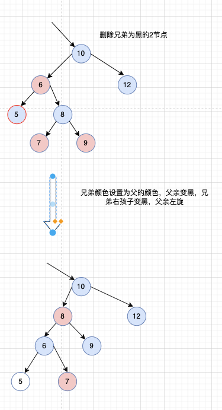

       

       * 有右孩子

         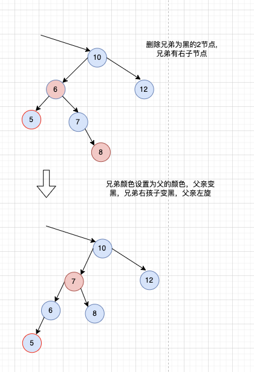

         

       

       * 有左孩子

         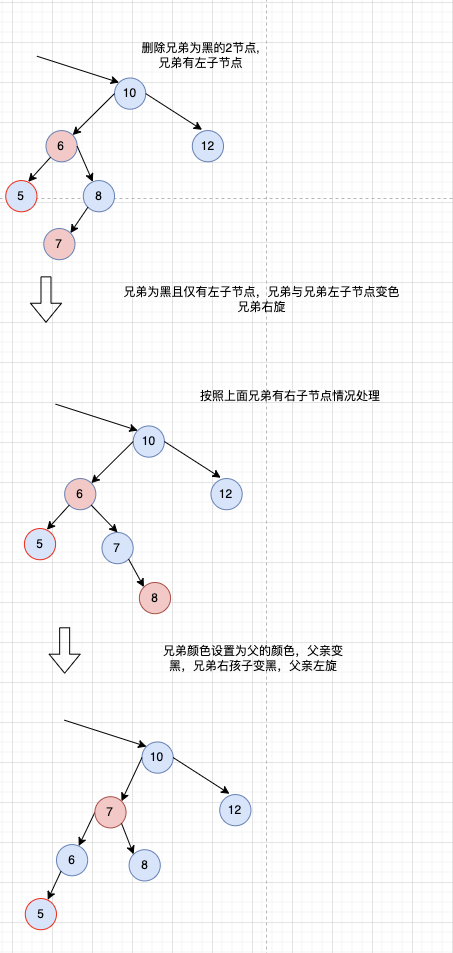
  
         

  * 兄弟不可借的情况:
  
    兄弟节点修改为红色(兄弟自损)
  
    将调整的节点设置为父亲节点，继续循环当前调整方法
  
    当前循环有两种可能:
  
    1. 当前调整节点为红色或者根节点
  
       设置调整节点为黑色即可平衡
  
       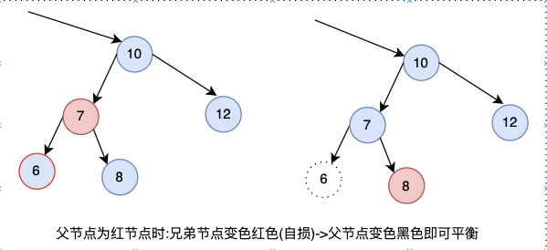
  
       
  
    2. 当前调整节点为黑色
  
       则要向上循环的去调整，可能是当前调整节点兄弟自损，也可能是当前调整节点兄弟有替补孩子作为替补
  
       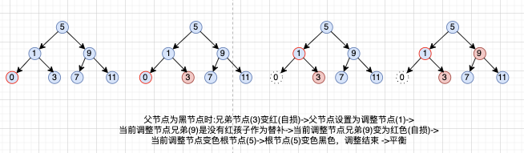
  
       


红黑树删除时做调整的目的是希望删除后，红黑树经过调整后也能平衡。


问题:

删除有两个子节点的红色节点，要怎么操作

因为有两个子节点的节点肯定不是2-3-4树的叶子节点，也就不是红黑树的叶子节点和叶子节点上一层，而红黑树删除针对的是叶子节点和叶子节点上一层，所以删除其他层的红色节点，只需要在叶子节点和叶子节点上一层找到后继节点即可，找到后，用后继节点的值代替当前要删除的节点，然后处理后继节点被删的问题，后继节点被删，则要看后继节点是2节点，3节点，还是4节点，根据这几种节点的情况分别处理。


总结:

删除的节点一定在红黑树的最后两层

删除的是红色节点，不需要做任何平衡调整

删除的是黑色节点，才需要做平衡调整，调整的节点有两种:

1. 调整的是替代的红色节点颜色
2. 调整的是以被删除的黑色节点的父节点为根节点的红黑树。


##### 代码思路

* 调整的节点不是根节点且是黑色

  当前黑色节点有两种情况

  * 当前节点是父节点的左节点

    获取右兄弟节点sib

    * 如果当前节点的兄弟节点(父节点的右节点)是红色需要先做以下调整

      ```java
      x.parent.right.color = BLACK //兄弟节点的颜色变黑
      x.parent.color = RED //父节点变红
      leftRotate(x.parent) //父节点左旋
      sib = x.parent.right //兄弟节点变为旋转后的新兄弟
      ```

      调整完上面的还要进行以下面调整
      
      * 如果当前兄弟没有红色替补孩子
      
        ```java
        sib.color = RED //兄弟自损
        x = x.parent //向上循环
        ```
      
      * 当前兄弟有红孩子
      
        * 当前兄弟右孩子是空或者黑(代表左孩子是红)
      
          ```java
          sib.left.color = BLACK //兄弟左孩子变黑
          sib.color = RED //兄弟队变红
          rightRotate(sib) //兄弟右旋
          sib = x.parent.right //兄弟节点变为旋转后的新兄弟
          ```
      
        ```java
        sib.color = x.parent.color//兄弟的颜色变成父节点颜色
        x.parent.color = BLACK //父节点变黑
        sib.right.color = BLACK //兄弟节点的右孩子变黑，为了补充黑平衡
        leftRotate(x.parent) //父节点左旋
        x = root //将调整节点设置为根节点，相当于停止调整  
        ```
  
  * 当前节点是父节点的右节点
  
    * 获取左兄弟节点sib
  
      * 如果当前节点的兄弟节点(父节点的左节点)是红色需要先做以下调整
    
        ```java
        x.parent.left.color = BLACK //兄弟节点的颜色变黑
        x.parent.color = RED //父节点变红
        rightRotate(x.parent) //父节点右旋
        sib = x.parent.left //兄弟节点变为旋转后的新兄弟
        ```
    
        调整完上面的还要进行以下面调整
    
        * 如果当前兄弟没有替补红孩子
    
          ```java
          sib.color = RED //兄弟自损
          x = x.parent //向上循环
          ```
        
        * 当前兄弟有孩子
        
          * 当前兄弟左孩子是空的或者黑的(右孩子是红的)
        
            ```java
            sib.right.color = BLACK //兄弟左孩子变黑
            sib.color = RED //兄弟队变红
            leftRotate(sib) //兄弟右旋
            sib = x.parent.left //兄弟节点变为旋转后的新兄弟
            ```
        
          ```java
          sib.color = x.parent.color//兄弟的颜色变成父节点颜色
          x.parent.color = BLACK //父节点变黑
          sib.left.color = BLACK //兄弟节点的左孩子变黑，为了补充黑平衡
          rightRotate(x.parent) //父节点左旋
          x = root //将调整节点设置为根节点，相当于停止调整  
          ```
  
  现在调整的节点是根节点**或**是红色节点
  
  ```java
  x.color = BLACK
  ```


###### Java

```java
        /**
         * 删除时调整红黑平衡
         *
         * @param x
         */
        private void fixAfterDeletion(RBNode<K, V> x) {
            while (x != root && colorOf(x) == BLACK) {
                if (x == leftOf(parentOf(x))) {
                    //删除的是父节点的左节点
                    RBNode sib = rightOf(parentOf(x));
                    //查看兄弟节点是否为红色
                    if (colorOf(sib) == RED) {
                        setColor(sib, BLACK);
                        //变色旋转，获取真正的兄弟节点
                        setColor(parentOf(x), RED);
                        leftRotate(parentOf(x));
                        sib = rightOf(parentOf(x));
                    }
                    //此时兄弟节点为黑色

                    if (colorOf(leftOf(sib)) == BLACK && colorOf(rightOf(sib)) == BLACK) {
                        //兄弟没有红孩子作为替补
                        //TODO
                        setColor(sib, RED);
                        x = parentOf(x);
                    } else {
                        //兄弟节点有红孩子作为替补
                        if (colorOf(rightOf(sib)) == BLACK) {
                            //兄弟有左红孩子，则旋转为右孩子作为真正的替补兄弟
                            setColor(leftOf(sib), BLACK);
                            setColor(sib, RED);
                            rightOf(sib);
                            sib = rightOf(parentOf(x));
                        }
                        //当前兄弟有右红孩子作为替补
                        setColor(sib, colorOf(parentOf(x)));
                        setColor(parentOf(x), BLACK);
                        setColor(rightOf(sib), BLACK);
                        leftRotate(parentOf(x));
                        x = root;
                    }
                } else {
                    //删除的是父节点的右节点
                    RBNode sib = leftOf(parentOf(x));//兄弟节点
                    if (colorOf(sib) == RED) {
                        setColor(sib, BLACK);
                        setColor(parentOf(x), RED);
                        rightRotate(parentOf(x));
                        sib = leftOf(parentOf(x));
                    }
                    //判断兄弟是否有孩子可借
                    if (colorOf(leftOf(sib)) == BLACK && colorOf(rightOf(sib)) == BLACK) {
                        // TODO 无孩子可借
                        setColor(sib, RED);
                        x = parentOf(x);
                    } else {
                        //判断是否有左孩子
                        if (colorOf(leftOf(sib)) == BLACK) {
                            //左孩子为空，右孩子旋转
                            setColor(rightOf(sib), BLACK);
                            setColor(sib, RED);
                            leftRotate(sib);
                            sib = leftOf(parentOf(x));
                        }
                        setColor(sib, colorOf(parentOf(x)));
                        setColor(parentOf(x), BLACK);
                        setColor(leftOf(sib), BLACK);
                        rightRotate(parentOf(x));
                        x = root;
                    }
                }
            }
            //根节点或者替补红节点
            setColor(x, BLACK);
        }
```


###### Python

```python
```


注意：


传入参数为当前要调整的节点，所谓的调整就是变色或旋转，只有叶子节点和叶子节点上一层的节点才可能要使用这个方法做调整


要调用这个方法也就(叶子结点和叶子结点上一层)两个地方:

1. 红黑树最后两层上红下黑(3节点)删除上面的黑色节点，替代的节点红色需要调整颜色
2. 红黑树叶子节点(2节点)删除--->删除的是黑色

	如果传入的参数是null，则使用调整方法后，会将根节点设置为黑色