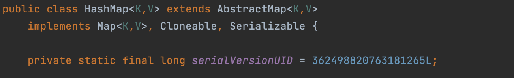
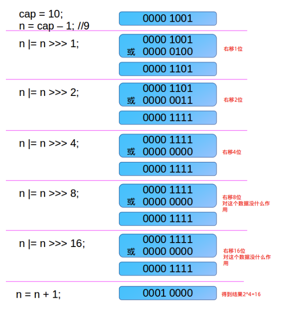
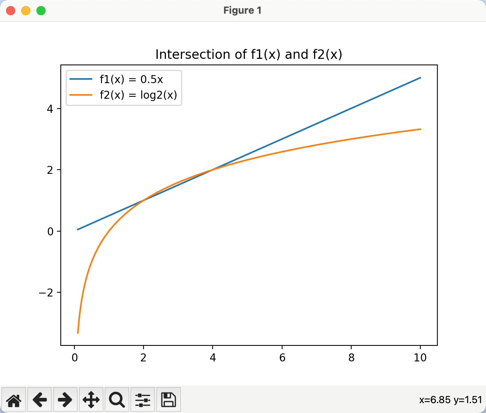

# HashMap

## 哈希表

### 使用数组加链表实现个简单的哈希表


#### Java

```java
public static void main(String[] args) {
        IHashTable<String, String> table = new IHashTable<>(10);

        Scanner sc = new Scanner(System.in);
        while (true) {
            System.out.println("功能:");
            System.out.println("1. add");
            System.out.println("2. show");
            System.out.println("3. exit");
            System.out.println("4. findById");
            System.out.println("5. removeById");
            String input = sc.next();
            int id;
            String key;
            String value;
            switch (input) {
                case "1":
                    System.out.println("请输入要输入的id:");
                    id = sc.nextInt();
                    System.out.println("请输入key:");
                    key = sc.next();
                    System.out.println("请输入value:");
                    value = sc.next();
                    table.put(id, key, value);
                    break;
                case "2":
                    table.show();
                    break;
                case "3":
                    sc.close();
                    System.exit(0);
                    break;
                case "4":
                    System.out.println("请输入要查找的id:");
                    id = sc.nextInt();
                    Node<String, String> entry = table.findById(id);
                    System.out.println(entry);
                    break;
                case "5":
                    System.out.println("请输入要删除的id:");
                    id = sc.nextInt();
                    table.removeById(id);
                    break;
                default:
                    System.out.println("输入错误请重新输入");
                    break;
            }
        }


    }

    private static String randomString(int size) {
        StringBuilder sbd = new StringBuilder();

        for (int j = 0; j < size; j++) {
            int random = new Random().nextInt('z' - 'a' + 1) + 'a';
            for (int i = 'a'; i <= 'z'; i++) {
                if (random == i) {
                    sbd.append((char) i);
                }
            }
        }
        return sbd.toString();
    }


    public static class IHashTable<K, V> {
        private LinkedNode<K, V>[] tables;
        private int size;

        public IHashTable(int size) {
            this.size = size;
            tables = new LinkedNode[size];
            for (int i = 0; i < tables.length; i++) {
                tables[i] = new LinkedNode<>();
            }
        }

        public void put(int id, K key, V value) {
            int index = hash(id);
            tables[index].add(new Node<K, V>(id, key, value));
        }

        public void show() {
            for (int i = 0; i < tables.length; i++) {
                LinkedNode<K, V> table = tables[i];
                table.show(i);
            }
        }


        private int hash(int id) {
            return id % this.size;
        }

        public Node<K, V> findById(int id) {
            int index = hash(id);
            return tables[index].findById(id);
        }

        public void removeById(int id) {
            int index = hash(id);
            tables[index].removeById(id);
        }
    }

    public static class LinkedNode<K, V> {
        private Node<K, V> head;

        /**
         * 将节点加入链表结尾
         *
         * @param node
         */
        public void add(Node<K, V> node) {
            if (head == null) {
                head = node;
                return;
            }
            Node<K, V> current = head;
            while (true) {
                if (current.getNext() == null) {
                    break;
                }
                current = current.getNext();
            }
            current.setNext(node);
        }

        /**
         * 展示当前链表的数据
         *
         * @param linkedNo
         */
        public void show(int linkedNo) {
            System.out.printf("%d --> ", linkedNo);
            Node<K, V> current = head;
            while (current != null) {
                System.out.printf("id:%s, key: %s,value: %s\t",
                        current.getId(), current.getKey(), current.getValue());
                current = current.getNext();
            }
            System.out.println();
        }

        public Node<K, V> findById(int id) {
            Node<K, V> current = head;
            while (current != null) {
                if (current.getId() == id) {
                    return current;
                }
                current = current.getNext();
            }
            return null;
        }

        public void removeById(int id) {
            Node<K, V> current = head;
            if (current.getId() == id) {
                head = head.getNext();
                System.out.println("删除成功");
                return;
            }
            while (true) {
                if (current.getNext() == null) {
                    System.out.println("未找到");
                    break;
                }
                if (current.getNext().getId() == id) {
                    current.setNext(current.getNext().getNext());
                    System.out.println("删除成功");
                }
                current = current.getNext();
            }
        }
    }

    /**
     * 节点
     *
     * @param <K>
     * @param <V>
     */
    public static class Node<K, V> {
        private int id;
        private K key;
        private V value;
        private Node next;

        public Node() {
        }

        public Node(int id, K key, V value) {
            this.id = id;
            this.key = key;
            this.value = value;
        }

        public void setNext(Node next) {
            this.next = next;
        }

        public Node getNext() {
            return next;
        }

        public int getId() {
            return id;
        }

        public K getKey() {
            return key;
        }

        public V getValue() {
            return value;
        }

        @Override
        public String toString() {
            return "{" +
                    "id=" + id +
                    ",key=" + key +
                    ", value=" + value +
                    '}';
        }
    }
```


#### Python

```python

```


## hash冲突

### 什么是hash冲突

就是两个对象的hashCode()方法返回的值是一样的，这就是hash冲突

在HashMap中，hash冲突是发生在获取数组索引位置这个过程中


### 为什么hash会冲突

Java中,hashCode()内部其实是使用散列函数进行计算的，散列函数虽然在设计上具有**抗弱碰撞性** ，但是这也仅仅是减少了碰撞的概率，包括现在的MD5,SHA1,SHA256等，也只是在尽量减少碰撞概率，并不能完全避免碰撞，所以会出现hash冲突


### HashMap如何解决hash冲突

这句话其实是有问题的，hash冲突是不可避免的。所以这个问题应该是HashMap在遇到hash冲突时是怎么做的

1. 搅拌

2. 扩大存储空间

   

## String、Integer

### String

#### hashcode函数

累加每个字符的ascii码值得到最终的hahscode

```java
    public int hashCode() {
        int h = hash;
   
        if (h == 0 && value.length > 0) {
            char val[] = value;

            for (int i = 0; i < value.length; i++) {
              // 累加每个字符的ascii码值得到最终的hahscode
                h = 31 * h + val[i];
            }
            hash = h;
        }
        return h;
    }
```


#### equals函数

````java
    /**
     * 判断两个字符串是否equals
     * 先判断是否是同一个对象，再判断每个字符是否一样
     * @param anObject
     * @return
     */
    public boolean equals(Object anObject) {
        if (this == anObject) {
            //对象的引用一样，肯定是同一个对象
            return true;
        }
        if (anObject instanceof String) {
            //传入的也是String对象
            String anotherString = (String)anObject;
            int n = value.length;
            if (n == anotherString.value.length) {
                //字符长度一致的情况下
                char v1[] = value;
                char v2[] = anotherString.value;
                int i = 0;
                while (n-- != 0) {
                    //遍历每个字符，看字符是否是同一个，每个字符都相同，则肯定是同一个String
                    if (v1[i] != v2[i])
                        return false;
                    i++;
                }
                return true;
            }
        }
        return false;
    }
````


### Integer

#### hashcode函数

Integer的hashcode就是Integer对应的int值

```java
    @Override
    public int hashCode() {
        return Integer.hashCode(value);
    }

    public static int hashCode(int value) {
        return value;
    }
```


#### equals函数

看其基本数据类型int值是否==

```java
    public boolean equals(Object obj) {
        if (obj instanceof Integer) {
            return value == ((Integer)obj).intValue();
        }
        return false;
    }
```


### Long

#### hashcode函数

二进制无符号右移32位，就是其高位的int值

```java

    public static int hashCode(long value) {
        return (int)(value ^ (value >>> 32));
    }
```


#### equals函数

看其基本数据类型long值是否相等

```java
    public boolean equals(Object obj) {
        if (obj instanceof Long) {
            return value == ((Long)obj).longValue();
        }
        return false;
    }
```


## 泊松分布简介

一句话来说，就是计算好的，一个事件在某个时间或空间发生的概率

比如说，统计学家计算好了

在等公交车时，一个小时内平均会有多少辆车经过你的站台

在使用HashMap的数组+链表结构时，链表的第8位有数据的概率几乎是0


## HashMap简介

HashMap是基于哈希表的Map接口实现的，是以key-value存储形式存在，即主要用来存放键值对。

HashMap的实现不是同步的，所以HashMap是线程不安全的

HashMap中节点的key,value都是可以为null的

HashMap的不是有序的


## HashMap源码分析

HashMap的数据结构为 数组+链表[红黑树]

### 成员变量


**DEFAULT_INITIAL_CAPACITY**:默认的初始容量，默认是16


**loadFactor**: 负载因子，默认为0.75，作用是如果已经占用了当前数组容量的3/4，则需要扩容，不建议修改

**DEFAULT_LOAD_FACTOR**: 默认负载因子，默认值为0.75

```text
为什么这个值为0.75，不建议修改
因为经过大量的测试，在节点数量为数组容量的3/4时，可以保证数组的数据不会太密，也不会太稀疏，且在这个范围，数组里的链表数量也不会太多，做扩容resize操作的时候，消耗的性能也小
```


**threshold**: 临界值，阈值

临界值）= capacity（容量）* loadFactor（负载因子）。这个值是当前已占用数组长度的最大值。size 超过这个值就重新 resize（扩容），扩容后的 HashMap 容量是之前容量的两倍。

* 在HashMap对象刚创建时，threshold是大于等于 initialCapacity 的最小的 2 的幂

 * 在第一次put的时候

   * 数组的初始容量就是threshold值

   * 后面会把threshold的值设置为原本threshold值的loadFactor，也就是3/4

**onlyIfAbsent**: 用于指定旧值是否不会被新值覆盖，默认为false。


​	具体而言，该选项控制着旧值在不为null的情况下是否不会被新值覆盖 
 * true: 不会被新值覆盖

 * false: 会被新值覆盖


**TREEIFY_THRESHOLD**:  链表树化临界值，链表树化阈值，链表的最大长度，恒定为8，当链表长度大于等于8链表就会考虑转为红黑树


**MIN_TREEIFY_CAPACITY**：最小的转红黑树数组容量，默认64，当链表长度大于等于8，且数组容量大于等于64时，则链表会转为红黑树


**modCount**:  使用CAS思想实现，每次结构修改时自增。在高并发情况下，若使用函数式接口回调的遍历或修改节点，并且发现操作后的 `modCount` 与原值不一致，则会抛出并发修改异常。

**size**: 整个HashMap中的节点数量


**entrySet**: 

这个成员变量会实现集合的相关方法，使得HashMap中的节点也可以通过这个成员变量使用集合的一些方法去遍历。

注意，在HashMap中这个成员变量的对象中并未维护一个真正的集合，HashMap中数据还是维护在数组中。

但是在LinkedHashMap中，确实维护着一个包含所有数据引用的双指针链表，使得entrySet也能按照节点插入顺序进行遍历


### HashMap继承关系




其中: 

AbstractMap：实现了Map接口的一些基本函数逻辑，HashMap中又重写了这里大部分函数

Map：所有的Map的基本接口，定义了基本的map操作

Cloneable：标记Cloneable可以被拷贝

​	被Cloneable标记的类，代表可以使用Object类的浅clone方法

​	如果没有重写clone方法，则会使用Object的浅clone方法

​	如果重写了clone类，则会使用重写的clone类

​	HashMap重写了clone方法，内部使用的还是Object的浅clone方法，但是还做了一系列的参数重置操作。

Serializable：标记HashMap类可以被序列化和反序列化


### Node类

```java
    static class Node<K,V> implements Map.Entry<K,V> {
        final int hash;
        final K key;
        V value;
        Node<K,V> next;
    }
```

在jdk1.8之前叫做Entry,结构和Node一样，只是换了名字

作用是：定义链表的节点结构


### 构造方法

#### HashMap()


* 只设置负载因子为0.75

* 数组初始容量在第一次put的时候会设置为默认值16

```java
    public HashMap() {
        this.loadFactor = DEFAULT_LOAD_FACTOR; // all other fields defaulted
    }
```

#### HashMap(int initialCapacity)

  * 用户自定义初始容量initialCapacity，会计算出比initialCapacity大或相等的2的指数次幂，比如17就设置为32，然后暂存到**threshold**变量中

  * 默认的负载因子0.75

  ```java
      public HashMap(int initialCapacity) {
          this(initialCapacity, DEFAULT_LOAD_FACTOR);
      }
  ```

#### HashMap(int initialCapacity, float loadFactor)

  * 用户自定义初始容量initialCapacity，会计算出比initialCapacity大或相等的2的指数次幂，比如17就设置为32，然后暂存到**threshold**变量中

  * 用户自定义负载因子，一般建议直接使用默认值0.75

    

  ```java
      public HashMap(int initialCapacity, float loadFactor) {
          if (initialCapacity < 0)
              throw new IllegalArgumentException("Illegal initial capacity: " +
                                                 initialCapacity);
          if (initialCapacity > MAXIMUM_CAPACITY)
              initialCapacity = MAXIMUM_CAPACITY;
          if (loadFactor <= 0 || Float.isNaN(loadFactor))
              throw new IllegalArgumentException("Illegal load factor: " +
                                                 loadFactor);
          this.loadFactor = loadFactor;
          this.threshold = tableSizeFor(initialCapacity);
      }
  
      /**
       * 作用是返回比cap大的2的指数次幂
       * 比如
       * 3-->4
       * 5-->8
       * 6-->8
       * 8-->8
       * 10-->16
       * 17-->32
       *
       * @param cap
       * @return
       */
      static final int tableSizeFor(int cap) {
          int MAXIMUM_CAPACITY = 1 << 30; //1*2^30
          int n = cap - 1;
          n |= n >>> 1;
          n |= n >>> 2;
          n |= n >>> 4;
          n |= n >>> 8;
          n |= n >>> 16;
          return (n < 0) ? 1 : (n >= MAXIMUM_CAPACITY) ? MAXIMUM_CAPACITY : n + 1;
      }
  ```

#### HashMap(Map<? extends K, ? extends V> m)

  * 设置默认的平衡因子是0.75
  * 将旧map放到新map中

  ```java
      public HashMap(Map<? extends K, ? extends V> m) {
          this.loadFactor = DEFAULT_LOAD_FACTOR;
          putMapEntries(m, false);
      }
  
      /**
       * 将一个map放到一个已经存在的HashMap中，如果没有，则构造一个HashMap
       *
       * @param m
       * @param evict
       */
      final void putMapEntries(Map<? extends K, ? extends V> m, boolean evict) {
          /**
           * 定义要加入map的数量s
           */
          int s = m.size();
          if (s > 0) {
              if (table == null) { // pre-size
                  /**
                   * 如果已经存在的map数组为空，则已经存在的map还是个新的map
                   * 则要计算出新map数组的容量
                   * 新数组容量的计算分为两步
                   *   1. 未来数据容量 = 原本map的数据容量/0.75 + 1
                   *   2. 数组容量为 比 未来数据容量 大的最小的2的倍数
                   * 为什么这个容量要加1，考虑原本map节点数量可能就处于临界值，如果这里不加1，
                   * 这种情况，只要一使用通过这个方法创建的map就会发生扩容操作。
                   * 比如 s=6
                   *   在不加1的情况 得到的数组容量为8 (只要使用了就会触发扩容)
                   *   在加1之后，得到的数组容量为16 (有足够的空间存储数据，不触发扩容)
                   */
                  float ft = ((float) s / loadFactor) + 1.0F;
                  int t = ((ft < (float) MAXIMUM_CAPACITY) ?
                          (int) ft : MAXIMUM_CAPACITY);
                  if (t > threshold)
                      threshold = tableSizeFor(t);
              } else if (s > threshold)
              /**
               * 已经存在的数组不为空，证明已经存在的map里是有数据的
               * 有数据则会有临界值，如果要加入map数量比当前临界值大，则要扩容
               * 然后遍历要加入的map中的数据，将其都加入到当前map中
               */
                  resize();
              for (Map.Entry<? extends K, ? extends V> e : m.entrySet()) {
                  K key = e.getKey();
                  V value = e.getValue();
                  putVal(hash(key), key, value, false, evict);
              }
          }
      }
  ```


* 手动设置**初始容量initialCapacity**，**负载因子loadFactor**(默认0.75)

  ​	初始容量initialCapacity最大只能是2的30次方

  ​    检查或设置loadFator的值

  ​    设置**threshold**为比initialCapacity大或相等的2的指数次幂，比如17就设置为32

​    

* 不手动设置初始容量initialCapacity(默认16)

  只设置负载因子为0.75


主要函数:

#### tableSizeFor函数


```java
    /**
     * 作用是返回比cap大的2的指数次幂
     * 比如
     * 3-->4
     * 5-->8
     * 6-->8
     * 8-->8
     * 10-->16
     * 17-->32
     *
     * @param cap
     * @return
     */
    static final int tableSizeFor(int cap) {
        int MAXIMUM_CAPACITY = 1 << 30; //1*2^30
        int n = cap - 1;
        n |= n >>> 1;
        n |= n >>> 2;
        n |= n >>> 4;
        n |= n >>> 8;
        n |= n >>> 16;
        return (n < 0) ? 1 : (n >= MAXIMUM_CAPACITY) ? MAXIMUM_CAPACITY : n + 1;
    }
```

经过上面的运算，会把n对应的二进制最高位的1后面的数据全变为1，比如下面的0000 1001会变成 0000 1111




### put方法

#### 第一次put

* 在调用put方法时，会调用hash方法，在hash方法中

  如果key的hash_code小于2的16次方

  ​	则直接返回原本的hash_code

  否则

  ​	返回`hash_code无符号右移16位`和`原本的hash_code做`异或运算的值

  ​	这个运算值的结果就约等于 hash_code+ (hash_code>>>16)的值

* HashMap的节点为单指针节点

* 第一次调用put方法的时候，调用resize方法，该方法内部默认会创建一个长度为**newCap**的节点数组node[] ，这个时候`newCap`的值有两种情况

  * 如果构造HashMap时有指定initialCapacity的大小，则这里newCap的值为就是`threshold`的值

  * 如果构造HashMap时没有指定initialCapacity的大小，则这里newCap的值就是默认值16，threshold的值就是16的3/4为12

​	   再将`threshold`的值设置为原本的3/4，这个时候threshold就担任起了临界值的作用


* 使用按位与运算计算其索引值，然后判断数组对应索引值上是否有节点

  * 如果没有节点，则创建新节点，将节点放到数组对应的索引值上
  * 如果有节点，下一小节介绍
  
  计算索引值的表达式为
  
  > (n - 1) & hash
  >
  > 其中n就是数组的长度,也就是newCap的值
  >
  > 掩码思想，这个结果可以确保得到的索引值在[0,n-1]范围内

​		这方法比取模好的就是，位运算速度快，且对于正数，大的操作数与小的操作数进行按位运算，其结果一定会小于等于小的操作数。

* 在HashTable中，key是不允许为null，因为他的hash值是直接取hashcode

  

​	

主要代码

```java
    /**
     * 获取key的hash值
     * 如果key的hash_code小于2的16次方，那这里就直接返回原本的hash_code
     * 如果key的hash_code大于等于2的16次方，那这里就返回约等于原本hash_code + hash_code无符号右移16位的值
     * @param key
     * @return
     */
    static final int hash(Object key) {
        int h;
        //h = key.hashCode()) ^ (h >>> 16是搅拌操作
        return (key == null) ? 0 : (h = key.hashCode()) ^ (h >>> 16);
    }

    /**
     * 第一次put，创建数组，并计算索引值，将新创建的节点设置到数组对应索引位置上
     * @param hash
     * @param key
     * @param value
     * @param onlyIfAbsent
     * @param evict
     * @return
     */
    final V putVal(int hash, K key, V value, boolean onlyIfAbsent,
                   boolean evict) {
        HashMap.Node<K, V>[] tab;
        HashMap.Node<K, V> p;
        int n, i;
        if ((tab = table) == null || (n = tab.length) == 0)
            n = (tab = resize()).length;
        if ((p = tab[i = (n - 1) & hash]) == null)
            tab[i] = newNode(hash, key, value, null);
        ...
        ++modCount;
				if (++size > threshold)
            resize();
    }
		
		/**
		* 单指针节点
		*/
    static class Node<K,V> implements Map.Entry<K,V> {
        final int hash;
        final K key;
        V value;
        Node<K,V> next;
    }

    /**
     * resize第一次put时创建节点数组的代码
     */
    void resize(){
        HashMap.Node<K,V>[] oldTab = table;
        int oldCap = (oldTab == null) ? 0 : oldTab.length;
        int oldThr = threshold;
        int newCap, newThr = 0;
        if (newThr == 0) {
            float ft = (float)newCap * loadFactor;
            newThr = (newCap < MAXIMUM_CAPACITY && ft < (float)MAXIMUM_CAPACITY ?
                    (int)ft : Integer.MAX_VALUE);
        }
        threshold = newThr;
        @SuppressWarnings({"rawtypes","unchecked"})
        HashMap.Node<K,V>[] newTab = (HashMap.Node<K,V>[])new HashMap.Node[newCap];
        table = newTab;
        ...
    }
```


#### 第n次put

##### 流程图
TODO


在进行第n次put操作时的逻辑:

* 使用按位与运算计算其索引值，然后判断数组对应索引值上是否有节点

  * 如果没有节点，则创建新节点，将新节点放在数组的对应索引位置上(和上一节内容一样)，结束。

  * 如果在数组对应的索引位置上存在节点，记为节点p，则

    在对应索引位置上的链表或者红黑树中查找出key一样的节点e

    * 先判断头节点的key与传入的key是否一样，如果一样

      则 e=p;

    * 否则当前头节点p的key与当前新增的key不一样

      判断当前节点p是红黑树节点还是链表节点

      * 如果是红黑树节点，则按照红黑树的规则查找key一样的节点e

      * 否则是链表节点，则按照链表的规则查找key一样的节点e

        * 如果遍历了整个链表都没有找到(即p.next为null)

          * 则创建新节点对象，将p.next设置为当前新节点对象

          * 创建完新节点后，判断链表长度是否**大于等于**8

            如果是，则可以转成红黑树，则调用转换方法，**考虑**将链表转成红黑树
        
          查找结束
        
         * 否则继续找，找到了则直接返回e
        
           
    
     如果找到了节点e(即e!=null)
    
    ​	在旧值允许被新值覆盖(onlyIfAbsent=false)或者旧值为null的情况下
    
    ​    直接将新value覆盖旧value，即e.value = newValue

​       上面的操作成功后

​			modCount自增1

​			size自增1

​				如果当前size大于当前临界值threshold，则要考虑扩容resize()


 * 如何判断传入key与当前节点的key是否一样
  
    当前节点的哈希值（hash）和键（key）与新加入数据的哈希值和键内容是否一样
    
    判断key是否一样，要先判断key是否是同一个，或者判断key的内容是否一样
    
    ```java
    if (p.hash == hash &&
                    ((k = p.key) == key || (key != null && key.equals(k))))
      //符合则代表key一样
    ```
    
    
    
    
    
    
    
    这里要注意
    
    `==` :
    
    	* 对于对象类型，==判断是两个对象的引用是否一样，也就是否是同一个对象
    
     * 对于基本类型，==判断的是两个两个变量的值是否一样
    
       
    
    


 * 每次put后modCount数量都自增1

 * 每次put后节点数量size也自增1

 * 节点数量size自增1后，要判断当前HashMap节点数量**size**是否大于**临界值threshold**

   则要**考虑**扩容resize()

   

   

相关代码：
```java

    final V putVal(int hash, K key, V value, boolean onlyIfAbsent,
                   boolean evict) {
        HashMap.Node<K,V>[] tab; HashMap.Node<K,V> p; int n, i;
        if ((tab = table) == null || (n = tab.length) == 0)
            //首次put，创建数组，返回数组长度
            n = (tab = resize()).length;
        if ((p = tab[i = (n - 1) & hash]) == null)
            //数组中的位置没有任何数据时，新建节点放到这个位置
            tab[i] = newNode(hash, key, value, null);
        else {
            //数组中的位置有数据，这个数据的数据结构是链表或者红黑树
            //去这个数据结构中找key相同的节点
            HashMap.Node<K,V> e; K k;
            if (p.hash == hash &&
                    ((k = p.key) == key || (key != null && key.equals(k))))
                //如果头结点就是要找的节点，则e(exist_node)就是p
                e = p;
            //头结点找不到，判断数据结构是链表还是红黑树
            else if (p instanceof HashMap.TreeNode)
            /**
             * 数据结构是红黑树
             *  在红黑树中找到key相同的节点，找到了直接返回,并赋值给e
             *  在红黑树中找不到key相同的节点，直接创建新节点加入到红黑树中，返回null赋值给e
             */
                e = ((HashMap.TreeNode<K,V>)p).putTreeVal(this, tab, hash, key, value);
            else {
                /**
                 * 数据结构是链表，按照链表的规则查找
                 *  如果链表中找不到key相同的节点，则创建新节点，加入到链表中，返回null赋值给e
                 *  如果链表中找到了key相同的节点，则直接返回这个节点，并赋值给e
                 */
                for (int binCount = 0; ; ++binCount) {
                    if ((e = p.next) == null) {
                        p.next = newNode(hash, key, value, null);
                        if (binCount >= TREEIFY_THRESHOLD - 1) // -1 for 1st
                        /**
                         * 如果链表长度大于等于8，考虑将链表转换为红黑树
                         */
                            treeifyBin(tab, hash);
                        break;
                    }
                    if (e.hash == hash &&
                            ((k = e.key) == key || (key != null && key.equals(k))))
                        break;
                    p = e;
                }
            }
            if (e != null) { // existing mapping for key
                /**
                 * 如果找到了key相同的节点e，则在允许的情况下直接覆盖value
                 */
                V oldValue = e.value;
                if (!onlyIfAbsent || oldValue == null)
                    e.value = value;
                afterNodeAccess(e);
                return oldValue;
            }
        }
        /**
         * 使用modCount，记录修改次数
         * CAS思想，在高并发情况下回调 的迭代处理Map中的节点时，如果modCount的值与原本的不一致，会出现并发修改异常
         */
        ++modCount;
        /**
         * 自增节点数量
         * 节点数量大于临界值时，考虑扩容
         */
        if (++size > threshold)
            resize();
        /**
         * put后的回调函数，子类会实现这个方法
         * 子类有LinkedHashMap
         */
        afterNodeInsertion(evict);
        return null;
    }
```

​    

问题:


### resize方法

#### 作用

* 初始化数组

* 给数组按原本的2倍扩容

* 缩容

  
  
  
  
  
#### 注意

* 由于resize这个操作要进行节点索引的重新计算和移位，所以这个过程是比较消耗计算机资源的，所以使用HashMap时，尽量在构造前确定数组的容量
*   


### treeifyBin方法


#### 作用

* 当HashMap数组中某个位置的链表长度大于8且数组的长度大于等于64时，将单指针链表转双指针链表，然后再转红黑树
* 当HashMap数组中某个位置的链表长度大于8且数组的长度小于64时，考虑做resize扩容


相关代码

```java
    /**
     * 当数组长度大于等于64时 当前hash所在的索引位置的链表转红黑树
     * 否则考虑做扩容
     * 
     */
    final void treeifyBin(HashMap.Node<K,V>[] tab, int hash) {
        int n, index; HashMap.Node<K,V> e;
        if (tab == null || (n = tab.length) < MIN_TREEIFY_CAPACITY)
            resize();
        else if ((e = tab[index = (n - 1) & hash]) != null) {
            /**
             * e -> 当前链表
             * hd -> 头结点
             * p -> 当前节点
             * tl -> 记住的上一个节点，当前节点的前一个节点
             *
             * 这里while循环的作用是将单指针的链表修改成双指针链表
             *   遍历单链表，将上一个节点记在tl变量中
              */
            HashMap.TreeNode<K,V> hd = null, tl = null;
            do {
                HashMap.TreeNode<K,V> p = replacementTreeNode(e, null);
                if (tl == null)
                    hd = p;
                else {
                    p.prev = tl;
                    tl.next = p;
                }
                tl = p;
            } while ((e = e.next) != null);
            /**
             * 将数组中索引位置的节点换成TreeNode结构的头结点
             * 更换好后，将双指针链表红黑树化
             */
            if ((tab[index] = hd) != null)
                hd.treeify(tab);
        }
    }
```


### split方法

#### 作用

* 当红黑树节点个数小于6，就要开始转链表


### remove方法

* 当红黑树的节点小于等于6时，就会将红黑树转换为链表

  

### 链表与红黑树

* 相同数据的情况下链表的存储空间比红黑树存储空间小吗？

  红黑树每个节点通常需要存储如下信息：

  - 键
  - 值
  - 父节点指针
  - 左孩子指针
  - 右孩子指针
  - 颜色标记

  而链表每个节点通常只需要存储如下信息：

  - 键
  - 值
  - 指向下一个节点的指针

  所以在相同节点的情况下，红黑树的存储空间是链表的两倍


## ConcurrentHashMap源码分析

也是数组+链表(红黑树)

ConcurrentHashMap在进行 put和remove时，会锁住整个桶


## 面试题

* 为什么HashMap数组的长度最大只能是2的30次方

因为数组长度定义为int，int的最大值是`2^31-1`，`2^30`比int最大值还大，而数组容量又只能是2的倍数，在int范围内2的最大倍数为`2^30`,所以HashMap数组的最大长度只能是2的30次方。


* 为什么数组容量一定要是2的倍数

因为计算索引的表达式是 （容量-1）& hash, 容量是 2的倍数，那(容量-1) 是一个全是 1的二进制与hash做按位与运算，任何二进制和1做与运算结果可能是1也可能是0，而如果容量不是2的倍数，那（容量-1）可能是一个有很多0的二进制，任何二进制和0做按位与运算，结果都只能是0，这样导致有更多的hash_code会运算出一个相同的索引值，导致碰撞几率变大。

而且，（容量-1）& hash 一定会得到一个范围再0 到 容量-1 的索引值，且这个值是均匀分布的。


* 为什么链表长度大于等于8就要开始考虑转红黑树，而红黑树节点的个数小于等于6就要考虑转链表

  官方解释：

  因为经过统计，在正常使用HashMap的时候，链表的第8位被使用到的概率几乎是0，如果第8为被使用到了，那要保持HashMap的性能，就要考虑转红黑树了。而红黑树的节点个数被删除到小于等于6的概率也几乎是0，如果确实删到了6只剩6个，那使用者大概率也不会再往HashMap中添加数据了，所以为了保证HashMap的最优性能，这个时候红黑树就会转成链表。

  这种统计概率符合泊松分布

  

  自己理解：

  

  红黑树的查询时间复杂度是log(n),链表的查询时间复杂度是n/2

  在n大于4的时候，红黑树的查询效率开始比链表高，但是再综合考虑使用者的使用意图，所以定了8和6两个值

  

  

  

* 为什么负载因子默认值是0.75

  


* 在计算索引的表达式中，hash一般比(n-1)的值大，然后n的值是一个2的倍数，那在加入的键值对数量比n的值小的时候，不是一直往一个槽位里加吗？

  不是的，按位与运算的结果会大于0且小于等于更小的操作数


* 为什么(n-1)&hash的结果是无序的

原因是hash值其实是无序的，hash值的设计，就是尽可能的将不同的输入映射到尽可能广泛的输出范围，所以hash值本身就是无序且均匀分布的。而(n-1)&hash的作用只是将均匀分布的hash值用按位与操作，均匀的集中在0到n-1这个区间。

* 在HashMap内部重写的hash方法中，hash_code无符号右移16位的作用是什么

  就是搅拌

```text
在HashMap内部，重写的hash方法中，hash_code无符号右移16位的作用是为了搅拌（mixing）。它的目的是通过将高位的信息混入到低位，使得原本可能相同的hashCode在最终计算出的索引位置上分布更加均匀，从而减少哈希冲突的概率。哈希冲突是因为哈希函数的输出空间远小于输入空间，导致多个不同的输入可能映射到同一个哈希值。通过搅拌操作，可以减少冲突的发生，但无法完全消除。这种搅拌操作的目的是转移冲突，让原本集中的数据分散到其他位置去，从而增加HashMap的性能和效率。

然而，需要注意的是，如果哈希函数不够复杂或者数据分布不均匀，搅拌操作可能会导致数据在哈希表中集中到某些槽位上，增加了哈希冲突的可能性。即使如此，在实际使用中，HashMap仍然是有效的，因为后续处理冲突的方法如链表和红黑树可以进一步处理冲突，并保持数据的存储和检索效率。
```


hash_code是散列值，我们可以理解成取模的余数，比如任何正整数对10取模，都可以得到一个0到9的结果。散列算法可以让hash_code尽可能的均匀分布，那把这个范围缩小到0-9，也能均匀分布。

当两个不同的数据，取模后是一样的数，这就发生了hash碰撞。为了减少hash碰撞的概率，这里用了移位的方法，让原本的hash_code和高位hash_code进行运算(搅拌)，这样原本相同的hash_code就不一样了，这样就又减少了碰撞的概率。

所以无符号右移16位效果就是搅拌，就是为了让一样的hash_code变得不一样。

比如 5对10取余是5,15对10取余也是5，如果我们让15+1=16,再对10取余就是6了

搅拌的目的其实是转移冲突，让原本集中的火力分散到其他为位置去了。

换句话说，存在这种情况，如果有人精确的计算出分散后的位置，然后数据中都是搅拌后能集中到一个槽位的hash_code，那这个搅拌动作反而让原本分散的数据变得更集中。但是实际使用中，即使有人恶意攻击这个搅拌的hash函数，这个HashMap依然是有效的，后续还有链表+红黑树可以存储数据，且插入删除修改查询效率依旧可观


* 什么是Java集合中的快速失败机制

其实就是modifySize的利用，思想是CAS思想

* 在HashMap中,key一般要选用不可变类，比如Integer,String,所以key对应的hash值是不会变的，但是如果使用者使用了一个可变类型的key,那该怎么办

如果出现这个问题，公司应该要再强调一下代码规范。

如果确实是出现了这个问题，首先HashMap的数据只要放进去了，位置是不会移动的，原本在哪个索引位置就在哪个索引位置，并且使用者的hash值已经发生了改变，则在没有记录旧hash值的时候，就无法定位这个数据了，也就是无法通过get拿到这个节点了，并且这个节点也不会被GC回收，因为HashMap内部还有节点指向它。


* threshold的值什么时候修改

   * HashMap指定初始容量构造的时候，会将threshold的值设置为比初始容量大或相等的最小的2的倍数

   * 第一次put的时候，会将threshold设置为原本threshold的3/4

   * 扩容时会改变为扩容后容量的3/4

     

* threshold临界值，临界的是什么

​	当HashMap的节点数量大于这个临界值的时候，就要考虑扩容


* HashMap转红黑树是所有槽位的链表转红黑树，还是某个槽位的链表转红黑树

一个槽位


* 总结什么时候做resize

	* 第一次put的时候，需要调用resize创建一个长度为2的倍数的数组，这个长度默认是16
	* 在put的时候，如果HashMap中节点的数量大于临界值threshold的时候，会调用resize
	* 在put的时候，如果某条链表中的数量大于8且数组的长度 小于64的时候，会调用resize


* 为什么String要重写hashcode方法

  因为Object的hashcode方法，是直接获取对象的内存地址，这意味着相同的字符串内容产生的String对象，其hashcode是不一样的，这不符合使用需求，所以重写了string的hashcode方法，使用字符串中每个字符的ascii码生成hashcode，这样只要输入的字符串字符的ascii码一致，返回的String hashcode就一致

  

* 转红黑树的条件是什么
  
  链表长度大于等于8且数组容量大于等于64
  
  
  
  
  
* 两个对象的hash_code一样时会发生什么
  
  
  
* 什么是hash碰撞，何时发生hash碰撞，如何解决hash碰撞
  
  
  
* 如果两个对象key的hashcode相同，如何存储键值对
  
  
  
* 什么时候扩容
  
* 什么时候缩容
  
  
  
  
  
* 为什么Java8中，要引入红黑树
  
  


* 为什么hash_code^(hash_code>>>16)得到的hash，再(length-1)&hash能均匀分布且减少碰撞

  


