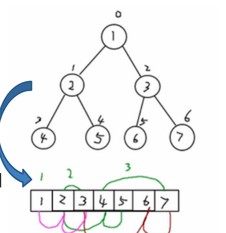

# 查找算法

## 线性查找

### Java

```java
    /**
     * 线性查找
     * @param data 要查找的数据
     * @param target 要查找的值
     * @return 要查找数据的索引值
     */
    @Override
    int search(int[] data, int target) {
        for (int i = 0; i < data.length; i++) {
            if (data[i] == target) {
                return i;
            }
        }
        return -1;
    }

    @Override
    int[] searchAll(int[] data, int target) {
        List<Integer> list = new ArrayList<>();
        for (int i = 0; i < data.length; i++) {
            if (data[i] == target) {
                list.add(i);
            }
        }
        int[] result = new int[list.size()];
        for (int i = 0; i < list.size(); i++) {
            result[i] = list.get(i);
        }
        return result;
    }
```


### Python

```python

```

## 二分查找法

### 思想

> int mid = left + (right - left) *1/2

递归条件：

* 如果左指针大于右指针，则停止递归。

* 如果找到了，则停止递归。

递归方式：

* 如果 target 小于当前位置的值，则代表没有找到，向左边找，注意右指针为 mid - 1。
* 如果 target 大于当前位置的值，则代表没有找到，向右边找，注意左指针为 mid +1。

### Java

```java
    /**
     * 二分查找法:
     * 递归条件:
     *  递归条件：如果左指针大于右指针，则停止递归
     *  如果找到了，则停止递归
     * 递归方式：
     *  如果target小于当前位置的值，则代表没有找到，向左边找，注意右指针为mid-1
     *  如果target大于当前位置的值，则代表没有找到，向左边找，注意左指针为mid+1
     *
     * @param data
     * @param target
     * @param left
     * @param right
     * @return
     */
    private static int binarySearch(int[] data, int target, int left, int right) {
        if (left > right) {
            return -1;
        }
        int mid = (left + right) / 2;
        int midValue = data[mid];
        if (target == midValue) {
            return mid;
        } else if (target < midValue) {
            return binarySearch(data, target, left, mid - 1);
        } else {
            return binarySearch(data, target, mid + 1, right);
        }
    }

    /**
     * 二分查找法
     * 递归查找:
     * 递归条件：如果左指针大于右指针，则停止递归
     * 如果找到了，则再找找该位置左边有没有一样的值，右边有没有一样的值，将他们的位置都放入结果中返回结束递归
     * 递归方式：
     * 如果target小于当前位置的值，则代表没有找到，向左边找，注意右指针为mid-1
     * 如果target大于当前位置的值，则代表没有找到，向左边找，注意左指针为mid+1
     *
     * @param data   原序列
     * @param target 目标数据
     * @param left   左指针
     * @param right  右指针
     * @return 所有找到的索引位置
     */
    private static List<Integer> binarySearchAll(int[] data, int target, int left, int right) {
        List result = new ArrayList();
        if (left > right) {
            return result;
        }
        int mid = (left + right) / 2;
        int midValue = data[mid];
        if (target == midValue) {
            //找到了，向左右继续查找是否有一样的
            int l = mid - 1;
            while (l >= 0) {
                if (data[l] != target) {
                    break;
                }
                result.add(l--);
            }
            result.add(mid);
            int r = mid + 1;
            while (r <= data.length - 1) {
                if (data[r] != target) {
                    break;
                }
                result.add(r++);
            }
            return result;
        } else if (target < midValue) {
            return binarySearchAll(data, target, left, mid - 1);
        } else {
            return binarySearchAll(data, target, mid + 1, right);
        }
    }
```


### Python

```python
```


## 插值查找算法

### 思想

**插值查找算法**

>int mid = left + (right - left) * (target - data[left]) / (data[right] - data[left])

- 插值查找算法的思路与二分查找法一致。
- 区别在于：
  - 二分查找的 `mid` 为 `left + 1/2 * 序列长度`。
  - 插值查找的 `mid` 为 `left + 查找的值的范围在序列索引长度中的比例`。

注意:

插值查找，因为mid是根据查找值计算出来的，如果查找值用户输入的值不在要查找的序列范围中，则查找时可能会越界，所以每次查找时要判断当前值在查找的序列之中


### Java

```java
 @Override
    public int search(int[] data, int target) {

        return interpolationSearch(data, 0, data.length - 1, target);
    }

    private int interpolationSearch(int[] data, int left, int right, int target) {

        if (left > right
                || target < data[left]
                || target > data[right]) {
            return -1;
        }
        int mid = left + (right - left) * (target - data[left]) / (data[right] - data[left]);
        if (target == data[mid]) {
            return mid;
        } else if (target > data[mid]) {
            return interpolationSearch(data, mid + 1, right, target);
        } else {
            return interpolationSearch(data, left, mid - 1, target);
        }
    }


    @Override
    public int[] searchAll(int[] data, int target) {
        List<Integer> list = interpolationSearchAll(data, 0, data.length - 1, target);
        int result[] = new int[list.size()];
        for (int i = 0; i < list.size(); i++) {
            result[i] = list.get(i);
        }
        return result;
    }

    private List<Integer> interpolationSearchAll(int[] data, int left, int right, int target) {

        if (left > right
                || target < data[left]
                || target > data[right]) {
            return new ArrayList<>();
        }
        int mid = left + (right - left) * (target - data[left]) / (data[right] - data[left]);
        if (target == data[mid]) {
            List<Integer> result = new ArrayList();
            int midLeft = mid - 1;
            while (midLeft >= 0 && data[midLeft] == target) {
                result.add(midLeft--);
            }
            result.add(mid);
            int midRight = mid + 1;
            while (midRight <= data.length - 1 && data[midRight] == target) {
                result.add(midRight++);
            }
            return result;
        } else if (target > data[mid]) {
            return interpolationSearchAll(data, mid + 1, right, target);
        } else {
            return interpolationSearchAll(data, left, mid - 1, target);
        }
    }
```


### Python

```python
```


### 总结

其实二分查找和插值查找的本质思想是一样的。区别在于二分查找确定 `mid` 位置在序列的一半，而插值查找的基本原理是根据目标元素与数组首尾元素的差值比例，估计目标元素在数组中的大致位置，并根据该估计来动态调整搜索范围。


## 斐波那契查找

### 思想


- 插值查找算法的思路与二分查找法一致。
- 区别在于：
  - 二分查找的 `mid` 为 `left + 1/2 * 序列长度`。
  - 斐波那契查找的 `mid` 为 `left + 当前序列长度的斐波那契分割点-1`。

因为斐波那契数列前后值的比例符合黄金分割点

所以我们每次查找序列时，都要获取到当前序列的长度，然后去斐波那契数列中找到和这个长度接近的值，然后去找这个值前面的值作为黄金分割点即可


### 递归法

#### 思路

**递归算法思想:**

- 插值查找算法的思路与二分查找法一致。
- 区别在于：
  - 二分查找的 `mid` 为 `left + 1/2 * 序列长度`。
  - 斐波那契查找的 `mid` 为 `left + 当前序列长度的斐波那契分割点-1`。

因为斐波那契数列前后值的比例符合黄金分割点

所以我们每次查找序列时，都要获取到当前序列的长度，然后去斐波那契数列中找到和这个长度接近的值，然后去找这个值前面的值作为黄金分割点即可


#### Java

```java
    /**
     * fibonacci查找
     * 按照斐波那契数列分割
     *
     * @param data   要查找的数据
     * @param target 要查找的值
     * @return
     */
    @Override
    public int search(int[] data, int target) {
        //构建斐波那契数列
        int[] f = fibs(data.length);
        return fibonacciSearch(data, f, 0, data.length - 1, target);
    }


    private int fibonacciSearch(int[] data, int[] f, int left, int right, int target) {
        if (left > right) {
            return -1;
        }
				
      	//长度对应的斐波那契值前面的数就是黄金分割点
        int fibIndex = 0;
        int currentLength = right - left + 1;
        for (int i = 0; i < f.length; i++) {
            if (f[i] >= currentLength) {
                fibIndex = i;
                break;
            }
        }
        int fibStep = 1;//黄金分割点
        if (fibIndex != 0) {
            fibStep = f[fibIndex - 1];
        }
        int mid = left + fibStep - 1;
        if (target == data[mid]) {
            return mid;
        } else if (target < data[mid]) {
            return fibonacciSearch(data, f, left, mid - 1, target);
        } else {
            return fibonacciSearch(data, f, mid + 1, right, target);
        }
    }

    /**
     * 根据序列长度构建斐波那契数列
     *
     * @param size
     * @return
     */
    private static int[] fibs(int size) {
        List<Integer> fibs = new ArrayList<Integer>() {{
            this.add(0, 1);
            this.add(1, 1);
        }};
        int i = 2;
        while (true) {
            fibs.add(i, fibs.get(i - 1) + fibs.get(i - 2));
            if (fibs.get(i) >= size) {
                break;
            }
            i = i + 1;
        }
        int result[] = new int[fibs.size()];
        for (int j = 0; j < fibs.size(); j++) {
            result[j] = fibs.get(j);
        }
        return result;
    }

```


#### Python

```python
```


### 遍历法

#### 思路

思路和递归法一致

将是将递归循环调用的逻辑放到while循环中做，当left>right时停止循环，找到了也停止循环

循环结束还没找到，则返回-1

#### Java

```java
    /**
     * fibonacci查找
     * 按照斐波那契数列分割
     *
     * @param data   要查找的数据
     * @param target 要查找的值
     * @return
     */
    @Override
    public int search(int[] data, int target) {
        //构建斐波那契数列
        int[] f = fibs(data.length);
        return fibonacciSearch(data, f, target);
    }


    private int fibonacciSearch(int[] data, int[] f, int target) {
        int left = 0;
        int right = data.length - 1;


        while (left <= right) {
            /**
             * 计算斐波那契偏移量：
             * 拿到当前长度对应的斐波那契值，当前值的前面那个值就是斐波那契偏移量
             * 拿到斐波那契偏移量，当前left+偏移量-1就是当前mid
             */
            int fibIndex = 0;
            int currentLength = right - left + 1;
            for (int i = 0; i < f.length; i++) {
                if (f[i] >= currentLength) {
                    fibIndex = i;
                    break;
                }
            }
            int fibStep = 1; //斐波那契偏移量
            if (fibIndex != 0) {
                fibStep = f[fibIndex - 1];
            }
            int mid = left + fibStep - 1;
            if (target == data[mid]) {
                return mid;
            } else if (target < data[mid]) {
                right = mid - 1;
            } else {
                left = mid + 1;
            }
        }
        return -1;
    }

    @Override
    int[] searchAll(int[] data, int target) {
        return new int[0];
    }


    /**
     * 根据序列长度构建斐波那契数列
     *
     * @param size
     * @return
     */
    private static int[] fibs(int size) {
        List<Integer> fibs = new ArrayList<Integer>() {{
            this.add(0, 1);
            this.add(1, 1);
        }};
        int i = 2;
        while (true) {
            fibs.add(i, fibs.get(i - 1) + fibs.get(i - 2));
            if (fibs.get(i) >= size) {
                break;
            }
            i = i + 1;
        }
        int result[] = new int[fibs.size()];
        for (int j = 0; j < fibs.size(); j++) {
            result[j] = fibs.get(j);
        }
        return result;
    }
```


#### Python

```python

```


# 哈希表

## 使用数组加链表实现哈希表


### Java

```java
public static void main(String[] args) {
        IHashTable<String, String> table = new IHashTable<>(10);

        Scanner sc = new Scanner(System.in);
        while (true) {
            System.out.println("功能:");
            System.out.println("1. add");
            System.out.println("2. show");
            System.out.println("3. exit");
            System.out.println("4. findById");
            System.out.println("5. removeById");
            String input = sc.next();
            int id;
            String key;
            String value;
            switch (input) {
                case "1":
                    System.out.println("请输入要输入的id:");
                    id = sc.nextInt();
                    System.out.println("请输入key:");
                    key = sc.next();
                    System.out.println("请输入value:");
                    value = sc.next();
                    table.put(id, key, value);
                    break;
                case "2":
                    table.show();
                    break;
                case "3":
                    sc.close();
                    System.exit(0);
                    break;
                case "4":
                    System.out.println("请输入要查找的id:");
                    id = sc.nextInt();
                    Node<String, String> entry = table.findById(id);
                    System.out.println(entry);
                    break;
                case "5":
                    System.out.println("请输入要删除的id:");
                    id = sc.nextInt();
                    table.removeById(id);
                    break;
                default:
                    System.out.println("输入错误请重新输入");
                    break;
            }
        }


    }

    private static String randomString(int size) {
        StringBuilder sbd = new StringBuilder();

        for (int j = 0; j < size; j++) {
            int random = new Random().nextInt('z' - 'a' + 1) + 'a';
            for (int i = 'a'; i <= 'z'; i++) {
                if (random == i) {
                    sbd.append((char) i);
                }
            }
        }
        return sbd.toString();
    }


    public static class IHashTable<K, V> {
        private LinkedNode<K, V>[] tables;
        private int size;

        public IHashTable(int size) {
            this.size = size;
            tables = new LinkedNode[size];
            for (int i = 0; i < tables.length; i++) {
                tables[i] = new LinkedNode<>();
            }
        }

        public void put(int id, K key, V value) {
            int index = hash(id);
            tables[index].add(new Node<K, V>(id, key, value));
        }

        public void show() {
            for (int i = 0; i < tables.length; i++) {
                LinkedNode<K, V> table = tables[i];
                table.show(i);
            }
        }


        private int hash(int id) {
            return id % this.size;
        }

        public Node<K, V> findById(int id) {
            int index = hash(id);
            return tables[index].findById(id);
        }

        public void removeById(int id) {
            int index = hash(id);
            tables[index].removeById(id);
        }
    }

    public static class LinkedNode<K, V> {
        private Node<K, V> head;

        /**
         * 将节点加入链表结尾
         *
         * @param node
         */
        public void add(Node<K, V> node) {
            if (head == null) {
                head = node;
                return;
            }
            Node<K, V> current = head;
            while (true) {
                if (current.getNext() == null) {
                    break;
                }
                current = current.getNext();
            }
            current.setNext(node);
        }

        /**
         * 展示当前链表的数据
         *
         * @param linkedNo
         */
        public void show(int linkedNo) {
            System.out.printf("%d --> ", linkedNo);
            Node<K, V> current = head;
            while (current != null) {
                System.out.printf("id:%s, key: %s,value: %s\t",
                        current.getId(), current.getKey(), current.getValue());
                current = current.getNext();
            }
            System.out.println();
        }

        public Node<K, V> findById(int id) {
            Node<K, V> current = head;
            while (current != null) {
                if (current.getId() == id) {
                    return current;
                }
                current = current.getNext();
            }
            return null;
        }

        public void removeById(int id) {
            Node<K, V> current = head;
            if (current.getId() == id) {
                head = head.getNext();
                System.out.println("删除成功");
                return;
            }
            while (true) {
                if (current.getNext() == null) {
                    System.out.println("未找到");
                    break;
                }
                if (current.getNext().getId() == id) {
                    current.setNext(current.getNext().getNext());
                    System.out.println("删除成功");
                }
                current = current.getNext();
            }
        }
    }

    /**
     * 节点
     *
     * @param <K>
     * @param <V>
     */
    public static class Node<K, V> {
        private int id;
        private K key;
        private V value;
        private Node next;

        public Node() {
        }

        public Node(int id, K key, V value) {
            this.id = id;
            this.key = key;
            this.value = value;
        }

        public void setNext(Node next) {
            this.next = next;
        }

        public Node getNext() {
            return next;
        }

        public int getId() {
            return id;
        }

        public K getKey() {
            return key;
        }

        public V getValue() {
            return value;
        }

        @Override
        public String toString() {
            return "{" +
                    "id=" + id +
                    ",key=" + key +
                    ", value=" + value +
                    '}';
        }
    }
```


### Python

```python
```


# 树

## 为什么需要树这种数据结构

### 数组存储方式的分析

#### 优点

通过下标方式访问元素，速度快

对于有序数组，可以使用二分查找提高检索速度

#### 缺点

如果要插入或删除某个值会整体移动，效率较低


### 链式存储方式的分析

#### 优点

插入和删除相对数组快，只需要重新连接指针即可

#### 缺点

检索效率低，访问指定位置的结点时需要遍历查找


所以就出现了树这种数据结构


### 树存储方式的分析

提供数据 **存储** 、**读取** 效率。

例如：利用 **二叉排序树（Binary Sort Tree）**，既可以保证数据的检索速度，同时也可以保证数据的**插入**、**删除**、**修改** 的速度


如图所示：

- 插入时，小的数在 **左节点**、大的数在 **右节点**
- 查找时：根据插入事的特性，基本上就类似折半查找了，每次都过滤一半的节点
- 删除时：只需要移动相邻的节点的引用


## 树的常用术语


- 节点：每一个圆圈表示一个节点，也称节点对象

- 根节点：最上面，最顶部的那个节点，也就是一棵树的入口

- 父节点：有子节点的节点

- 子节点

- 叶子节点：没有子节点的节点

- 节点的权：可以简单的理解为节点值

  有时候也用 **路径** 来表示

- 路径：从 root 节点找到该节点的路线

- 层

- 子树：有子节点的父子两层就可以称为是一个子树

- 树的高度：最大层数

- 森林：多颗子树构成森林


## 二叉树的遍历


### 前序遍历

遍历顺序：根左右

1,2,3,5,4


### 中序遍历

遍历顺序：左根右

2,1,5,3,4

### 后序遍历

遍历顺序：左右根

2,5,4,3,1


### 代码

#### Java

```java
package com.watermelon.tree;

public class A01BinaryTree {

    public static void main(String[] args) {
        HeroNode root = new HeroNode(1, "张三");
        HeroNode node2 = new HeroNode(2, "李四");
        HeroNode node3 = new HeroNode(3, "王老五");
        HeroNode node4 = new HeroNode(4, "朱重八");
        HeroNode node5 = new HeroNode(5, "刘大力");
        root.setLeft(node2);
        root.setRight(node3);
        node3.setLeft(node5);
        node3.setRight(node4);

        Binary binary = new Binary(root);
        binary.preOrder();
        binary.infixOrder();
        binary.postOrder();
    }
}

class Binary {
    private HeroNode root;

    public Binary(HeroNode root) {
        this.root = root;
    }

    public void preOrder() {
        if (this.root == null) {
            System.out.println("根节点为空");
            return;
        }
        System.out.println("前序遍历：");
        this.root.preOrder();
    }

    public void infixOrder() {
        if (this.root == null) {
            System.out.println("根节点为空");
            return;
        }
        System.out.println("中序遍历：");
        System.out.println();
        this.root.infixOrder();
    }

    public void postOrder() {
        if (this.root == null) {
            System.out.println("根节点为空");
            return;
        }
        System.out.println("后序遍历：");
        this.root.postOrder();
    }
}

class HeroNode {
    private int no;
    private String name;
    private HeroNode left;
    private HeroNode right;

    public HeroNode(int no, String name) {
        this.no = no;
        this.name = name;
    }

    public HeroNode getLeft() {
        return left;
    }

    public void setLeft(HeroNode left) {
        this.left = left;
    }

    public HeroNode getRight() {
        return right;
    }

    public void setRight(HeroNode right) {
        this.right = right;
    }

    @Override
    public String toString() {
        return "HeroNode{" +
                "no=" + no +
                ", name='" + name + '\'' +
                '}';
    }

    /**
     * 前序遍历
     * 根左右
     */
    public void preOrder() {
        System.out.println(this);
        if (this.left != null) {
            this.left.preOrder();
        }
        if (this.right != null) {
            this.right.preOrder();
        }
    }

    /**
     * 中序遍历
     * 左根右
     */
    public void infixOrder() {
        if (this.left != null) {
            this.left.infixOrder();
        }
        System.out.println(this);
        if (this.right != null) {
            this.right.infixOrder();
        }
    }

    /**
     * 后序遍历
     * 左右根
     */
    public void postOrder() {
        if (this.left != null) {
            this.left.postOrder();
        }
        if (this.right != null) {
            this.right.postOrder();
        }
        System.out.println(this);
    }
}
```


#### Python

```python
```


## 二叉树的查找

### Java

```java
        /**
         * 前序查找
         * 根左右
         */
        public HeroNode preSearch(int no) {
            System.out.println("前序查找中:" + this.no);
            HeroNode current = this;
            if (current.no == no) {
                return current;
            }
            if (this.left != null) {
                current = this.left.preSearch(no);
                if (current != null) {
                    return current;
                }
            }
            if (this.right != null) {
                current = this.right.preSearch(no);
                if (current != null) {
                    return current;
                }
            }
            return null;
        }

        /**
         * 中序查找
         * 左根右
         */
        public HeroNode infixSearch(int no) {

            HeroNode current;
            if (this.left != null) {
                current = this.left.infixSearch(no);
                if (current != null) {
                    return current;
                }
            }
            System.out.println("中序查找中:" + this.no);
            if (this.no == no) {
                return this;
            }
            if (this.right != null) {
                current = this.right.infixSearch(no);
                if (current != null) {
                    return current;
                }
            }
            return null;
        }

        /**
         * 后序查找
         * 左右根
         */
        public HeroNode postSearch(int no) {
            HeroNode current;
            if (this.left != null) {
                current = this.left.postSearch(no);
                if (current != null) {
                    return current;
                }
            }
            if (this.right != null) {
                current = this.right.postSearch(no);
                if (current != null) {
                    return current;
                }
            }
            System.out.println("后序查找中:" + this.no);
            if (this.no == no) {
                return this;
            }
            return null;
        }
```


### Python

```python
```


## 二叉树节点的删除(不完整版)

要求：

1. 如果删除的节点是 **叶子节点**，则删除该节点
2. 如果删除的节点是非叶子节点，则删除该子树

### 思路

- 由于我们的二叉树是单向的

- 所以我们判定一个节点是否可以删除，是判断它的 **子节点**，是否可删除，否则则没法回到父节点删除了，因为要判断被删除的节点满足前面的两点要求

  1. 当前节点的 **左子节点** 不为空，并且左子节点就是要删除的节点，则 left = null，并且返回（结束递归删除）
  2. 当前节点的 **右子节点** 不为空，并且右子节点就是要删除的节点，则 right = null，并且返回（结束递归删除）

  如果前面都没有删除，则继续递归删除。上面的要求是 2 点，实际上是，找到符合条件的节点则直接删除（因为不考虑是否有子树）

  如果树只有一个 root 节点，则将 root 节点置空

### 代码

#### Java

```java
public class A03BinaryTreeDelete {

    public static void main(String[] args) {
        HeroNode root = new HeroNode(1, "张三");
        HeroNode node2 = new HeroNode(2, "李四");
        HeroNode node3 = new HeroNode(3, "王老五");
        HeroNode node4 = new HeroNode(4, "朱重八");
        HeroNode node5 = new HeroNode(5, "刘大力");
        root.setLeft(node2);
        root.setRight(node3);
        node3.setLeft(node5);
        node3.setRight(node4);

        Binary binary = new Binary(root);
        binary.preOrder();
        System.out.println("----------删除后---------");
        binary.delNode(3);
        binary.preOrder();

    }

    public static class Binary {
        private HeroNode root;

        public Binary(HeroNode root) {
            this.root = root;
        }

        public void delNode(int no) {
            if (root == null) {
                return;
            }
            if (root.no == no) {
                root = null;
                return;
            }
            root.delNode(no);
        }

        public void preOrder() {
            if (root == null) {
                return;
            }
            root.preOrder();
        }
    }

    public static class HeroNode {
        private int no;
        private String name;
        private HeroNode left;
        private HeroNode right;

        public HeroNode(int no, String name) {
            this.no = no;
            this.name = name;
        }

        public HeroNode getLeft() {
            return left;
        }

        public void setLeft(HeroNode left) {
            this.left = left;
        }

        public HeroNode getRight() {
            return right;
        }

        public void setRight(HeroNode right) {
            this.right = right;
        }

        @Override
        public String toString() {
            return "HeroNode{" +
                    "no=" + no +
                    ", name='" + name + '\'' +
                    '}';
        }


        public boolean delNode(int no) {
            if (this.left != null) {
                if (this.left.no == no) {
                    this.left = null;
                    return true;
                }
            }
            if (this.right != null) {
                if (this.right.no == no) {
                    this.right = null;
                    return true;
                }
            }
            if (this.left != null) {
                if (this.left.delNode(no)) {
                    return true;
                }
            }
            if (this.right != null) {
                if (this.right.delNode(no)) {
                    return true;
                }
            }

            return false;
        }

        public void preOrder() {
            System.out.println(this);
            if (this.left != null) {
                this.left.preOrder();
            }
            if (this.right != null) {
                this.right.preOrder();
            }
        }
    }
}
```


#### Python

```python
```


### 课后练习


如上二叉树：

- 删除 1，则所有都删除了
- 删除 3，则删除的有 3、5、4

现在要求，考虑子树的情况，如：

- 删除 1，则保留 2，但是 1， 3，5，4 会被删除掉
- 删除 3，则保留 5，但是 3，4 会被删除掉


思路:

```
先判断删除的是否是根节点，如果是根节点，要单独处理
然后判断删除的是否是左节点，如果不是左节点，再判断是否是右节点
如果都不是，则递归的判断是否是左节点，递归判断是否是右节点
还不是，则返回false，代表没有找到
```


```java
package com.watermelon.tree;

public class A03BinaryTreeDeletePractice {

    public static void main(String[] args) {
        HeroNode root = new HeroNode(1, "张三");
        HeroNode node2 = new HeroNode(2, "李四");
        HeroNode node3 = new HeroNode(3, "王老五");
        HeroNode node4 = new HeroNode(4, "朱重八");
        HeroNode node5 = new HeroNode(5, "刘大力");
        root.setLeft(node2);
        root.setRight(node3);
        node3.setLeft(node5);
        node3.setRight(node4);

        Binary binary = new Binary(root);
        binary.preOrder();
        System.out.println("----------删除后---------");
        binary.delNode(3);
        binary.preOrder();

    }

    public static class Binary {
        private HeroNode root;

        public Binary(HeroNode root) {
            this.root = root;
        }

        /**
         * 先判断删除的是否是根节点，如果是根节点，要单独处理
         * 然后判断删除的是否是左节点，如果不是左节点，再判断是否是右节点
         * 如果都不是，则递归的判断是否是左节点，递归判断是否是右节点
         * 还不是，则返回false，代表没有找到
         *
         * @param no
         */
        public void delNode(int no) {
            if (root == null) {
                return;
            }

            if (root.no == no) {
                if (root.left == null && root.right == null) {
                    root = null;
                    return;
                } else if (this.root.left != null) {
                    //左节点不为空
                    root = root.left;
                } else {
                    //右节点不为空
                    root = root.right;
                }
                return;
            }
            root.delNode(no);
        }

        public void preOrder() {
            if (root == null) {
                return;
            }
            root.preOrder();
        }
    }

    public static class HeroNode {
        private int no;
        private String name;
        private HeroNode left;
        private HeroNode right;

        public HeroNode(int no, String name) {
            this.no = no;
            this.name = name;
        }

        public HeroNode getLeft() {
            return left;
        }

        public void setLeft(HeroNode left) {
            this.left = left;
        }

        public HeroNode getRight() {
            return right;
        }

        public void setRight(HeroNode right) {
            this.right = right;
        }

        @Override
        public String toString() {
            return "HeroNode{" +
                    "no=" + no +
                    ", name='" + name + '\'' +
                    '}';
        }


        public boolean delNode(int no) {

            if (this.left != null) {
                if (this.left.no == no) {
                    if (this.left.left != null) {
                        this.left = this.left.left;
                    } else if (this.left.right != null) {
                        this.left = this.left.right;
                    } else {
                        this.left = null;
                    }
                    return true;
                }
            }
            if (this.right != null) {
                if (this.right.no == no) {
                    if (this.right.left != null) {
                        this.right = this.right.left;
                    } else if (this.right.right != null) {
                        this.right = this.right.right;
                    } else {
                        this.right = null;
                    }
                    return true;
                }
            }
            if (this.left != null) {
                if (this.left.delNode(no)) {
                    return true;
                }
            }
            if (this.right != null) {
                if (this.right.delNode(no)) {
                    return true;
                }
            }
            return false;
        }


        public void preOrder() {
            System.out.println(this);
            if (this.left != null) {
                this.left.preOrder();
            }
            if (this.right != null) {
                this.right.preOrder();
            }
        }
    }
}
```


## 序列存储的二叉树

从数据存储来看，**数组存储** 方式和 **树** 的存储方式可以 **相互转换**。即使数组可以转换成树，树也可以转换成数组。如下示意图



上图阅读说明：

- 圆圈顶部的数字对应了数组中的索引
- 圆圈内部的值对应的数数组元素的值

现在有两个要求：

1. 上图的二叉树的节点，要求以数组的方式来存储 `arr=[1,2,3,4,5,6,7]`
2. 要求在遍历数组 arr 时，仍然可以以 前序、中序、后序的方式遍历


### 特点

想要 实现上面的两个要求，需要知道顺序存储二叉树的特点：

1. 顺序二叉树 通常只考虑 **完全二叉树**
2. 第 n 个元素的 **左子节点** 为 `2*n+1`
3. 第 n 个元素的 **右子节点** 为 `2*n+2`
4. 第 n 个元素的 **父节点** 为 `(n-1)/2`

注：n 表示二叉树中的第几个元素（按 0 开始编号）

比如：

- 元素 2 的左子节点为：`2 * 1 + 1 = 3`，对比上图去查看，的确是 3
- 元素 2 的右子节点为：`2 * 1 + 2 = 4`，也 就是元素 5
- 元素 3 的左子节点为：`2 * 2 + 1 = 5`，也就是元素 6
- 元素 3 的父节点为: `(2-1)/2= 1/2 = 0`，也就是根节点 1


### 前序打印

使用如上的知识点，进行前序遍历，需求：将数组 `arr=[1,2,3,4,5,6,7]`，以二叉树前序遍历的方式进行遍历，遍历结果为 `1、2、4、5、3、6`


```java
package com.watermelon.tree;


/**
 * 将顺序存储的二叉树 以 前序、中序、后序的方式打印
 * 左节点索引值为 2*n+1
 * 右节点索引值为 2*n+2
 * 父节点索引值为 (n-1)/2
 */
public class A04ArrayToPreOrder {
    public static void main(String[] args) {
        int[] data = {1, 2, 3, 4, 5, 6, 7};
        ArrayToPrint printer = new ArrayToPrint(data);
        printer.prePrint();
    }

    public static class ArrayToPrint {
        private int[] data;

        public ArrayToPrint(int[] data) {
            this.data = data;
        }

        public void prePrint() {
            prePrint(0);
        }

        /**
         * 前序的方式打印:递归方式
         * 左节点索引值为 2*n+1
         * 右节点索引值为 2*n+2
         * 1,2,4,5,3,6,7
         *
         * @param index 当前索引值
         */
        private void prePrint(int index) {
            if (data == null || data.length == 0) {
                return;
            }
            System.out.println(data[index]);
            if (2 * index + 1 < data.length) {
                prePrint(2 * index + 1);
            }
            if (2 * index + 2 < data.length) {
                prePrint(2 * index + 2);
            }
        }
}

```


### 中序打印

```java
package com.watermelon.tree;


/**
 * 将顺序存储的二叉树 以 前序、中序、后序的方式打印
 * 左节点索引值为 2*n+1
 * 右节点索引值为 2*n+2
 * 父节点索引值为 (n-1)/2
 */
public class A04ArrayToPreOrder {
    public static void main(String[] args) {
        int[] data = {1, 2, 3, 4, 5, 6, 7};
        ArrayToPrint printer = new ArrayToPrint(data);
        printer.infixPrint();
    }

    public static class ArrayToPrint {
        private int[] data;

        public ArrayToPrint(int[] data) {
            this.data = data;
        }
      
        public void infixPrint() {
            infixPrint(0);
        }

        /**
         * 中序打印
         * 4,2,5,1,6,3,7
         *
         * @param index
         */
        private void infixPrint(int index) {
            if (data == null || data.length == 0) {
                return;
            }
            if (2 * index + 1 < data.length) {
                infixPrint(2 * index + 1);
            }

            System.out.println(data[index]);

            if (2 * index + 2 < data.length) {
                infixPrint(2 * index + 2);
            }
        }
    }
}

```


### 后序打印

```java
package com.watermelon.tree;


/**
 * 将顺序存储的二叉树 以 前序、中序、后序的方式打印
 * 左节点索引值为 2*n+1
 * 右节点索引值为 2*n+2
 * 父节点索引值为 (n-1)/2
 */
public class A04ArrayToPreOrder {
    public static void main(String[] args) {
        int[] data = {1, 2, 3, 4, 5, 6, 7};
        ArrayToPrint printer = new ArrayToPrint(data);
        printer.postPrint();
    }

    public static class ArrayToPrint {
        private int[] data;

        public ArrayToPrint(int[] data) {
            this.data = data;
        }

        public void postPrint() {
            postPrint(0);
        }


        /**
         * 后序打印
         * 4,5,2,6,7,3,1
         *
         * @param index
         */
        private void postPrint(int index) {
            if (data == null || data.length == 0) {
                return;
            }
            if (2 * index + 1 < data.length) {
                postPrint(2 * index + 1);
            }
            if (2 * index + 2 < data.length) {
                postPrint(2 * index + 2);
            }
            System.out.println(data[index]);
        }
    }
}
```


## 线索化二叉树

