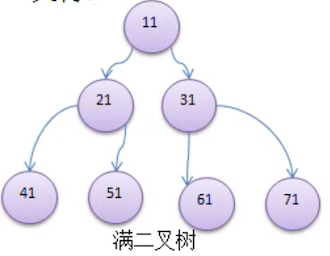
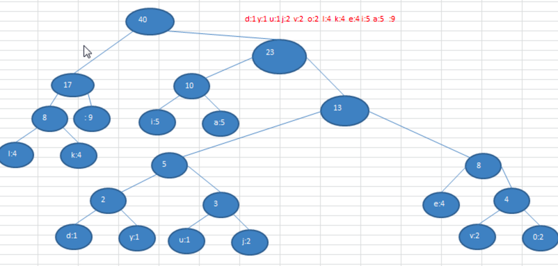

# 查找算法

## 线性查找

### Java

```java
    /**
     * 线性查找
     * @param data 要查找的数据
     * @param target 要查找的值
     * @return 要查找数据的索引值
     */
    @Override
    int search(int[] data, int target) {
        for (int i = 0; i < data.length; i++) {
            if (data[i] == target) {
                return i;
            }
        }
        return -1;
    }

    @Override
    int[] searchAll(int[] data, int target) {
        List<Integer> list = new ArrayList<>();
        for (int i = 0; i < data.length; i++) {
            if (data[i] == target) {
                list.add(i);
            }
        }
        int[] result = new int[list.size()];
        for (int i = 0; i < list.size(); i++) {
            result[i] = list.get(i);
        }
        return result;
    }
```


### Python

```python

```

## 二分查找法

### 思想

> int mid = left + (right - left) *1/2

递归条件：

* 如果左指针大于右指针，则停止递归。

* 如果找到了，则停止递归。

递归方式：

* 如果 target 小于当前位置的值，则代表没有找到，向左边找，注意右指针为 mid - 1。
* 如果 target 大于当前位置的值，则代表没有找到，向右边找，注意左指针为 mid +1。

### Java

```java
    /**
     * 二分查找法:
     * 递归条件:
     *  递归条件：如果左指针大于右指针，则停止递归
     *  如果找到了，则停止递归
     * 递归方式：
     *  如果target小于当前位置的值，则代表没有找到，向左边找，注意右指针为mid-1
     *  如果target大于当前位置的值，则代表没有找到，向左边找，注意左指针为mid+1
     *
     * @param data
     * @param target
     * @param left
     * @param right
     * @return
     */
    private static int binarySearch(int[] data, int target, int left, int right) {
        if (left > right) {
            return -1;
        }
        int mid = (left + right) / 2;
        int midValue = data[mid];
        if (target == midValue) {
            return mid;
        } else if (target < midValue) {
            return binarySearch(data, target, left, mid - 1);
        } else {
            return binarySearch(data, target, mid + 1, right);
        }
    }

    /**
     * 二分查找法
     * 递归查找:
     * 递归条件：如果左指针大于右指针，则停止递归
     * 如果找到了，则再找找该位置左边有没有一样的值，右边有没有一样的值，将他们的位置都放入结果中返回结束递归
     * 递归方式：
     * 如果target小于当前位置的值，则代表没有找到，向左边找，注意右指针为mid-1
     * 如果target大于当前位置的值，则代表没有找到，向左边找，注意左指针为mid+1
     *
     * @param data   原序列
     * @param target 目标数据
     * @param left   左指针
     * @param right  右指针
     * @return 所有找到的索引位置
     */
    private static List<Integer> binarySearchAll(int[] data, int target, int left, int right) {
        List result = new ArrayList();
        if (left > right) {
            return result;
        }
        int mid = (left + right) / 2;
        int midValue = data[mid];
        if (target == midValue) {
            //找到了，向左右继续查找是否有一样的
            int l = mid - 1;
            while (l >= 0) {
                if (data[l] != target) {
                    break;
                }
                result.add(l--);
            }
            result.add(mid);
            int r = mid + 1;
            while (r <= data.length - 1) {
                if (data[r] != target) {
                    break;
                }
                result.add(r++);
            }
            return result;
        } else if (target < midValue) {
            return binarySearchAll(data, target, left, mid - 1);
        } else {
            return binarySearchAll(data, target, mid + 1, right);
        }
    }
```


### Python

```python
```


## 插值查找算法

### 思想

**插值查找算法**

>int mid = left + (right - left) * (target - data[left]) / (data[right] - data[left])

- 插值查找算法的思路与二分查找法一致。
- 区别在于：
  - 二分查找的 `mid` 为 `left + 1/2 * 序列长度`。
  - 插值查找的 `mid` 为 `left + 查找的值的范围在序列索引长度中的比例`。

注意:

插值查找，因为mid是根据查找值计算出来的，如果查找值用户输入的值不在要查找的序列范围中，则查找时可能会越界，所以每次查找时要判断当前值在查找的序列之中


### Java

```java
 @Override
    public int search(int[] data, int target) {

        return interpolationSearch(data, 0, data.length - 1, target);
    }

    private int interpolationSearch(int[] data, int left, int right, int target) {

        if (left > right
                || target < data[left]
                || target > data[right]) {
            return -1;
        }
        int mid = left + (right - left) * (target - data[left]) / (data[right] - data[left]);
        if (target == data[mid]) {
            return mid;
        } else if (target > data[mid]) {
            return interpolationSearch(data, mid + 1, right, target);
        } else {
            return interpolationSearch(data, left, mid - 1, target);
        }
    }


    @Override
    public int[] searchAll(int[] data, int target) {
        List<Integer> list = interpolationSearchAll(data, 0, data.length - 1, target);
        int result[] = new int[list.size()];
        for (int i = 0; i < list.size(); i++) {
            result[i] = list.get(i);
        }
        return result;
    }

    private List<Integer> interpolationSearchAll(int[] data, int left, int right, int target) {

        if (left > right
                || target < data[left]
                || target > data[right]) {
            return new ArrayList<>();
        }
        int mid = left + (right - left) * (target - data[left]) / (data[right] - data[left]);
        if (target == data[mid]) {
            List<Integer> result = new ArrayList();
            int midLeft = mid - 1;
            while (midLeft >= 0 && data[midLeft] == target) {
                result.add(midLeft--);
            }
            result.add(mid);
            int midRight = mid + 1;
            while (midRight <= data.length - 1 && data[midRight] == target) {
                result.add(midRight++);
            }
            return result;
        } else if (target > data[mid]) {
            return interpolationSearchAll(data, mid + 1, right, target);
        } else {
            return interpolationSearchAll(data, left, mid - 1, target);
        }
    }
```


### Python

```python
```


### 总结

其实二分查找和插值查找的本质思想是一样的。区别在于二分查找确定 `mid` 位置在序列的一半，而插值查找的基本原理是根据目标元素与数组首尾元素的差值比例，估计目标元素在数组中的大致位置，并根据该估计来动态调整搜索范围。


## 斐波那契查找

### 思想


- 插值查找算法的思路与二分查找法一致。
- 区别在于：
  - 二分查找的 `mid` 为 `left + 1/2 * 序列长度`。
  - 斐波那契查找的 `mid` 为 `left + 当前序列长度的斐波那契分割点-1`。

因为斐波那契数列前后值的比例符合黄金分割点

所以我们每次查找序列时，都要获取到当前序列的长度，然后去斐波那契数列中找到和这个长度接近的值，然后去找这个值前面的值作为黄金分割点即可


### 递归法

#### 思路

**递归算法思想:**

- 插值查找算法的思路与二分查找法一致。
- 区别在于：
  - 二分查找的 `mid` 为 `left + 1/2 * 序列长度`。
  - 斐波那契查找的 `mid` 为 `left + 当前序列长度的斐波那契分割点-1`。

因为斐波那契数列前后值的比例符合黄金分割点

所以我们每次查找序列时，都要获取到当前序列的长度，然后去斐波那契数列中找到和这个长度接近的值，然后去找这个值前面的值作为黄金分割点即可


#### Java

```java
    /**
     * fibonacci查找
     * 按照斐波那契数列分割
     *
     * @param data   要查找的数据
     * @param target 要查找的值
     * @return
     */
    @Override
    public int search(int[] data, int target) {
        //构建斐波那契数列
        int[] f = fibs(data.length);
        return fibonacciSearch(data, f, 0, data.length - 1, target);
    }


    private int fibonacciSearch(int[] data, int[] f, int left, int right, int target) {
        if (left > right) {
            return -1;
        }
				
      	//长度对应的斐波那契值前面的数就是黄金分割点
        int fibIndex = 0;
        int currentLength = right - left + 1;
        for (int i = 0; i < f.length; i++) {
            if (f[i] >= currentLength) {
                fibIndex = i;
                break;
            }
        }
        int fibStep = 1;//黄金分割点
        if (fibIndex != 0) {
            fibStep = f[fibIndex - 1];
        }
        int mid = left + fibStep - 1;
        if (target == data[mid]) {
            return mid;
        } else if (target < data[mid]) {
            return fibonacciSearch(data, f, left, mid - 1, target);
        } else {
            return fibonacciSearch(data, f, mid + 1, right, target);
        }
    }

    /**
     * 根据序列长度构建斐波那契数列
     *
     * @param size
     * @return
     */
    private static int[] fibs(int size) {
        List<Integer> fibs = new ArrayList<Integer>() {{
            this.add(0, 1);
            this.add(1, 1);
        }};
        int i = 2;
        while (true) {
            fibs.add(i, fibs.get(i - 1) + fibs.get(i - 2));
            if (fibs.get(i) >= size) {
                break;
            }
            i = i + 1;
        }
        int result[] = new int[fibs.size()];
        for (int j = 0; j < fibs.size(); j++) {
            result[j] = fibs.get(j);
        }
        return result;
    }

```


#### Python

```python
```


### 遍历法

#### 思路

思路和递归法一致

将是将递归循环调用的逻辑放到while循环中做，当left>right时停止循环，找到了也停止循环

循环结束还没找到，则返回-1

#### Java

```java
    /**
     * fibonacci查找
     * 按照斐波那契数列分割
     *
     * @param data   要查找的数据
     * @param target 要查找的值
     * @return
     */
    @Override
    public int search(int[] data, int target) {
        //构建斐波那契数列
        int[] f = fibs(data.length);
        return fibonacciSearch(data, f, target);
    }


    private int fibonacciSearch(int[] data, int[] f, int target) {
        int left = 0;
        int right = data.length - 1;


        while (left <= right) {
            /**
             * 计算斐波那契偏移量：
             * 拿到当前长度对应的斐波那契值，当前值的前面那个值就是斐波那契偏移量
             * 拿到斐波那契偏移量，当前left+偏移量-1就是当前mid
             */
            int fibIndex = 0;
            int currentLength = right - left + 1;
            for (int i = 0; i < f.length; i++) {
                if (f[i] >= currentLength) {
                    fibIndex = i;
                    break;
                }
            }
            int fibStep = 1; //斐波那契偏移量
            if (fibIndex != 0) {
                fibStep = f[fibIndex - 1];
            }
            int mid = left + fibStep - 1;
            if (target == data[mid]) {
                return mid;
            } else if (target < data[mid]) {
                right = mid - 1;
            } else {
                left = mid + 1;
            }
        }
        return -1;
    }

    @Override
    int[] searchAll(int[] data, int target) {
        return new int[0];
    }


    /**
     * 根据序列长度构建斐波那契数列
     *
     * @param size
     * @return
     */
    private static int[] fibs(int size) {
        List<Integer> fibs = new ArrayList<Integer>() {{
            this.add(0, 1);
            this.add(1, 1);
        }};
        int i = 2;
        while (true) {
            fibs.add(i, fibs.get(i - 1) + fibs.get(i - 2));
            if (fibs.get(i) >= size) {
                break;
            }
            i = i + 1;
        }
        int result[] = new int[fibs.size()];
        for (int j = 0; j < fibs.size(); j++) {
            result[j] = fibs.get(j);
        }
        return result;
    }
```


#### Python

```python

```


# 哈希表

## 使用数组加链表实现哈希表


### Java

```java
public static void main(String[] args) {
        IHashTable<String, String> table = new IHashTable<>(10);

        Scanner sc = new Scanner(System.in);
        while (true) {
            System.out.println("功能:");
            System.out.println("1. add");
            System.out.println("2. show");
            System.out.println("3. exit");
            System.out.println("4. findById");
            System.out.println("5. removeById");
            String input = sc.next();
            int id;
            String key;
            String value;
            switch (input) {
                case "1":
                    System.out.println("请输入要输入的id:");
                    id = sc.nextInt();
                    System.out.println("请输入key:");
                    key = sc.next();
                    System.out.println("请输入value:");
                    value = sc.next();
                    table.put(id, key, value);
                    break;
                case "2":
                    table.show();
                    break;
                case "3":
                    sc.close();
                    System.exit(0);
                    break;
                case "4":
                    System.out.println("请输入要查找的id:");
                    id = sc.nextInt();
                    Node<String, String> entry = table.findById(id);
                    System.out.println(entry);
                    break;
                case "5":
                    System.out.println("请输入要删除的id:");
                    id = sc.nextInt();
                    table.removeById(id);
                    break;
                default:
                    System.out.println("输入错误请重新输入");
                    break;
            }
        }


    }

    private static String randomString(int size) {
        StringBuilder sbd = new StringBuilder();

        for (int j = 0; j < size; j++) {
            int random = new Random().nextInt('z' - 'a' + 1) + 'a';
            for (int i = 'a'; i <= 'z'; i++) {
                if (random == i) {
                    sbd.append((char) i);
                }
            }
        }
        return sbd.toString();
    }


    public static class IHashTable<K, V> {
        private LinkedNode<K, V>[] tables;
        private int size;

        public IHashTable(int size) {
            this.size = size;
            tables = new LinkedNode[size];
            for (int i = 0; i < tables.length; i++) {
                tables[i] = new LinkedNode<>();
            }
        }

        public void put(int id, K key, V value) {
            int index = hash(id);
            tables[index].add(new Node<K, V>(id, key, value));
        }

        public void show() {
            for (int i = 0; i < tables.length; i++) {
                LinkedNode<K, V> table = tables[i];
                table.show(i);
            }
        }


        private int hash(int id) {
            return id % this.size;
        }

        public Node<K, V> findById(int id) {
            int index = hash(id);
            return tables[index].findById(id);
        }

        public void removeById(int id) {
            int index = hash(id);
            tables[index].removeById(id);
        }
    }

    public static class LinkedNode<K, V> {
        private Node<K, V> head;

        /**
         * 将节点加入链表结尾
         *
         * @param node
         */
        public void add(Node<K, V> node) {
            if (head == null) {
                head = node;
                return;
            }
            Node<K, V> current = head;
            while (true) {
                if (current.getNext() == null) {
                    break;
                }
                current = current.getNext();
            }
            current.setNext(node);
        }

        /**
         * 展示当前链表的数据
         *
         * @param linkedNo
         */
        public void show(int linkedNo) {
            System.out.printf("%d --> ", linkedNo);
            Node<K, V> current = head;
            while (current != null) {
                System.out.printf("id:%s, key: %s,value: %s\t",
                        current.getId(), current.getKey(), current.getValue());
                current = current.getNext();
            }
            System.out.println();
        }

        public Node<K, V> findById(int id) {
            Node<K, V> current = head;
            while (current != null) {
                if (current.getId() == id) {
                    return current;
                }
                current = current.getNext();
            }
            return null;
        }

        public void removeById(int id) {
            Node<K, V> current = head;
            if (current.getId() == id) {
                head = head.getNext();
                System.out.println("删除成功");
                return;
            }
            while (true) {
                if (current.getNext() == null) {
                    System.out.println("未找到");
                    break;
                }
                if (current.getNext().getId() == id) {
                    current.setNext(current.getNext().getNext());
                    System.out.println("删除成功");
                }
                current = current.getNext();
            }
        }
    }

    /**
     * 节点
     *
     * @param <K>
     * @param <V>
     */
    public static class Node<K, V> {
        private int id;
        private K key;
        private V value;
        private Node next;

        public Node() {
        }

        public Node(int id, K key, V value) {
            this.id = id;
            this.key = key;
            this.value = value;
        }

        public void setNext(Node next) {
            this.next = next;
        }

        public Node getNext() {
            return next;
        }

        public int getId() {
            return id;
        }

        public K getKey() {
            return key;
        }

        public V getValue() {
            return value;
        }

        @Override
        public String toString() {
            return "{" +
                    "id=" + id +
                    ",key=" + key +
                    ", value=" + value +
                    '}';
        }
    }
```


### Python

```python
```


# 树

## 为什么需要树这种数据结构

### 数组存储方式的分析

#### 优点

通过下标方式访问元素，速度快

对于有序数组，可以使用二分查找提高检索速度

#### 缺点

如果要插入或删除某个值会整体移动，效率较低


### 链式存储方式的分析

#### 优点

插入和删除相对数组快，只需要重新连接指针即可

#### 缺点

检索效率低，访问指定位置的结点时需要遍历查找


所以就出现了树这种数据结构


### 树存储方式的分析

提供数据 **存储** 、**读取** 效率。

例如：利用 **二叉排序树（Binary Sort Tree）**，既可以保证数据的检索速度，同时也可以保证数据的**插入**、**删除**、**修改** 的速度


如图所示：

- 插入时，小的数在 **左节点**、大的数在 **右节点**
- 查找时：根据插入事的特性，基本上就类似折半查找了，每次都过滤一半的节点
- 删除时：只需要移动相邻的节点的引用


## 树的常用术语


- 节点：每一个圆圈表示一个节点，也称节点对象

- 根节点：最上面，最顶部的那个节点，也就是一棵树的入口

- 父节点：有子节点的节点

- 子节点

- 叶子节点：没有子节点的节点

- 节点的权：可以简单的理解为节点值

  有时候也用 **路径** 来表示

- 路径：从 root 节点找到该节点的路线

- 层

- 子树：有子节点的父子两层就可以称为是一个子树

- 树的高度：最大层数

- 森林：多颗子树构成森林

## 二叉树的概念

- 树有很多种，每个节点 **最多只能有两个子节点** 的一种形式称为 **二叉树**
- 二叉树的子节点分为 **左节点** 和 **右节点**


### 满二叉树

如果该二叉树的所有 **叶子节点** 都在 **最后一层**，并且 **节点总数 =** 2n-1 （n 为层数），则我们称为 **满二叉树**




### 完全二叉树

如果该二叉树的所有叶子节点都在最 **后一层或倒数第二层**，而且 **最后一层的叶子节点在左边连续**，**倒数第二层的叶子节点在右边连续**，我们称为 **完全二叉树**


## 二叉树的遍历


### 前序遍历

遍历顺序：根左右

1,2,3,5,4


### 中序遍历

遍历顺序：左根右

2,1,5,3,4

### 后序遍历

遍历顺序：左右根

2,5,4,3,1


### 代码

#### Java

```java
package com.watermelon.tree;

public class A01BinaryTree {

    public static void main(String[] args) {
        HeroNode root = new HeroNode(1, "张三");
        HeroNode node2 = new HeroNode(2, "李四");
        HeroNode node3 = new HeroNode(3, "王老五");
        HeroNode node4 = new HeroNode(4, "朱重八");
        HeroNode node5 = new HeroNode(5, "刘大力");
        root.setLeft(node2);
        root.setRight(node3);
        node3.setLeft(node5);
        node3.setRight(node4);

        Binary binary = new Binary(root);
        binary.preOrder();
        binary.infixOrder();
        binary.postOrder();
    }
}

class Binary {
    private HeroNode root;

    public Binary(HeroNode root) {
        this.root = root;
    }

    public void preOrder() {
        if (this.root == null) {
            System.out.println("根节点为空");
            return;
        }
        System.out.println("前序遍历：");
        this.root.preOrder();
    }

    public void infixOrder() {
        if (this.root == null) {
            System.out.println("根节点为空");
            return;
        }
        System.out.println("中序遍历：");
        System.out.println();
        this.root.infixOrder();
    }

    public void postOrder() {
        if (this.root == null) {
            System.out.println("根节点为空");
            return;
        }
        System.out.println("后序遍历：");
        this.root.postOrder();
    }
}

class HeroNode {
    private int no;
    private String name;
    private HeroNode left;
    private HeroNode right;

    public HeroNode(int no, String name) {
        this.no = no;
        this.name = name;
    }

    public HeroNode getLeft() {
        return left;
    }

    public void setLeft(HeroNode left) {
        this.left = left;
    }

    public HeroNode getRight() {
        return right;
    }

    public void setRight(HeroNode right) {
        this.right = right;
    }

    @Override
    public String toString() {
        return "HeroNode{" +
                "no=" + no +
                ", name='" + name + '\'' +
                '}';
    }

    /**
     * 前序遍历
     * 根左右
     */
    public void preOrder() {
        System.out.println(this);
        if (this.left != null) {
            this.left.preOrder();
        }
        if (this.right != null) {
            this.right.preOrder();
        }
    }

    /**
     * 中序遍历
     * 左根右
     */
    public void infixOrder() {
        if (this.left != null) {
            this.left.infixOrder();
        }
        System.out.println(this);
        if (this.right != null) {
            this.right.infixOrder();
        }
    }

    /**
     * 后序遍历
     * 左右根
     */
    public void postOrder() {
        if (this.left != null) {
            this.left.postOrder();
        }
        if (this.right != null) {
            this.right.postOrder();
        }
        System.out.println(this);
    }
}
```


#### Python

```python
```


## 二叉树的查找

### Java

```java
        /**
         * 前序查找
         * 根左右
         */
        public HeroNode preSearch(int no) {
            System.out.println("前序查找中:" + this.no);
            HeroNode current = this;
            if (current.no == no) {
                return current;
            }
            if (this.left != null) {
                current = this.left.preSearch(no);
                if (current != null) {
                    return current;
                }
            }
            if (this.right != null) {
                current = this.right.preSearch(no);
                if (current != null) {
                    return current;
                }
            }
            return null;
        }

        /**
         * 中序查找
         * 左根右
         */
        public HeroNode infixSearch(int no) {

            HeroNode current;
            if (this.left != null) {
                current = this.left.infixSearch(no);
                if (current != null) {
                    return current;
                }
            }
            System.out.println("中序查找中:" + this.no);
            if (this.no == no) {
                return this;
            }
            if (this.right != null) {
                current = this.right.infixSearch(no);
                if (current != null) {
                    return current;
                }
            }
            return null;
        }

        /**
         * 后序查找
         * 左右根
         */
        public HeroNode postSearch(int no) {
            HeroNode current;
            if (this.left != null) {
                current = this.left.postSearch(no);
                if (current != null) {
                    return current;
                }
            }
            if (this.right != null) {
                current = this.right.postSearch(no);
                if (current != null) {
                    return current;
                }
            }
            System.out.println("后序查找中:" + this.no);
            if (this.no == no) {
                return this;
            }
            return null;
        }
```


### Python

```python
```


## 二叉树节点的删除(不完整版)

要求：

1. 如果删除的节点是 **叶子节点**，则删除该节点
2. 如果删除的节点是非叶子节点，则删除该子树

### 思路

- 由于我们的二叉树是单向的

- 所以我们判定一个节点是否可以删除，是判断它的 **子节点**，是否可删除，否则则没法回到父节点删除了，因为要判断被删除的节点满足前面的两点要求

  1. 当前节点的 **左子节点** 不为空，并且左子节点就是要删除的节点，则 left = null，并且返回（结束递归删除）
  2. 当前节点的 **右子节点** 不为空，并且右子节点就是要删除的节点，则 right = null，并且返回（结束递归删除）

  如果前面都没有删除，则继续递归删除。上面的要求是 2 点，实际上是，找到符合条件的节点则直接删除（因为不考虑是否有子树）

  如果树只有一个 root 节点，则将 root 节点置空

### 代码

#### Java

```java
public class A03BinaryTreeDelete {

    public static void main(String[] args) {
        HeroNode root = new HeroNode(1, "张三");
        HeroNode node2 = new HeroNode(2, "李四");
        HeroNode node3 = new HeroNode(3, "王老五");
        HeroNode node4 = new HeroNode(4, "朱重八");
        HeroNode node5 = new HeroNode(5, "刘大力");
        root.setLeft(node2);
        root.setRight(node3);
        node3.setLeft(node5);
        node3.setRight(node4);

        Binary binary = new Binary(root);
        binary.preOrder();
        System.out.println("----------删除后---------");
        binary.delNode(3);
        binary.preOrder();

    }

    public static class Binary {
        private HeroNode root;

        public Binary(HeroNode root) {
            this.root = root;
        }

        public void delNode(int no) {
            if (root == null) {
                return;
            }
            if (root.no == no) {
                root = null;
                return;
            }
            root.delNode(no);
        }

        public void preOrder() {
            if (root == null) {
                return;
            }
            root.preOrder();
        }
    }

    public static class HeroNode {
        private int no;
        private String name;
        private HeroNode left;
        private HeroNode right;

        public HeroNode(int no, String name) {
            this.no = no;
            this.name = name;
        }

        public HeroNode getLeft() {
            return left;
        }

        public void setLeft(HeroNode left) {
            this.left = left;
        }

        public HeroNode getRight() {
            return right;
        }

        public void setRight(HeroNode right) {
            this.right = right;
        }

        @Override
        public String toString() {
            return "HeroNode{" +
                    "no=" + no +
                    ", name='" + name + '\'' +
                    '}';
        }


        public boolean delNode(int no) {
            if (this.left != null) {
                if (this.left.no == no) {
                    this.left = null;
                    return true;
                }
            }
            if (this.right != null) {
                if (this.right.no == no) {
                    this.right = null;
                    return true;
                }
            }
            if (this.left != null) {
                if (this.left.delNode(no)) {
                    return true;
                }
            }
            if (this.right != null) {
                if (this.right.delNode(no)) {
                    return true;
                }
            }

            return false;
        }

        public void preOrder() {
            System.out.println(this);
            if (this.left != null) {
                this.left.preOrder();
            }
            if (this.right != null) {
                this.right.preOrder();
            }
        }
    }
}
```


#### Python

```python
```


### 课后练习


如上二叉树：

- 删除 1，则所有都删除了
- 删除 3，则删除的有 3、5、4

现在要求，考虑子树的情况，如：

- 删除 1，则保留 2，但是 1， 3，5，4 会被删除掉
- 删除 3，则保留 5，但是 3，4 会被删除掉


思路:

```
先判断删除的是否是根节点，如果是根节点，要单独处理
然后判断删除的是否是左节点，如果不是左节点，再判断是否是右节点
如果都不是，则递归的判断是否是左节点，递归判断是否是右节点
还不是，则返回false，代表没有找到
```


```java
package com.watermelon.tree;

public class A03BinaryTreeDeletePractice {

    public static void main(String[] args) {
        HeroNode root = new HeroNode(1, "张三");
        HeroNode node2 = new HeroNode(2, "李四");
        HeroNode node3 = new HeroNode(3, "王老五");
        HeroNode node4 = new HeroNode(4, "朱重八");
        HeroNode node5 = new HeroNode(5, "刘大力");
        root.setLeft(node2);
        root.setRight(node3);
        node3.setLeft(node5);
        node3.setRight(node4);

        Binary binary = new Binary(root);
        binary.preOrder();
        System.out.println("----------删除后---------");
        binary.delNode(3);
        binary.preOrder();

    }

    public static class Binary {
        private HeroNode root;

        public Binary(HeroNode root) {
            this.root = root;
        }

        /**
         * 先判断删除的是否是根节点，如果是根节点，要单独处理
         * 然后判断删除的是否是左节点，如果不是左节点，再判断是否是右节点
         * 如果都不是，则递归的判断是否是左节点，递归判断是否是右节点
         * 还不是，则返回false，代表没有找到
         *
         * @param no
         */
        public void delNode(int no) {
            if (root == null) {
                return;
            }

            if (root.no == no) {
                if (root.left == null && root.right == null) {
                    root = null;
                    return;
                } else if (this.root.left != null) {
                    //左节点不为空
                    root = root.left;
                } else {
                    //右节点不为空
                    root = root.right;
                }
                return;
            }
            root.delNode(no);
        }

        public void preOrder() {
            if (root == null) {
                return;
            }
            root.preOrder();
        }
    }

    public static class HeroNode {
        private int no;
        private String name;
        private HeroNode left;
        private HeroNode right;

        public HeroNode(int no, String name) {
            this.no = no;
            this.name = name;
        }

        public HeroNode getLeft() {
            return left;
        }

        public void setLeft(HeroNode left) {
            this.left = left;
        }

        public HeroNode getRight() {
            return right;
        }

        public void setRight(HeroNode right) {
            this.right = right;
        }

        @Override
        public String toString() {
            return "HeroNode{" +
                    "no=" + no +
                    ", name='" + name + '\'' +
                    '}';
        }


        public boolean delNode(int no) {

            if (this.left != null) {
                if (this.left.no == no) {
                    if (this.left.left != null) {
                        this.left = this.left.left;
                    } else if (this.left.right != null) {
                        this.left = this.left.right;
                    } else {
                        this.left = null;
                    }
                    return true;
                }
            }
            if (this.right != null) {
                if (this.right.no == no) {
                    if (this.right.left != null) {
                        this.right = this.right.left;
                    } else if (this.right.right != null) {
                        this.right = this.right.right;
                    } else {
                        this.right = null;
                    }
                    return true;
                }
            }
            if (this.left != null) {
                if (this.left.delNode(no)) {
                    return true;
                }
            }
            if (this.right != null) {
                if (this.right.delNode(no)) {
                    return true;
                }
            }
            return false;
        }


        public void preOrder() {
            System.out.println(this);
            if (this.left != null) {
                this.left.preOrder();
            }
            if (this.right != null) {
                this.right.preOrder();
            }
        }
    }
}
```


## 序列存储的二叉树

从数据存储来看，**数组存储** 方式和 **树** 的存储方式可以 **相互转换**。即使数组可以转换成树，树也可以转换成数组。如下示意图


上图阅读说明：

- 圆圈顶部的数字对应了数组中的索引
- 圆圈内部的值对应的数数组元素的值

现在有两个要求：

1. 上图的二叉树的节点，要求以数组的方式来存储 `arr=[1,2,3,4,5,6,7]`
2. 要求在遍历数组 arr 时，仍然可以以 前序、中序、后序的方式遍历


### 特点

想要 实现上面的两个要求，需要知道顺序存储二叉树的特点：

1. 顺序二叉树 通常只考虑 **完全二叉树**
2. 第 n 个元素的 **左子节点** 为 `2*n+1`
3. 第 n 个元素的 **右子节点** 为 `2*n+2`
4. 第 n 个元素的 **父节点** 为 `(n-1)/2`

注：n 表示二叉树中的第几个元素（按 0 开始编号）

比如：

- 元素 2 的左子节点为：`2 * 1 + 1 = 3`，对比上图去查看，的确是 3
- 元素 2 的右子节点为：`2 * 1 + 2 = 4`，也 就是元素 5
- 元素 3 的左子节点为：`2 * 2 + 1 = 5`，也就是元素 6
- 元素 3 的父节点为: `(2-1)/2= 1/2 = 0`，也就是根节点 1


### 前序打印

使用如上的知识点，进行前序遍历，需求：将数组 `arr=[1,2,3,4,5,6,7]`，以二叉树前序遍历的方式进行遍历，遍历结果为 `1、2、4、5、3、6`


```java
package com.watermelon.tree;


/**
 * 将顺序存储的二叉树 以 前序、中序、后序的方式打印
 * 左节点索引值为 2*n+1
 * 右节点索引值为 2*n+2
 * 父节点索引值为 (n-1)/2
 */
public class A04ArrayToPreOrder {
    public static void main(String[] args) {
        int[] data = {1, 2, 3, 4, 5, 6, 7};
        ArrayToPrint printer = new ArrayToPrint(data);
        printer.prePrint();
    }

    public static class ArrayToPrint {
        private int[] data;

        public ArrayToPrint(int[] data) {
            this.data = data;
        }

        public void prePrint() {
            prePrint(0);
        }

        /**
         * 前序的方式打印:递归方式
         * 左节点索引值为 2*n+1
         * 右节点索引值为 2*n+2
         * 1,2,4,5,3,6,7
         *
         * @param index 当前索引值
         */
        private void prePrint(int index) {
            if (data == null || data.length == 0) {
                return;
            }
            System.out.println(data[index]);
            if (2 * index + 1 < data.length) {
                prePrint(2 * index + 1);
            }
            if (2 * index + 2 < data.length) {
                prePrint(2 * index + 2);
            }
        }
}

```


### 中序打印

```java
package com.watermelon.tree;


/**
 * 将顺序存储的二叉树 以 前序、中序、后序的方式打印
 * 左节点索引值为 2*n+1
 * 右节点索引值为 2*n+2
 * 父节点索引值为 (n-1)/2
 */
public class A04ArrayToPreOrder {
    public static void main(String[] args) {
        int[] data = {1, 2, 3, 4, 5, 6, 7};
        ArrayToPrint printer = new ArrayToPrint(data);
        printer.infixPrint();
    }

    public static class ArrayToPrint {
        private int[] data;

        public ArrayToPrint(int[] data) {
            this.data = data;
        }
      
        public void infixPrint() {
            infixPrint(0);
        }

        /**
         * 中序打印
         * 4,2,5,1,6,3,7
         *
         * @param index
         */
        private void infixPrint(int index) {
            if (data == null || data.length == 0) {
                return;
            }
            if (2 * index + 1 < data.length) {
                infixPrint(2 * index + 1);
            }

            System.out.println(data[index]);

            if (2 * index + 2 < data.length) {
                infixPrint(2 * index + 2);
            }
        }
    }
}

```


### 后序打印

```java
package com.watermelon.tree;


/**
 * 将顺序存储的二叉树 以 前序、中序、后序的方式打印
 * 左节点索引值为 2*n+1
 * 右节点索引值为 2*n+2
 * 父节点索引值为 (n-1)/2
 */
public class A04ArrayToPreOrder {
    public static void main(String[] args) {
        int[] data = {1, 2, 3, 4, 5, 6, 7};
        ArrayToPrint printer = new ArrayToPrint(data);
        printer.postPrint();
    }

    public static class ArrayToPrint {
        private int[] data;

        public ArrayToPrint(int[] data) {
            this.data = data;
        }

        public void postPrint() {
            postPrint(0);
        }


        /**
         * 后序打印
         * 4,5,2,6,7,3,1
         *
         * @param index
         */
        private void postPrint(int index) {
            if (data == null || data.length == 0) {
                return;
            }
            if (2 * index + 1 < data.length) {
                postPrint(2 * index + 1);
            }
            if (2 * index + 2 < data.length) {
                postPrint(2 * index + 2);
            }
            System.out.println(data[index]);
        }
    }
}
```


## 线索化二叉树

### 概念

n 个节点的二叉树链表中含有 `n + 1` 个空指针域，他的推导公式为 `2n-(n-1) = n + 1`。

利用二叉链表中的空指针域，存放指向该节点在 **某种遍历次序 \**下的 \*\*前驱\*\* 和 \*\*后继\*\* 节点的指针，这种附加的指针称为\**「线索」**

- 前驱：一个节点的前一个节点
- 后继：一个节点的后一个节点

如下图:


可以看到上图的二叉树为一颗 **完全二叉树**。对他进行分析，可以发现如下的一些问题：

1. 当对上面的二叉树进行中序遍历时，数列为 `8,3,10,1,14,6`
2. 但是 `6,8,10,14` 这几个节点的左右指针，并没有完全用上

如果希望充分利用各个节点的左右指针，让各个节点可以 **指向自己的前后节点**，这个时候就可以使用 **线索化二叉树** 了


### 作用

二叉树线索化是一种将普通二叉树转换为具有特殊线索（指向前驱和后继节点）的二叉树的过程。这种线索化的目的是为了提高对二叉树的遍历效率，特别是在不使用递归或栈的情况下进行遍历。

将二叉树线索化的主要目的是为了提高对二叉树的遍历效率以及节省存储空间。线索化使得在不使用递归或栈的情况下可以更快速地进行遍历，特别是在特定顺序的遍历时，如前序、中序或后序遍历。 

* 提高遍历效率：线索化后，可以在常量时间内找到节点的前驱和后继节点，从而实现更高效的遍历。这对于需要频繁遍历大型二叉树或需要在树的中间部分执行插入和删除操作时特别有用。

* 无需递归或栈：线索化的二叉树允许你在遍历时省去递归或栈的开销，因为你可以沿着线索直接访问节点的前驱和后继，从而降低了内存和时间复杂度。

* 节省存储空间：线索化可以用较少的额外存储空间来实现。通常，只需为每个节点添加一个或两个指针来存储线索信息，而不需要额外的数据结构（如堆栈）来辅助遍历。

* 支持双向遍历：线索化的二叉树可以支持双向遍历，即可以在给定节点的前向和后向方向上遍历树。这在某些应用中很有用，例如双向链表的操作。

* 节省计算资源：在某些特定的应用场景中，通过线索化可以避免重复计算，因为可以直接访问前驱和后继节点，而无需再次搜索或遍历


### 中序线索化二叉树代码

#### 思路

主要还是利用递归中序遍历的思想

先直接递归遍历到最左边的节点

在获取到当前节点时，如果发现当前节点的左节点为空，则指定左指针为上一个节点

如果上一个节点的右节点为空，则指定右指针指向当前节点

确定好后，记录当前节点为下一个节点，开始下一次递归


#### Java

```java
package com.watermelon.tree;


/**
 * 线索化二叉树
 */
public class A05ThreadedBinaryTree {
    public static void main(String[] args) {
        HeroNode n1 = new HeroNode(1, "张三");
        HeroNode n3 = new HeroNode(3, "李四");
        HeroNode n6 = new HeroNode(6, "王老五");
        HeroNode n8 = new HeroNode(8, "老六");
        HeroNode n10 = new HeroNode(10, "朱");
        HeroNode n14 = new HeroNode(14, "赵四");
        n1.setLeft(n3);
        n1.setRight(n6);
        n3.setLeft(n8);
        n3.setRight(n10);
        n6.setLeft(n14);
        ThreadedBinaryTree tree = new ThreadedBinaryTree(n1);
        tree.preThreadedNodes();
        tree.preOrder();
        //8,3,10,1,14,6
//        System.out.printf("当前节点:%d,左节点:%d,右节点:%d\n", node4.id, node4.left.id, node4.right.id);
        System.out.printf("当前节点:%d,左节点:%d,右节点:%d\n", n10.id, n10.left.id, n10.right.id);
        System.out.printf("当前节点:%d,左节点:%d,右节点:%d\n", n14.id, n14.left.id, n14.right);

        System.out.printf("当前节点:%d,左节点:%d,右节点:%d\n", n6.id, n6.left.id, n6.right.id);
//        tree.preOrder();
    }

    public static class ThreadedBinaryTree {
        private HeroNode root;
        private HeroNode pre;

        public ThreadedBinaryTree(HeroNode root) {
            this.root = root;
        }

        public void infixThreadedNodes() {
            this.infixThreadedNodes(this.root);
        }

        public void preThreadedNodes() {
            this.preThreadedNodes(this.root);
        }

        /**
         * 线索化二叉树
         * 使用中序线索化二叉树
         * 8,3,10,1,14,6
         */
        private void infixThreadedNodes(HeroNode node) {
            if (node == null) {
                return;
            }
            //向左递归
            infixThreadedNodes(node.left);
            /**
             * 处理当前节点
             * 如果当前节点的左节点为空，则将左指针指向前驱节点
             * 如果当前节点的右节点为空，由于二叉树节点并没有回路指针，所以先用pre记住当前节点
             * 然后在回溯到上一个节点时，可以用pre.right = current_node来确定pre节点的后续节点
             */
            if (node.left == null) {
                node.left = pre;
                node.leftType = 1;
            }
            if (pre != null && pre.right == null) {
                pre.right = node;
                pre.rightType = 1;
            }
            this.pre = node;
            //向右递归
            infixThreadedNodes(node.right);
        }

    }

    public static class HeroNode {
        private int id;
        private String name;
        private HeroNode left;
        private HeroNode right;
        /**
         * 左指针类型
         * 0:左子树
         * 1:前驱节点
         */
        private int leftType;
        /**
         * 右指针类型
         * 0:右子树
         * 1:后继节点
         */
        private int rightType;
    }


}

```

#### Python

```python
```


### 中序线索化二叉树的遍历

#### 思路

顺序还是要用中序遍历的思想

先遍历左边到左边的结尾，中途不打印，到结尾再打印

然后遍历后续指针指向的节点，要打印

最后将当前节点设置为迭代的节点，循环上面的步骤


#### 代码

##### Java

```java
        /**
         * 线索二叉树的中序遍历
         */
        private void infixOrder() {
            HeroNode node = this.root;
            while (node != null) {
                while (node.leftType == 0) {
                    node = node.left;
                }
                System.out.println(node);
                while (node.rightType == 1) {
                    node = node.right;
                    System.out.println(node);
                }
                node = node.right;
            }
        }
```


##### Python
```python
```


### 前序线索化二叉树及遍历

#### 思路

线索化时，利用前序遍历的思想

直接获取当前节点，如果当前节点的左指针为空，则左指针指向上一个节点

如果该节点的右节点为空，则记当前点为上一个节点，在遍历到下一个节点时，上一个节点的右指针指向的后驱节点就是当前节点。

每次遍历都要把当前节点记录为上一个节点

然后左递归

回溯完，然后右递归。

#### 代码

##### Java

```java
package com.watermelon.tree;


/**
 * 线索化二叉树
 */
public class A05ThreadedBinaryTree {
    public static void main(String[] args) {
        HeroNode n1 = new HeroNode(1, "张三");
        HeroNode n3 = new HeroNode(3, "李四");
        HeroNode n6 = new HeroNode(6, "王老五");
        HeroNode n8 = new HeroNode(8, "老六");
        HeroNode n10 = new HeroNode(10, "朱");
        HeroNode n14 = new HeroNode(14, "赵四");
        n1.setLeft(n3);
        n1.setRight(n6);
        n3.setLeft(n8);
        n3.setRight(n10);
        n6.setLeft(n14);
        ThreadedBinaryTree tree = new ThreadedBinaryTree(n1);
        tree.preThreadedNodes();
        tree.preOrder();
        //8,3,10,1,14,6
//        System.out.printf("当前节点:%d,左节点:%d,右节点:%d\n", node4.id, node4.left.id, node4.right.id);
        System.out.printf("当前节点:%d,左节点:%d,右节点:%d\n", n10.id, n10.left.id, n10.right.id);
        System.out.printf("当前节点:%d,左节点:%d,右节点:%d\n", n14.id, n14.left.id, n14.right);

        System.out.printf("当前节点:%d,左节点:%d,右节点:%d\n", n6.id, n6.left.id, n6.right.id);
//        tree.preOrder();
    }

    public static class ThreadedBinaryTree {
        private HeroNode root;
        private HeroNode pre;

        public ThreadedBinaryTree(HeroNode root) {
            this.root = root;
        }

        public void preThreadedNodes() {
            this.preThreadedNodes(this.root);
        }

        /**
         * 线索化二叉树
         * 使用前序线索化二叉树
         * 1,3,8,10,6,14
         */
        private void preThreadedNodes(HeroNode node) {
            if (node == null) {
                return;
            }
            if (node.left == null) {
                node.left = pre;
                node.leftType = 1;
            }

            if (pre != null && pre.right == null) {
                pre.right = node;
                pre.rightType = 1;
            }

            this.pre = node;
            if (node.leftType == 0) {
                preThreadedNodes(node.left);
            }

            if (node.rightType == 0) {
                preThreadedNodes(node.right);
            }

        }

        /**
         * 前序遍历线索二叉树
         */
        public void preOrder() {
            HeroNode node = this.root;
            System.out.println(node);

            while (node.leftType == 0) {
                System.out.println(node.left);
                node = node.left;
            }
            while (node.rightType == 1) {
                System.out.println(node.right);
                node = node.right;
            }

        }

    }

    public static class HeroNode {
        private int id;
        private String name;
        private HeroNode left;
        private HeroNode right;
        /**
         * 左指针类型
         * 0:左子树
         * 1:前驱节点
         */
        private int leftType;
        /**
         * 右指针类型
         * 0:右子树
         * 1:后继节点
         */
        private int rightType;
    }
}
```


##### Python

```python
```


### 后序线索化二叉树及遍历

#### 思路

线索化时，利用后序遍历的思想

先递归左指针

再递归右指针

回溯到当前指针时，直接获取当前节点，如果当前节点的左指针为空，则左指针指向上一个节点

如果该节点的右节点为空，则记当前点为上一个节点，在遍历到下一个节点时，上一个节点的右指针指向的后驱节点就是当前节点。

每次遍历都要把当前节点记录为上一个节点


遍历思路:

后续遍历时要记住，后序遍历在后续节点遍历完后，会出现没有指针指向下一个要遍历的节点的情况，所以要借用parent指针，线索化时，要顺便把parent的指针的赋值指向好，然后这里遇到指针没有指向下一个要遍历的节点时，就可以使用父指针的右指针继续遍历。


#### 代码

##### Java

```java
package com.watermelon.tree;


/**
 * 线索化二叉树
 */
public class A05ThreadedBinaryTree {
    public static void main(String[] args) {
        HeroNode n1 = new HeroNode(1, "张三");
        HeroNode n3 = new HeroNode(3, "李四");
        HeroNode n6 = new HeroNode(6, "王老五");
        HeroNode n8 = new HeroNode(8, "老六");
        HeroNode n10 = new HeroNode(10, "朱");
        HeroNode n14 = new HeroNode(14, "赵四");
        n1.setLeft(n3);
        n1.setRight(n6);
        n3.setLeft(n8);
        n3.setRight(n10);
        n6.setLeft(n14);
        ThreadedBinaryTree tree = new ThreadedBinaryTree(n1);
        tree.postThreadedNodes();
        tree.postOrder();
        //8,3,10,1,14,6
        System.out.printf("当前节点:%d,左节点:%d,右节点:%d\n", n8.id, n8.left, n8.right.id);
        System.out.printf("当前节点:%d,左节点:%d,右节点:%d\n", n10.id, n10.left.id, n10.right.id);
        System.out.printf("当前节点:%d,左节点:%d,右节点:%d\n", n14.id, n14.left.id, n14.right.id);

        System.out.printf("当前节点:%d,左节点:%d,右节点:%d\n", n6.id, n6.left.id, n6.right.id);
//        tree.preOrder();
    }

    public static class ThreadedBinaryTree {
        private HeroNode root;
        private HeroNode pre;

        public ThreadedBinaryTree(HeroNode root) {
            this.root = root;
        }
      
        public void postThreadedNodes() {
            this.postThreadedNodes(this.root);
        }

        /**
         * 线索化二叉树
         * 使用后序遍历线索化二叉树
         * 8,10,3,14,6,1
         */
        private void postThreadedNodes(HeroNode node) {
            if (node == null) {
                return;
            }
            if (node.left != null) {
                node.left.setParent(node);
                postThreadedNodes(node.left);
            }
            if (node.right != null) {
                node.right.setParent(node);
                postThreadedNodes(node.right);
            }
            if (node.left == null) {
                node.left = pre;
                node.leftType = 1;
            }
            if (pre != null && pre.right == null) {
                pre.right = node;
                pre.rightType = 1;
            }
            pre = node;
        }


        private void postOrder() {
            HeroNode node = root;
            while (node != null) {
                while (node.leftType == 0) {
                    node = node.left;
                }
                while (node.rightType == 1) {
                    System.out.println(node);
                    node = node.right;
                }
                System.out.println(node);
                if (node.parent != null) {
                    node = node.parent.right;//这一步一定要，因为后序遍历会有个指针没有指向下一个节点，只能回到父节点的右节点继续
                } else {
                    node = null;
                }
            }
        }
    }

    public static class HeroNode {
        private int id;
        private String name;
        private HeroNode left;
        private HeroNode right;
        /**
         * 后序遍历才需要用到
         */
        private HeroNode parent;
        /**
         * 左指针类型
         * 0:左子树
         * 1:前驱节点
         */
        private int leftType;
        /**
         * 右指针类型
         * 0:右子树
         * 1:后继节点
         */
        private int rightType;
    }


}

```


##### Python

```python
```


## 堆

### 堆的概念

堆是具有堆序性的完全二叉树

* 大顶堆

  每个节点的值都 **大于或等于** 其左右孩子节点的值

  

  此堆在数组中的表示如下图:
  
  
  大顶堆特点：`arr[i] >= arr[2*i+1] && arr[i] >= arr[2*i+2]`，i 对应第几个节点，i 从 0 开始编号
  
  

* 小顶堆
  每个节点的值都 **小于或等于** 其左右孩子节点的值

  
  小顶堆特点：`arr[i] <= arr[2*i+1] && arr[i] <= arr[2*i+2]`，i 对应第几个节点，i 从 0 开始
  
  注：堆序性没有要求左右值的大小关系

### 堆排序

https://www.bilibili.com/video/BV1aj411M71h/?spm_id_from=333.337.search-card.all.click

- 升序：一般采用大顶堆
- 降序：一般采用小顶堆

要实现堆排序，需要知道完全二叉树的以下知识

1. 最后一个非叶子结点的索引值为: n/2-1
2. 任意一个结点的左子节点索引为: 2*n+1
3. 任意一个节点的右子节点索引为: 2*n+2

#### 思路

升序排序主要分两步

1. 循环这个步骤直到当前索引值从最后一个非叶子结点到了堆顶

   ​	将当前结点的完全二叉树序列调整成大顶堆序列

2. 循环下面这个步骤直到完全二叉树的长度为0

   ​	交换堆顶和堆尾的位置,交换好后，此时的堆尾就是已经排好序的序列了

   ​	从堆顶开始调整完全二叉树序列(此时不需要包括已经排好序的序列)，又得到个大顶堆

调整完全二叉树成为大顶堆的思路:

* 递归实现思路:

	1. 对于当前节点，比较其与左右子节点的大小关系，如果存在左右子节点且左右节点中的较大者大于当前节点，则将较大的子节点与当前节点交换位置。

	2. 如果发生了交换操作，继续递归调整被交换节点的子树，以确保子树也满足大顶堆的性质。
* 非递归实现思路:
  1. 循环操作：  
     1. 比较当前节点与其左右子节点的大小关系，如果存在左右子节点且左右节点中的较大者大于当前节点，则将较大的子节点与当前节点交换位置。
     2. 如果发生了交换操作，将当前交换的节点设置为当前节点，继续循环操作，以确保子树也满足大顶堆的性质。
  2. 结束条件： 
     1. 如果循环中没有发生交换操作，证明已经是大顶堆。 
     2. 如果当前节点的左右节点都越界了，即没有左右子节点，证明当前节点已经是最后一层叶子结点了。


#### 代码

##### Java

```java
package com.watermelon.sort;


public class B08HeapSortV1 extends B00Sort {

    public static void main(String[] args) {
//        int[] array = {3, 7, 1, 2, 6, 8, 0, 9, 4};
        int[] array = B00Sort.randomArray(800_0000);
        new B08HeapSortV1("递归堆排序").executeAndTime(array);
//        System.out.println(Arrays.toString(array));
    }

    public B08HeapSortV1(String name) {
        super(name);
    }

    /**
     * 堆排序
     *
     * @param data
     */
    @Override
    public void sort(int[] data) {
        //遍历当前要排序的堆
        /**
         * 1. 循环这个步骤直到当前索引值从最后一个非叶子结点到了堆顶
         *      将当前结点的完全二叉树序列调整成大顶堆序列
         * 2. 循环下面这个步骤直到完全二叉树的长度为0
         *      交换堆顶和堆尾的位置,交换好后，此时的堆尾就是已经排好序的序列了
         *      从堆顶开始调整完全二叉树序列(此时不需要包括已经排好序的序列)，又得到个大顶堆
         */
        int len = data.length;
        for (int i = len / 2 - 1; i >= 0; i--) {
            /**
             * 从最后一个非叶子结点开始调整堆-->得到大顶堆序列
             */
            adjustHeap(data, i, len);
        }
        for (int i = len - 1; i > 0; i--) {
            /**
             * 循环下面这个步骤直到完全二叉树的长度为0
             *  交换堆顶和堆尾的位置,交换好后，此时的堆尾就是已经排好序的序列了
             *  从堆顶开始调整完全二叉树序列(此时不需要包括已经排好序的序列)，又得到个大顶堆
             */
            swap(data, 0, i);//堆排序完，交换堆顶和队尾的位置
            adjustHeap(data, 0, i);//从对顶开始下沉排序
        }
    }
  
    /**
     * 对堆顶位置为i的子堆进行下沉堆排序,非递归操作
     * 循环操作
     * 1. 对于当前节点，比较其与左右子节点的大小关系，如果存在左右子节点且左右节点中的较大者大于当前节点，则将较大的子节点与当前节点交换位置。
     * 2. 如果发生了交换操作，将当前交换的节点设置为当前节点，继续循环操作，以确保子树也满足大顶堆的性质。】
     * 什么时候结束:
     * 1. 没发生交换，证明已经是大顶堆了
     * 2. 当前节点的左右节点都越界了，则证明当前节点已经是最后一层叶子结点了
     *
     * @param data
     * @param i    非叶子结点
     * @param len  属于堆的序列长度
     */
    private static void adjustHeap(int[] data, int i, int len) {
        int left;
        int right;
        while (true) {
            left = 2 * i + 1;
            right = 2 * i + 2;
            if (right < len) {
                //有左节点和右节点
                if (data[left] < data[right]) {
                    //right更大
                    if (data[i] < data[right]) {
                        swap(data, right, i);
                        i = right;
                    } else {
                        break;
                    }
                } else {
                    //left更大
                    if (data[i] < data[left]) {
                        swap(data, left, i);
                        i = left;
                    } else {
                        break;
                    }
                }
            } else if (left < len) {
                //只有一个左节点
                if (data[i] < data[left]) {
                    swap(data, left, i);
                } else {
                    break;
                }
            } else {
                //左右节点都越界了
                break;
            }
        }
    }
  
    /**
     * 对堆顶位置为i的子堆进行下沉堆排序，递归操作
     * 1. 对于当前节点，比较其与左右子节点的大小关系，如果存在左右子节点且左右节点中的较大者大于当前节点，则将较大的子节点与当前节点交换位置。
     * 2. 如果发生了交换操作，继续递归调整被交换节点的子树，以确保子树也满足大顶堆的性质。
     *
     * @param data
     * @param i    非叶子结点
     * @param len  属于堆的序列长度
     */
    private static void adjustHeap1(int[] data, int i, int len) {
        int left = 2 * i + 1;
        int right = 2 * i + 2;
        if (right < len) {
            //有左节点和右节点
            if (data[left] < data[right]) {
                //right更大
                if (data[i] < data[right]) {
                    swap(data, right, i);
                    adjustHeap(data, right, len);
                }
            } else {
                //left更大
                if (data[i] < data[left]) {
                    swap(data, left, i);
                    adjustHeap(data, left, len);
                }
            }
        } else if (left < len) {
            //只有一个左节点
            if (data[i] < data[left]) {
                swap(data, left, i);
            }
        }
    }

    private static void swap(int[] data, int i, int j) {
        int temp = data[j];
        data[j] = data[i];
        data[i] = temp;
    }
}

```


## 赫夫曼树

https://www.bilibili.com/video/BV1kD4y1P76D/?spm_id_from=333.788&vd_source=b151a3d9d3902335a95fde17253afa9f

### 概念

1. 给定 n 个 **权值** 作为 n 个 **叶子节点**，构造一颗二叉树，**若该树的 带权路径长度（WPL）达到最小**，称这样的二叉树为 **最优二叉树**，也称为 **哈夫曼树（Huffman Tree）**，还有的叫 霍夫曼树
2. 赫夫曼树是带全路径长度最短的树，权值较大的节点离根节点较近

### 重要概念

- **路径** 和 **路径长度**：

  在一颗树中，**从一个节点往下可以到达的孩子或孙子节点之间的通路**，称为 **路径**。

  **通路中分支的数目称为路径长度**。若规定根节点的层数为 1，则从根节点到第 L 层节点的路径长度为 L-1

- **节点的权** 及 **带权路径长度**

  若将树中节点赋给一个有着某种函数的数值，则这个数值称为该节点的 **权**。

  节点的带权路径长度为：从根节点到该节点之间的路径长度与该节点的权的乘积。

- 树的带权路径长度

  **所有叶子节点的带权路径长度之和**，记为 WPL（weighted path length），权值越大的节点离根节点越近的二叉树才是最优二叉树

- WPL 最小的就是赫夫曼树


​	如上图：

- 权：元素的值
- 路径长度：一个节点到另一个节点的一段路，就叫路径长度
- 带权路径长度：从根节点到 13 有几条路径长度，则是他的带权路径长度
- 树的带权路径长度：（图上的带全路径长度所指的是 树的带全路径长度）


### 将无序数列转成赫夫曼树

#### 思路

1. 将数列用节点对象包裹，存入链表中

2. 遍历链表，直到链表中仅剩一个元素

   将链表从小到大排序

   将数列的前两个取出，作为左子节点，右子节点

   计算左子节点右子节点的权值之和，作为父节点，将父节点加入到链表中

3. 将链表中仅剩的节点取出，这个节点就是赫夫曼树的根节点


#### 代码

##### Java

```java
package com.watermelon.tree;

import java.util.Arrays;
import java.util.LinkedList;
import java.util.List;

/**
 * 将一个序列转换成一棵赫夫曼树
 */
public class A06HuffmanTree {

    public static void main(String[] args) {
        int[] array = {13, 7, 8, 3, 29, 6, 1};
        Arrays.sort(array);
        //[1, 3, 6, 7, 8, 13, 29]
        List<Node> data = new LinkedList<>();
        for (int i = 0; i < array.length; i++) {
            data.add(new Node(array[i]));
        }
        Node node = toHuffmanTree(data);
        node.preOrder();
    }

    private static Node toHuffmanTree(List<Node> data) {
        while (data.size() > 1) {
            Node left = data.get(0);
            Node right = data.get(1);

            data.remove(0);
            data.remove(0);

            Node parent = new Node(left.value + right.value);
            parent.setLeft(left);
            parent.setRight(right);

            //获得链表中比parent.value大的值的索引,如果没有的话，则追加到结尾，有则插入到当前节点

            int index = -1;
            for (int i = 0; i < data.size(); i++) {
                if (data.get(i).value >= parent.value) {
                    index = i;
                    break;
                }
            }
            if (index == -1) {
                data.add(parent);
            } else {
                data.add(index, parent);
            }
        }
        return data.get(0);
    }

    public static class Node {
        private int value;
        private Node left;
        private Node right;

        public Node(int value) {
            this.value = value;
        }

        public Node getLeft() {
            return left;
        }

        public void setLeft(Node left) {
            this.left = left;
        }

        public Node getRight() {
            return right;
        }

        public void setRight(Node right) {
            this.right = right;
        }

        @Override
        public String toString() {
            return "Node{" +
                    "value=" + value +
                    '}';
        }

        public void preOrder() {
            preOrder(this);
        }


        /**
         * 前序遍历
         *
         * @param node
         */
        private static void preOrder(Node node) {
            System.out.println(node);
            if (node.left != null) {
                preOrder(node.left);
            }
            if (node.right != null) {
                preOrder(node.right);
            }
        }
    }
}
```


##### Python

```python
```


是不是有一个疑问？给定的数组是 `13,7,8,3,29,6,1`，变成树之后，怎么找回原来的数据？一定要记得赫夫曼树的特点：**它的数据都在叶子节点，父节点是通过叶子节点相加得到的**


## 赫夫曼编码

- 赫夫曼编码也翻译为 **哈夫曼编码(Huffman Coding)**，又称霍夫曼编码，是一种 **编码方式**,，属于一种 **程序算法**
- 赫夫曼编码是 **赫哈夫曼树** 在电讯通信中的经典的应用之一。
- 赫夫曼编码广泛地用于 **数据文件压缩**。其压缩率通常在 20%～90% 之间
- 赫夫曼码是 **可变字长编码(VLC)** 的一种。Huffman 于 1952 年提出一种编码方法，称之为最佳编码

### 定长编码

```text
// 原始字符，共40个字符(包括空格) 
i like like like java do you like a java     
// 对应 Ascii 码
105 32 108 105 107 101 32 108 105 107 101 32 108 105 107 101 32 106 97 118 97 32 100 111 32 121 111 117 32 108 105 107 101 32 97 32 106 97 118 97  
// Ascii 码对应的二进制
01101001 00100000 01101100 01101001 01101011 01100101 00100000 01101100 01101001 01101011 01100101 00100000 01101100 01101001 01101011 01100101 00100000 01101010 01100001 01110110 01100001 00100000 01100100 01101111 00100000 01111001 01101111 01110101 00100000 01101100 01101001 01101011 01100101 00100000 01100001 00100000 01101010 01100001 01110110 01100001
```

按照二进制来传递信息，总的长度是 359 (包括空格)；[在线转码工具](https://www.mokuge.com/tool/asciito16/)

### 变长编码

```text
// 原始字符，共40个字符(包括空格) 
i like like like java do you like a java  
// 各个字符对应的个数
d:1 y:1 u:1 j:2  v:2  o:2  l:4  k:4  e:4 i:5  a:5   :9 
// 按照各个字符出现的次数进行编码，原则是出现次数越多的，则编码越小，比如 空格出现了 9 次， 编码为 0 ,其它依次类推.
// 等号前面的数字就是就是赫夫曼树节点的带权路径，后面讲解为什么
0=  ,  1=a, 10=i, 11=e, 100=k, 101=l, 110=o, 111=v, 1000=j, 1001=u, 1010=y, 1011=d
```


按照上面给各个字符规定的编码，对于原始字符 `i like like like java do you like a java`，进行编码时，对应的编码为：

```text
i 空格  l   i   k
10  0   101 10 100 ...
传输的编码就是：10010110100 ...
```

**注意：** 字符的编码都不能是其他字符编码的前缀，符合此要求的编码叫做 **前缀编码**，即不能匹配到重复的编码。（下面会详细讲解）

### 赫夫曼编码

```text
// 原始字符，共40个字符(包括空格) 
i like like like java do you like a java  
// 各个字符对应的个数
d:1 y:1 u:1 j:2  v:2  o:2  l:4  k:4  e:4 i:5  a:5   :9 
```


按照上面字符出现的次数构建一颗赫夫曼树，次数作为权值。

构建好的赫夫曼树如下图：


根据赫夫曼树，给各个字符规定编码（前缀编码）：

- 向左的路径为 0
- 向右的路径为 1

那么编码如下：

```text
o: 1000   u: 10010   d: 100110   y: 100111   i: 101
a: 110    k: 1110    e: 1111     j: 0000     v: 0001
l: 001     : 01
```

按照上面给出的各个字符的 **前缀编码（赫夫曼编码）**，`i like like like java do you like a java` 字符串对应的编码为 (注意这里我们使用的 **无损压缩**)

```text
1010100110111101111010011011110111101001101111011110100001100001110011001111000011001111000100100100110111101111011100100001100001110
```

此编码总长度为：133，原始的定长编码长度为 359，压缩了 `359-133/359=62.9%`。

此编码满足前缀编码，即字符的编码都不能是其他字符编码的前缀。不会造成匹配的多义性，比如：

```text
比如前面的这一串编码：101010011011110
 i 空格  l    i   k
101 01  001 101 1110
```

简单说就是：上面给出的每个字符的编码都是唯一的

### 注意事项

赫夫曼树 **根据排序方法不同**，也可能不太一样，这样对应的 **赫夫曼编码** 也不完全一样，但是 WPL 是一样的，都是最小的，最后生成的赫夫曼编码的长度是一样。

什么意思呢：比如这个数列 `4,4,4,4,4,4,4,5,6,7`，有很多相同的树节点，每次取最小的两个组成一颗新树：

```text
原始：4,4,4,4,4,4,4,5,6,7
第一次：4,4,4,4,4,5,6,7,8    # 处理排序之后，减少了两个 4，多了一个 8 的树
第二次：4,4,4,5,6,7,8,8			 # 处理排序之后，减少了两个 4，多了一个 8 的树
```

那么问题就来了：相同的权值，你怎么排序？这个就是排序不稳定。导致后面每次重新生成树的编码都对应不上同一个字符。

但是他们的 WPL 是一样的，也就是最后用赫夫曼编码之后的数据长度都是一样的（压缩程度是一样的）。

下面对比下规则的不同，生成的树不同：

前面给出的图是：每次生成新的二叉树排在相同权值的前面


下面是每次生成新的二叉树总是排在权值相同的二叉树的最后一个，则生成二叉树为：



最明显的就是右下角的，`2+2=4`，第一张图是放在左下角的的 4 节点下，这里是放在右下角的 4 节点下

### 代码

#### 数据压缩

##### 思路

> 1. 统计要压缩的数据每个字符出现的次数，从小到大排序
>
> 2. 以次数为权值构建Huffman树
>
> 3. 计算每个huffman的叶子节点的前缀编码，向左为0，向右为1
>
>    使用前缀查找的方式查找叶子节点，记录下查找路径，left为0，right为1
>
>    得到 字符->前缀编码的哈希表
>
> 4. 使用前缀编码表替换要压缩的数据

##### Java

```java
```


##### Python

```python
```

