# 查找算法

## 线性查找

### Java

```java
    /**
     * 线性查找
     * @param data 要查找的数据
     * @param target 要查找的值
     * @return 要查找数据的索引值
     */
    @Override
    int search(int[] data, int target) {
        for (int i = 0; i < data.length; i++) {
            if (data[i] == target) {
                return i;
            }
        }
        return -1;
    }

    @Override
    int[] searchAll(int[] data, int target) {
        List<Integer> list = new ArrayList<>();
        for (int i = 0; i < data.length; i++) {
            if (data[i] == target) {
                list.add(i);
            }
        }
        int[] result = new int[list.size()];
        for (int i = 0; i < list.size(); i++) {
            result[i] = list.get(i);
        }
        return result;
    }
```


### Python

```python

```

## 二分查找法

### 思想

> int mid = left + (right - left) *1/2

递归条件：

* 如果左指针大于右指针，则停止递归。

* 如果找到了，则停止递归。

递归方式：

* 如果 target 小于当前位置的值，则代表没有找到，向左边找，注意右指针为 mid - 1。
* 如果 target 大于当前位置的值，则代表没有找到，向右边找，注意左指针为 mid +1。

### Java

```java
    /**
     * 二分查找法:
     * 递归条件:
     *  递归条件：如果左指针大于右指针，则停止递归
     *  如果找到了，则停止递归
     * 递归方式：
     *  如果target小于当前位置的值，则代表没有找到，向左边找，注意右指针为mid-1
     *  如果target大于当前位置的值，则代表没有找到，向左边找，注意左指针为mid+1
     *
     * @param data
     * @param target
     * @param left
     * @param right
     * @return
     */
    private static int binarySearch(int[] data, int target, int left, int right) {
        if (left > right) {
            return -1;
        }
        int mid = (left + right) / 2;
        int midValue = data[mid];
        if (target == midValue) {
            return mid;
        } else if (target < midValue) {
            return binarySearch(data, target, left, mid - 1);
        } else {
            return binarySearch(data, target, mid + 1, right);
        }
    }

    /**
     * 二分查找法
     * 递归查找:
     * 递归条件：如果左指针大于右指针，则停止递归
     * 如果找到了，则再找找该位置左边有没有一样的值，右边有没有一样的值，将他们的位置都放入结果中返回结束递归
     * 递归方式：
     * 如果target小于当前位置的值，则代表没有找到，向左边找，注意右指针为mid-1
     * 如果target大于当前位置的值，则代表没有找到，向左边找，注意左指针为mid+1
     *
     * @param data   原序列
     * @param target 目标数据
     * @param left   左指针
     * @param right  右指针
     * @return 所有找到的索引位置
     */
    private static List<Integer> binarySearchAll(int[] data, int target, int left, int right) {
        List result = new ArrayList();
        if (left > right) {
            return result;
        }
        int mid = (left + right) / 2;
        int midValue = data[mid];
        if (target == midValue) {
            //找到了，向左右继续查找是否有一样的
            int l = mid - 1;
            while (l >= 0) {
                if (data[l] != target) {
                    break;
                }
                result.add(l--);
            }
            result.add(mid);
            int r = mid + 1;
            while (r <= data.length - 1) {
                if (data[r] != target) {
                    break;
                }
                result.add(r++);
            }
            return result;
        } else if (target < midValue) {
            return binarySearchAll(data, target, left, mid - 1);
        } else {
            return binarySearchAll(data, target, mid + 1, right);
        }
    }
```


### Python

```python
```


## 插值查找算法

### 思想

**插值查找算法**

>int mid = left + (right - left) * (target - data[left]) / (data[right] - data[left])

- 插值查找算法的思路与二分查找法一致。
- 区别在于：
  - 二分查找的 `mid` 为 `left + 1/2 * 序列长度`。
  - 插值查找的 `mid` 为 `left + 查找的值的范围在序列索引长度中的比例`。

注意:

插值查找，因为mid是根据查找值计算出来的，如果查找值用户输入的值不在要查找的序列范围中，则查找时可能会越界，所以每次查找时要判断当前值在查找的序列之中


### Java

```java
 @Override
    public int search(int[] data, int target) {

        return interpolationSearch(data, 0, data.length - 1, target);
    }

    private int interpolationSearch(int[] data, int left, int right, int target) {

        if (left > right
                || target < data[left]
                || target > data[right]) {
            return -1;
        }
        int mid = left + (right - left) * (target - data[left]) / (data[right] - data[left]);
        if (target == data[mid]) {
            return mid;
        } else if (target > data[mid]) {
            return interpolationSearch(data, mid + 1, right, target);
        } else {
            return interpolationSearch(data, left, mid - 1, target);
        }
    }


    @Override
    public int[] searchAll(int[] data, int target) {
        List<Integer> list = interpolationSearchAll(data, 0, data.length - 1, target);
        int result[] = new int[list.size()];
        for (int i = 0; i < list.size(); i++) {
            result[i] = list.get(i);
        }
        return result;
    }

    private List<Integer> interpolationSearchAll(int[] data, int left, int right, int target) {

        if (left > right
                || target < data[left]
                || target > data[right]) {
            return new ArrayList<>();
        }
        int mid = left + (right - left) * (target - data[left]) / (data[right] - data[left]);
        if (target == data[mid]) {
            List<Integer> result = new ArrayList();
            int midLeft = mid - 1;
            while (midLeft >= 0 && data[midLeft] == target) {
                result.add(midLeft--);
            }
            result.add(mid);
            int midRight = mid + 1;
            while (midRight <= data.length - 1 && data[midRight] == target) {
                result.add(midRight++);
            }
            return result;
        } else if (target > data[mid]) {
            return interpolationSearchAll(data, mid + 1, right, target);
        } else {
            return interpolationSearchAll(data, left, mid - 1, target);
        }
    }
```


### Python

```python
```


### 总结

其实二分查找和插值查找的本质思想是一样的。区别在于二分查找确定 `mid` 位置在序列的一半，而插值查找的基本原理是根据目标元素与数组首尾元素的差值比例，估计目标元素在数组中的大致位置，并根据该估计来动态调整搜索范围。


## 斐波那契查找

### 思想


- 插值查找算法的思路与二分查找法一致。
- 区别在于：
  - 二分查找的 `mid` 为 `left + 1/2 * 序列长度`。
  - 斐波那契查找的 `mid` 为 `left + 当前序列长度的斐波那契分割点-1`。

因为斐波那契数列前后值的比例符合黄金分割点

所以我们每次查找序列时，都要获取到当前序列的长度，然后去斐波那契数列中找到和这个长度接近的值，然后去找这个值前面的值作为黄金分割点即可


### 递归法

#### 思路

**递归算法思想:**

- 插值查找算法的思路与二分查找法一致。
- 区别在于：
  - 二分查找的 `mid` 为 `left + 1/2 * 序列长度`。
  - 斐波那契查找的 `mid` 为 `left + 当前序列长度的斐波那契分割点-1`。

因为斐波那契数列前后值的比例符合黄金分割点

所以我们每次查找序列时，都要获取到当前序列的长度，然后去斐波那契数列中找到和这个长度接近的值，然后去找这个值前面的值作为黄金分割点即可


#### Java

```java
    /**
     * fibonacci查找
     * 按照斐波那契数列分割
     *
     * @param data   要查找的数据
     * @param target 要查找的值
     * @return
     */
    @Override
    public int search(int[] data, int target) {
        //构建斐波那契数列
        int[] f = fibs(data.length);
        return fibonacciSearch(data, f, 0, data.length - 1, target);
    }


    private int fibonacciSearch(int[] data, int[] f, int left, int right, int target) {
        if (left > right) {
            return -1;
        }
				
      	//长度对应的斐波那契值前面的数就是黄金分割点
        int fibIndex = 0;
        int currentLength = right - left + 1;
        for (int i = 0; i < f.length; i++) {
            if (f[i] >= currentLength) {
                fibIndex = i;
                break;
            }
        }
        int fibStep = 1;//黄金分割点
        if (fibIndex != 0) {
            fibStep = f[fibIndex - 1];
        }
        int mid = left + fibStep - 1;
        if (target == data[mid]) {
            return mid;
        } else if (target < data[mid]) {
            return fibonacciSearch(data, f, left, mid - 1, target);
        } else {
            return fibonacciSearch(data, f, mid + 1, right, target);
        }
    }

    /**
     * 根据序列长度构建斐波那契数列
     *
     * @param size
     * @return
     */
    private static int[] fibs(int size) {
        List<Integer> fibs = new ArrayList<Integer>() {{
            this.add(0, 1);
            this.add(1, 1);
        }};
        int i = 2;
        while (true) {
            fibs.add(i, fibs.get(i - 1) + fibs.get(i - 2));
            if (fibs.get(i) >= size) {
                break;
            }
            i = i + 1;
        }
        int result[] = new int[fibs.size()];
        for (int j = 0; j < fibs.size(); j++) {
            result[j] = fibs.get(j);
        }
        return result;
    }

```


#### Python

```python
```


### 遍历法

#### 思路

思路和递归法一致

将是将递归循环调用的逻辑放到while循环中做，当left>right时停止循环，找到了也停止循环

循环结束还没找到，则返回-1

#### Java

```java
    /**
     * fibonacci查找
     * 按照斐波那契数列分割
     *
     * @param data   要查找的数据
     * @param target 要查找的值
     * @return
     */
    @Override
    public int search(int[] data, int target) {
        //构建斐波那契数列
        int[] f = fibs(data.length);
        return fibonacciSearch(data, f, target);
    }


    private int fibonacciSearch(int[] data, int[] f, int target) {
        int left = 0;
        int right = data.length - 1;


        while (left <= right) {
            /**
             * 计算斐波那契偏移量：
             * 拿到当前长度对应的斐波那契值，当前值的前面那个值就是斐波那契偏移量
             * 拿到斐波那契偏移量，当前left+偏移量-1就是当前mid
             */
            int fibIndex = 0;
            int currentLength = right - left + 1;
            for (int i = 0; i < f.length; i++) {
                if (f[i] >= currentLength) {
                    fibIndex = i;
                    break;
                }
            }
            int fibStep = 1; //斐波那契偏移量
            if (fibIndex != 0) {
                fibStep = f[fibIndex - 1];
            }
            int mid = left + fibStep - 1;
            if (target == data[mid]) {
                return mid;
            } else if (target < data[mid]) {
                right = mid - 1;
            } else {
                left = mid + 1;
            }
        }
        return -1;
    }

    @Override
    int[] searchAll(int[] data, int target) {
        return new int[0];
    }


    /**
     * 根据序列长度构建斐波那契数列
     *
     * @param size
     * @return
     */
    private static int[] fibs(int size) {
        List<Integer> fibs = new ArrayList<Integer>() {{
            this.add(0, 1);
            this.add(1, 1);
        }};
        int i = 2;
        while (true) {
            fibs.add(i, fibs.get(i - 1) + fibs.get(i - 2));
            if (fibs.get(i) >= size) {
                break;
            }
            i = i + 1;
        }
        int result[] = new int[fibs.size()];
        for (int j = 0; j < fibs.size(); j++) {
            result[j] = fibs.get(j);
        }
        return result;
    }
```


#### Python

```python

```


# 树

## 为什么需要树这种数据结构

### 数组存储方式的分析

#### 优点

通过下标方式访问元素，速度快

对于有序数组，可以使用二分查找提高检索速度

#### 缺点

如果要插入或删除某个值会整体移动，效率较低


### 链式存储方式的分析

#### 优点

插入和删除相对数组快，只需要重新连接指针即可

#### 缺点

检索效率低，访问指定位置的结点时需要遍历查找


所以就出现了树这种数据结构


### 树存储方式的分析

提供数据 **存储** 、**读取** 效率。

例如：利用 **二叉排序树（Binary Sort Tree）**，既可以保证数据的检索速度，同时也可以保证数据的**插入**、**删除**、**修改** 的速度


如图所示：

- 插入时，小的数在 **左节点**、大的数在 **右节点**
- 查找时：根据插入事的特性，基本上就类似折半查找了，每次都过滤一半的节点
- 删除时：只需要移动相邻的节点的引用


## 树的常用术语


- 节点：每一个圆圈表示一个节点，也称节点对象

- 根节点：最上面，最顶部的那个节点，也就是一棵树的入口

- 父节点：有子节点的节点

- 子节点

- 叶子节点：没有子节点的节点

- 节点的权：可以简单的理解为节点值

  有时候也用 **路径** 来表示

- 路径：从 root 节点找到该节点的路线

- 层

- 子树：有子节点的父子两层就可以称为是一个子树

- 树的高度：最大层数

- 森林：多颗子树构成森林

## 二叉树的概念

- 树有很多种，每个节点 **最多只能有两个子节点** 的一种形式称为 **二叉树**
- 二叉树的子节点分为 **左节点** 和 **右节点**


### 满二叉树

如果该二叉树的所有 **叶子节点** 都在 **最后一层**，并且 **节点总数 =** 2n-1 （n 为层数），则我们称为 **满二叉树**


### 完全二叉树

如果该二叉树的所有叶子节点都在最 **后一层或倒数第二层**，而且 **最后一层的叶子节点在左边连续**，**倒数第二层的叶子节点在右边连续**，我们称为 **完全二叉树**


## 二叉树的遍历


### 前序遍历

遍历顺序：根左右

1,2,3,5,4


### 中序遍历

遍历顺序：左根右

2,1,5,3,4

### 后序遍历

遍历顺序：左右根

2,5,4,3,1


### 代码

#### Java

```java
package com.watermelon.tree;

public class A01BinaryTree {

    public static void main(String[] args) {
        HeroNode root = new HeroNode(1, "张三");
        HeroNode node2 = new HeroNode(2, "李四");
        HeroNode node3 = new HeroNode(3, "王老五");
        HeroNode node4 = new HeroNode(4, "朱重八");
        HeroNode node5 = new HeroNode(5, "刘大力");
        root.setLeft(node2);
        root.setRight(node3);
        node3.setLeft(node5);
        node3.setRight(node4);

        Binary binary = new Binary(root);
        binary.preOrder();
        binary.infixOrder();
        binary.postOrder();
    }
}

class Binary {
    private HeroNode root;

    public Binary(HeroNode root) {
        this.root = root;
    }

    public void preOrder() {
        if (this.root == null) {
            System.out.println("根节点为空");
            return;
        }
        System.out.println("前序遍历：");
        this.root.preOrder();
    }

    public void infixOrder() {
        if (this.root == null) {
            System.out.println("根节点为空");
            return;
        }
        System.out.println("中序遍历：");
        System.out.println();
        this.root.infixOrder();
    }

    public void postOrder() {
        if (this.root == null) {
            System.out.println("根节点为空");
            return;
        }
        System.out.println("后序遍历：");
        this.root.postOrder();
    }
}

class HeroNode {
    private int no;
    private String name;
    private HeroNode left;
    private HeroNode right;

    public HeroNode(int no, String name) {
        this.no = no;
        this.name = name;
    }

    public HeroNode getLeft() {
        return left;
    }

    public void setLeft(HeroNode left) {
        this.left = left;
    }

    public HeroNode getRight() {
        return right;
    }

    public void setRight(HeroNode right) {
        this.right = right;
    }

    @Override
    public String toString() {
        return "HeroNode{" +
                "no=" + no +
                ", name='" + name + '\'' +
                '}';
    }

    /**
     * 前序遍历
     * 根左右
     */
    public void preOrder() {
        System.out.println(this);
        if (this.left != null) {
            this.left.preOrder();
        }
        if (this.right != null) {
            this.right.preOrder();
        }
    }

    /**
     * 中序遍历
     * 左根右
     */
    public void infixOrder() {
        if (this.left != null) {
            this.left.infixOrder();
        }
        System.out.println(this);
        if (this.right != null) {
            this.right.infixOrder();
        }
    }

    /**
     * 后序遍历
     * 左右根
     */
    public void postOrder() {
        if (this.left != null) {
            this.left.postOrder();
        }
        if (this.right != null) {
            this.right.postOrder();
        }
        System.out.println(this);
    }
}
```


#### Python

```python
```


总结:

在不使用辅助变量，辅助指针的情况下，最好借助递归的思想进行前中后序遍历


## 二叉树的查找

### Java

```java
        /**
         * 前序查找
         * 根左右
         */
        public HeroNode preSearch(int no) {
            System.out.println("前序查找中:" + this.no);
            HeroNode current = this;
            if (current.no == no) {
                return current;
            }
            if (this.left != null) {
                current = this.left.preSearch(no);
                if (current != null) {
                    return current;
                }
            }
            if (this.right != null) {
                current = this.right.preSearch(no);
                if (current != null) {
                    return current;
                }
            }
            return null;
        }

        /**
         * 中序查找
         * 左根右
         */
        public HeroNode infixSearch(int no) {

            HeroNode current;
            if (this.left != null) {
                current = this.left.infixSearch(no);
                if (current != null) {
                    return current;
                }
            }
            System.out.println("中序查找中:" + this.no);
            if (this.no == no) {
                return this;
            }
            if (this.right != null) {
                current = this.right.infixSearch(no);
                if (current != null) {
                    return current;
                }
            }
            return null;
        }

        /**
         * 后序查找
         * 左右根
         */
        public HeroNode postSearch(int no) {
            HeroNode current;
            if (this.left != null) {
                current = this.left.postSearch(no);
                if (current != null) {
                    return current;
                }
            }
            if (this.right != null) {
                current = this.right.postSearch(no);
                if (current != null) {
                    return current;
                }
            }
            System.out.println("后序查找中:" + this.no);
            if (this.no == no) {
                return this;
            }
            return null;
        }
```


### Python

```python
```


## 二叉树节点的删除(不完整版)

要求：

1. 如果删除的节点是 **叶子节点**，则删除该节点
2. 如果删除的节点是非叶子节点，则删除该子树

### 思路

- 由于我们的二叉树是单向的

- 所以我们判定一个节点是否可以删除，是判断它的 **子节点**，是否可删除，否则则没法回到父节点删除了，因为要判断被删除的节点满足前面的两点要求

  1. 当前节点的 **左子节点** 不为空，并且左子节点就是要删除的节点，则 left = null，并且返回（结束递归删除）
  2. 当前节点的 **右子节点** 不为空，并且右子节点就是要删除的节点，则 right = null，并且返回（结束递归删除）

  如果前面都没有删除，则继续递归删除。上面的要求是 2 点，实际上是，找到符合条件的节点则直接删除（因为不考虑是否有子树）

  如果树只有一个 root 节点，则将 root 节点置空

### 代码

#### Java

```java
public class A03BinaryTreeDelete {

    public static void main(String[] args) {
        HeroNode root = new HeroNode(1, "张三");
        HeroNode node2 = new HeroNode(2, "李四");
        HeroNode node3 = new HeroNode(3, "王老五");
        HeroNode node4 = new HeroNode(4, "朱重八");
        HeroNode node5 = new HeroNode(5, "刘大力");
        root.setLeft(node2);
        root.setRight(node3);
        node3.setLeft(node5);
        node3.setRight(node4);

        Binary binary = new Binary(root);
        binary.preOrder();
        System.out.println("----------删除后---------");
        binary.delNode(3);
        binary.preOrder();

    }

    public static class Binary {
        private HeroNode root;

        public Binary(HeroNode root) {
            this.root = root;
        }

        public void delNode(int no) {
            if (root == null) {
                return;
            }
            if (root.no == no) {
                root = null;
                return;
            }
            root.delNode(no);
        }

        public void preOrder() {
            if (root == null) {
                return;
            }
            root.preOrder();
        }
    }

    public static class HeroNode {
        private int no;
        private String name;
        private HeroNode left;
        private HeroNode right;

        public HeroNode(int no, String name) {
            this.no = no;
            this.name = name;
        }

        public HeroNode getLeft() {
            return left;
        }

        public void setLeft(HeroNode left) {
            this.left = left;
        }

        public HeroNode getRight() {
            return right;
        }

        public void setRight(HeroNode right) {
            this.right = right;
        }

        @Override
        public String toString() {
            return "HeroNode{" +
                    "no=" + no +
                    ", name='" + name + '\'' +
                    '}';
        }


        public boolean delNode(int no) {
            if (this.left != null) {
                if (this.left.no == no) {
                    this.left = null;
                    return true;
                }
            }
            if (this.right != null) {
                if (this.right.no == no) {
                    this.right = null;
                    return true;
                }
            }
            if (this.left != null) {
                if (this.left.delNode(no)) {
                    return true;
                }
            }
            if (this.right != null) {
                if (this.right.delNode(no)) {
                    return true;
                }
            }

            return false;
        }

        public void preOrder() {
            System.out.println(this);
            if (this.left != null) {
                this.left.preOrder();
            }
            if (this.right != null) {
                this.right.preOrder();
            }
        }
    }
}
```


#### Python

```python
```


### 课后练习


如上二叉树：

- 删除 1，则所有都删除了
- 删除 3，则删除的有 3、5、4

现在要求，考虑子树的情况，如：

- 删除 1，则保留 2，但是 1， 3，5，4 会被删除掉
- 删除 3，则保留 5，但是 3，4 会被删除掉


思路:

```
先判断删除的是否是根节点，如果是根节点，要单独处理
然后判断删除的是否是左节点，如果不是左节点，再判断是否是右节点
如果都不是，则递归的判断是否是左节点，递归判断是否是右节点
还不是，则返回false，代表没有找到
```


```java
package com.watermelon.tree;

public class A03BinaryTreeDeletePractice {

    public static void main(String[] args) {
        HeroNode root = new HeroNode(1, "张三");
        HeroNode node2 = new HeroNode(2, "李四");
        HeroNode node3 = new HeroNode(3, "王老五");
        HeroNode node4 = new HeroNode(4, "朱重八");
        HeroNode node5 = new HeroNode(5, "刘大力");
        root.setLeft(node2);
        root.setRight(node3);
        node3.setLeft(node5);
        node3.setRight(node4);

        Binary binary = new Binary(root);
        binary.preOrder();
        System.out.println("----------删除后---------");
        binary.delNode(3);
        binary.preOrder();

    }

    public static class Binary {
        private HeroNode root;

        public Binary(HeroNode root) {
            this.root = root;
        }

        /**
         * 先判断删除的是否是根节点，如果是根节点，要单独处理
         * 然后判断删除的是否是左节点，如果不是左节点，再判断是否是右节点
         * 如果都不是，则递归的判断是否是左节点，递归判断是否是右节点
         * 还不是，则返回false，代表没有找到
         *
         * @param no
         */
        public void delNode(int no) {
            if (root == null) {
                return;
            }

            if (root.no == no) {
                if (root.left == null && root.right == null) {
                    root = null;
                    return;
                } else if (this.root.left != null) {
                    //左节点不为空
                    root = root.left;
                } else {
                    //右节点不为空
                    root = root.right;
                }
                return;
            }
            root.delNode(no);
        }

        public void preOrder() {
            if (root == null) {
                return;
            }
            root.preOrder();
        }
    }

    public static class HeroNode {
        private int no;
        private String name;
        private HeroNode left;
        private HeroNode right;

        public HeroNode(int no, String name) {
            this.no = no;
            this.name = name;
        }

        public HeroNode getLeft() {
            return left;
        }

        public void setLeft(HeroNode left) {
            this.left = left;
        }

        public HeroNode getRight() {
            return right;
        }

        public void setRight(HeroNode right) {
            this.right = right;
        }

        @Override
        public String toString() {
            return "HeroNode{" +
                    "no=" + no +
                    ", name='" + name + '\'' +
                    '}';
        }


        public boolean delNode(int no) {

            if (this.left != null) {
                if (this.left.no == no) {
                    if (this.left.left != null) {
                        this.left = this.left.left;
                    } else if (this.left.right != null) {
                        this.left = this.left.right;
                    } else {
                        this.left = null;
                    }
                    return true;
                }
            }
            if (this.right != null) {
                if (this.right.no == no) {
                    if (this.right.left != null) {
                        this.right = this.right.left;
                    } else if (this.right.right != null) {
                        this.right = this.right.right;
                    } else {
                        this.right = null;
                    }
                    return true;
                }
            }
            if (this.left != null) {
                if (this.left.delNode(no)) {
                    return true;
                }
            }
            if (this.right != null) {
                if (this.right.delNode(no)) {
                    return true;
                }
            }
            return false;
        }


        public void preOrder() {
            System.out.println(this);
            if (this.left != null) {
                this.left.preOrder();
            }
            if (this.right != null) {
                this.right.preOrder();
            }
        }
    }
}
```


## 序列存储的二叉树

从数据存储来看，**数组存储** 方式和 **树** 的存储方式可以 **相互转换**。即使数组可以转换成树，树也可以转换成数组。如下示意图


上图阅读说明：

- 圆圈顶部的数字对应了数组中的索引
- 圆圈内部的值对应的数数组元素的值

现在有两个要求：

1. 上图的二叉树的节点，要求以数组的方式来存储 `arr=[1,2,3,4,5,6,7]`
2. 要求在遍历数组 arr 时，仍然可以以 前序、中序、后序的方式遍历


### 特点

想要 实现上面的两个要求，需要知道顺序存储二叉树的特点：

1. 顺序二叉树 通常只考虑 **完全二叉树**
2. 第 n 个元素的 **左子节点** 为 `2*n+1`
3. 第 n 个元素的 **右子节点** 为 `2*n+2`
4. 第 n 个元素的 **父节点** 为 `(n-1)/2`

注：n 表示二叉树中的第几个元素（按 0 开始编号）

比如：

- 元素 2 的左子节点为：`2 * 1 + 1 = 3`，对比上图去查看，的确是 3
- 元素 2 的右子节点为：`2 * 1 + 2 = 4`，也 就是元素 5
- 元素 3 的左子节点为：`2 * 2 + 1 = 5`，也就是元素 6
- 元素 3 的父节点为: `(2-1)/2= 1/2 = 0`，也就是根节点 1


### 前序打印

使用如上的知识点，进行前序遍历，需求：将数组 `arr=[1,2,3,4,5,6,7]`，以二叉树前序遍历的方式进行遍历，遍历结果为 `1、2、4、5、3、6`


```java
package com.watermelon.tree;


/**
 * 将顺序存储的二叉树 以 前序、中序、后序的方式打印
 * 左节点索引值为 2*n+1
 * 右节点索引值为 2*n+2
 * 父节点索引值为 (n-1)/2
 */
public class A04ArrayToPreOrder {
    public static void main(String[] args) {
        int[] data = {1, 2, 3, 4, 5, 6, 7};
        ArrayToPrint printer = new ArrayToPrint(data);
        printer.prePrint();
    }

    public static class ArrayToPrint {
        private int[] data;

        public ArrayToPrint(int[] data) {
            this.data = data;
        }

        public void prePrint() {
            prePrint(0);
        }

        /**
         * 前序的方式打印:递归方式
         * 左节点索引值为 2*n+1
         * 右节点索引值为 2*n+2
         * 1,2,4,5,3,6,7
         *
         * @param index 当前索引值
         */
        private void prePrint(int index) {
            if (data == null || data.length == 0) {
                return;
            }
            System.out.println(data[index]);
            if (2 * index + 1 < data.length) {
                prePrint(2 * index + 1);
            }
            if (2 * index + 2 < data.length) {
                prePrint(2 * index + 2);
            }
        }
}

```


### 中序打印

```java
package com.watermelon.tree;


/**
 * 将顺序存储的二叉树 以 前序、中序、后序的方式打印
 * 左节点索引值为 2*n+1
 * 右节点索引值为 2*n+2
 * 父节点索引值为 (n-1)/2
 */
public class A04ArrayToPreOrder {
    public static void main(String[] args) {
        int[] data = {1, 2, 3, 4, 5, 6, 7};
        ArrayToPrint printer = new ArrayToPrint(data);
        printer.infixPrint();
    }

    public static class ArrayToPrint {
        private int[] data;

        public ArrayToPrint(int[] data) {
            this.data = data;
        }
      
        public void infixPrint() {
            infixPrint(0);
        }

        /**
         * 中序打印
         * 4,2,5,1,6,3,7
         *
         * @param index
         */
        private void infixPrint(int index) {
            if (data == null || data.length == 0) {
                return;
            }
            if (2 * index + 1 < data.length) {
                infixPrint(2 * index + 1);
            }

            System.out.println(data[index]);

            if (2 * index + 2 < data.length) {
                infixPrint(2 * index + 2);
            }
        }
    }
}

```


### 后序打印

```java
package com.watermelon.tree;


/**
 * 将顺序存储的二叉树 以 前序、中序、后序的方式打印
 * 左节点索引值为 2*n+1
 * 右节点索引值为 2*n+2
 * 父节点索引值为 (n-1)/2
 */
public class A04ArrayToPreOrder {
    public static void main(String[] args) {
        int[] data = {1, 2, 3, 4, 5, 6, 7};
        ArrayToPrint printer = new ArrayToPrint(data);
        printer.postPrint();
    }

    public static class ArrayToPrint {
        private int[] data;

        public ArrayToPrint(int[] data) {
            this.data = data;
        }

        public void postPrint() {
            postPrint(0);
        }


        /**
         * 后序打印
         * 4,5,2,6,7,3,1
         *
         * @param index
         */
        private void postPrint(int index) {
            if (data == null || data.length == 0) {
                return;
            }
            if (2 * index + 1 < data.length) {
                postPrint(2 * index + 1);
            }
            if (2 * index + 2 < data.length) {
                postPrint(2 * index + 2);
            }
            System.out.println(data[index]);
        }
    }
}
```


## 线索化二叉树

### 概念

n 个节点的二叉树链表中含有 `n + 1` 个空指针域，他的推导公式为 `2n-(n-1) = n + 1`。

利用二叉链表中的空指针域，存放指向该节点在 **某种遍历次序 \**下的 \*\*前驱\*\* 和 \*\*后继\*\* 节点的指针，这种附加的指针称为\**「线索」**

- 前驱：一个节点的前一个节点
- 后继：一个节点的后一个节点

如下图:

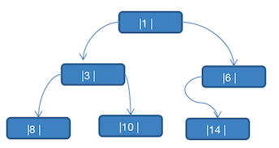


可以看到上图的二叉树为一颗 **完全二叉树**。对他进行分析，可以发现如下的一些问题：

1. 当对上面的二叉树进行中序遍历时，数列为 `8,3,10,1,14,6`
2. 但是 `6,8,10,14` 这几个节点的左右指针，并没有完全用上

如果希望充分利用各个节点的左右指针，让各个节点可以 **指向自己的前后节点**，这个时候就可以使用 **线索化二叉树** 了


### 作用

二叉树线索化是一种将普通二叉树转换为具有特殊线索（指向前驱和后继节点）的二叉树的过程。这种线索化的目的是为了提高对二叉树的遍历效率，特别是在不使用递归或栈的情况下进行遍历。

将二叉树线索化的主要目的是为了提高对二叉树的遍历效率以及节省存储空间。线索化使得在不使用递归或栈的情况下可以更快速地进行遍历，特别是在特定顺序的遍历时，如前序、中序或后序遍历。 

* 提高遍历效率：线索化后，可以在常量时间内找到节点的前驱和后继节点，从而实现更高效的遍历。这对于需要频繁遍历大型二叉树或需要在树的中间部分执行插入和删除操作时特别有用。

* 无需递归或栈：线索化的二叉树允许你在遍历时省去递归或栈的开销，因为你可以沿着线索直接访问节点的前驱和后继，从而降低了内存和时间复杂度。

* 节省存储空间：线索化可以用较少的额外存储空间来实现。通常，只需为每个节点添加一个或两个指针来存储线索信息，而不需要额外的数据结构（如堆栈）来辅助遍历。

* 支持双向遍历：线索化的二叉树可以支持双向遍历，即可以在给定节点的前向和后向方向上遍历树。这在某些应用中很有用，例如双向链表的操作。

* 节省计算资源：在某些特定的应用场景中，通过线索化可以避免重复计算，因为可以直接访问前驱和后继节点，而无需再次搜索或遍历


### 中序线索化二叉树代码

#### 思路


1. 由于当前二叉树是没有parent指针的，所以，我们需要使用个变量记住上一个节点

2. 什么时候记录上一个节点

   中序遍历回溯到当前节点时，就要记录当前节点为上一个节点

   


主要还是利用递归中序遍历的思想

先直接递归遍历到最左边的节点

在获取到当前节点时，如果发现当前节点的左节点为空，则指定左指针为上一个节点

如果上一个节点的右节点为空，则指定右指针指向当前节点

确定好后，记录当前节点为下一个节点，开始下一次递归


#### Java

```java

        /**
         * 线索化二叉树
         * 使用中序线索化二叉树
         * 8,3,10,1,14,6
         */
        private void infixThreadedNodes(HeroNode node) {
            if (node == null) {
                return;
            }
            //向左递归
            infixThreadedNodes(node.left);
            /**
             * 处理当前节点
             * 如果当前节点的左节点为空，则将左指针指向前驱节点
             * 如果当前节点的右节点为空，由于二叉树节点并没有回路指针，所以先用pre记住当前节点
             * 然后在回溯到上一个节点时，可以用pre.right = current_node来确定pre节点的后续节点
             */
            if (node.left == null) {
                node.left = pre;
                node.leftType = 1;
            }
            if (pre != null && pre.right == null) {
                pre.right = node;
                pre.rightType = 1;
            }
            this.pre = node;
            //向右递归
            infixThreadedNodes(node.right);
        }


    public static class HeroNode {
        private int id;
        private String name;
        private HeroNode left;
        private HeroNode right;
        /**
         * 左指针类型
         * 0:左子树
         * 1:前驱节点
         */
        private int leftType;
        /**
         * 右指针类型
         * 0:右子树
         * 1:后继节点
         */
        private int rightType;
    }


}

```

#### Python

```python
    def _infix_threaded(self, node):

        if node.left is not None:
            self._infix_threaded(node.left)
        else:
            node.left = self._pre_node
            node.left_type = 1

        if self._pre_node is not None:
            if self._pre_node.right is None:
                self._pre_node.right = node
                self._pre_node.right_type = 1

        self._pre_node = node
        if node.right is not None:
            self._infix_threaded(node.right)
```


### 中序线索化二叉树的遍历

#### 思路

顺序还是要用中序遍历的思想

先遍历左边到左边的结尾，中途不打印，到结尾再打印

然后遍历后继指针指向的节点，要打印

最后将当前节点设置为迭代的节点，循环上面的步骤


#### 代码

##### Java

```java
        /**
         * 线索二叉树的中序遍历
         */
        private void infixOrder() {
            HeroNode node = this.root;
            while (node != null) {
                while (node.leftType == 0) {
                    node = node.left;
                }
                System.out.println(node);
                while (node.rightType == 1) {
                    node = node.right;
                    System.out.println(node);
                }
                node = node.right;
            }
        }
```


##### Python
```python
```


### 前序线索化二叉树及遍历

#### 思路

线索化时，利用前序遍历的思想

直接获取当前节点，如果当前节点的左指针为空，则左指针指向上一个节点

如果该节点的右节点为空，则记当前点为上一个节点，在遍历到下一个节点时，上一个节点的右指针指向的后驱节点就是当前节点。

每次遍历都要把当前节点记录为上一个节点

然后左递归

回溯完，然后右递归。

#### 代码

##### Java

```java
package com.watermelon.tree;


/**
 * 线索化二叉树
 */
public class A05ThreadedBinaryTree {
    public static void main(String[] args) {
        HeroNode n1 = new HeroNode(1, "张三");
        HeroNode n3 = new HeroNode(3, "李四");
        HeroNode n6 = new HeroNode(6, "王老五");
        HeroNode n8 = new HeroNode(8, "老六");
        HeroNode n10 = new HeroNode(10, "朱");
        HeroNode n14 = new HeroNode(14, "赵四");
        n1.setLeft(n3);
        n1.setRight(n6);
        n3.setLeft(n8);
        n3.setRight(n10);
        n6.setLeft(n14);
        ThreadedBinaryTree tree = new ThreadedBinaryTree(n1);
        tree.preThreadedNodes();
        tree.preOrder();
        //8,3,10,1,14,6
//        System.out.printf("当前节点:%d,左节点:%d,右节点:%d\n", node4.id, node4.left.id, node4.right.id);
        System.out.printf("当前节点:%d,左节点:%d,右节点:%d\n", n10.id, n10.left.id, n10.right.id);
        System.out.printf("当前节点:%d,左节点:%d,右节点:%d\n", n14.id, n14.left.id, n14.right);

        System.out.printf("当前节点:%d,左节点:%d,右节点:%d\n", n6.id, n6.left.id, n6.right.id);
//        tree.preOrder();
    }

    public static class ThreadedBinaryTree {
        private HeroNode root;
        private HeroNode pre;

        public ThreadedBinaryTree(HeroNode root) {
            this.root = root;
        }

        public void preThreadedNodes() {
            this.preThreadedNodes(this.root);
        }

        /**
         * 线索化二叉树
         * 使用前序线索化二叉树
         * 1,3,8,10,6,14
         */
        private void preThreadedNodes(HeroNode node) {
            if (node == null) {
                return;
            }
            if (node.left == null) {
                node.left = pre;
                node.leftType = 1;
            }

            if (pre != null && pre.right == null) {
                pre.right = node;
                pre.rightType = 1;
            }

            this.pre = node;
            if (node.leftType == 0) {
                preThreadedNodes(node.left);
            }

            if (node.rightType == 0) {
                preThreadedNodes(node.right);
            }

        }

        /**
         * 前序遍历线索二叉树
         */
        public void preOrder() {
            HeroNode node = this.root;
            System.out.println(node);

            while (node.leftType == 0) {
                System.out.println(node.left);
                node = node.left;
            }
            while (node.rightType == 1) {
                System.out.println(node.right);
                node = node.right;
            }

        }

    }

    public static class HeroNode {
        private int id;
        private String name;
        private HeroNode left;
        private HeroNode right;
        /**
         * 左指针类型
         * 0:左子树
         * 1:前驱节点
         */
        private int leftType;
        /**
         * 右指针类型
         * 0:右子树
         * 1:后继节点
         */
        private int rightType;
    }
}
```


##### Python

```python
```


### 后序线索化二叉树及遍历

#### 思路

线索化时，利用后序遍历的思想

先递归左指针

再递归右指针

回溯到当前指针时，直接获取当前节点，如果当前节点的左指针为空，则左指针指向上一个节点

如果该节点的右节点为空，则记当前点为上一个节点，在遍历到下一个节点时，上一个节点的右指针指向的后驱节点就是当前节点。

每次遍历都要把当前节点记录为上一个节点


遍历思路:

后续遍历时要记住，后序遍历在后续节点遍历完后，会出现没有指针指向下一个要遍历的节点的情况，所以要借用parent指针，线索化时，要顺便把parent的指针的赋值指向好，然后这里遇到指针没有指向下一个要遍历的节点时，就可以使用父指针的右指针继续遍历。


#### 代码

##### Java

```java
package com.watermelon.tree;


/**
 * 线索化二叉树
 */
public class A05ThreadedBinaryTree {
    public static void main(String[] args) {
        HeroNode n1 = new HeroNode(1, "张三");
        HeroNode n3 = new HeroNode(3, "李四");
        HeroNode n6 = new HeroNode(6, "王老五");
        HeroNode n8 = new HeroNode(8, "老六");
        HeroNode n10 = new HeroNode(10, "朱");
        HeroNode n14 = new HeroNode(14, "赵四");
        n1.setLeft(n3);
        n1.setRight(n6);
        n3.setLeft(n8);
        n3.setRight(n10);
        n6.setLeft(n14);
        ThreadedBinaryTree tree = new ThreadedBinaryTree(n1);
        tree.postThreadedNodes();
        tree.postOrder();
        //8,3,10,1,14,6
        System.out.printf("当前节点:%d,左节点:%d,右节点:%d\n", n8.id, n8.left, n8.right.id);
        System.out.printf("当前节点:%d,左节点:%d,右节点:%d\n", n10.id, n10.left.id, n10.right.id);
        System.out.printf("当前节点:%d,左节点:%d,右节点:%d\n", n14.id, n14.left.id, n14.right.id);

        System.out.printf("当前节点:%d,左节点:%d,右节点:%d\n", n6.id, n6.left.id, n6.right.id);
//        tree.preOrder();
    }

    public static class ThreadedBinaryTree {
        private HeroNode root;
        private HeroNode pre;

        public ThreadedBinaryTree(HeroNode root) {
            this.root = root;
        }
      
        public void postThreadedNodes() {
            this.postThreadedNodes(this.root);
        }

        /**
         * 线索化二叉树
         * 使用后序遍历线索化二叉树
         * 8,10,3,14,6,1
         */
        private void postThreadedNodes(HeroNode node) {
            if (node == null) {
                return;
            }
            if (node.left != null) {
                node.left.setParent(node);
                postThreadedNodes(node.left);
            }
            if (node.right != null) {
                node.right.setParent(node);
                postThreadedNodes(node.right);
            }
            if (node.left == null) {
                node.left = pre;
                node.leftType = 1;
            }
            if (pre != null && pre.right == null) {
                pre.right = node;
                pre.rightType = 1;
            }
            pre = node;
        }


        private void postOrder() {
            HeroNode node = root;
            while (node != null) {
                while (node.leftType == 0) {
                    node = node.left;
                }
                while (node.rightType == 1) {
                    System.out.println(node);
                    node = node.right;
                }
                System.out.println(node);
                if (node.parent != null) {
                    node = node.parent.right;//这一步一定要，因为后序遍历会有个指针没有指向下一个节点，只能回到父节点的右节点继续
                } else {
                    node = null;
                }
            }
        }
    }

    public static class HeroNode {
        private int id;
        private String name;
        private HeroNode left;
        private HeroNode right;
        /**
         * 后序遍历才需要用到
         */
        private HeroNode parent;
        /**
         * 左指针类型
         * 0:左子树
         * 1:前驱节点
         */
        private int leftType;
        /**
         * 右指针类型
         * 0:右子树
         * 1:后继节点
         */
        private int rightType;
    }


}

```


##### Python

```python
```


## 堆

### 堆的概念

堆是具有堆序性的完全二叉树

* 大顶堆

  每个节点的值都 **大于或等于** 其左右孩子节点的值

  

  此堆在数组中的表示如下图:
  
  
  大顶堆特点：`arr[i] >= arr[2*i+1] && arr[i] >= arr[2*i+2]`，i 对应第几个节点，i 从 0 开始编号
  
  

* 小顶堆
  每个节点的值都 **小于或等于** 其左右孩子节点的值

  
  小顶堆特点：`arr[i] <= arr[2*i+1] && arr[i] <= arr[2*i+2]`，i 对应第几个节点，i 从 0 开始
  
  注：堆序性没有要求左右值的大小关系

### 堆排序

https://www.bilibili.com/video/BV1aj411M71h/?spm_id_from=333.337.search-card.all.click

- 升序：一般采用大顶堆
- 降序：一般采用小顶堆

要实现堆排序，需要知道完全二叉树的以下知识

1. 最后一个非叶子结点的索引值为: n/2-1
2. 任意一个结点的左子节点索引为: 2*n+1
3. 任意一个节点的右子节点索引为: 2*n+2

#### 思路

升序排序主要分两步

1. 循环这个步骤直到当前索引值从最后一个非叶子结点到了堆顶

   ​	将当前结点的完全二叉树序列调整成大顶堆序列

2. 循环下面这个步骤直到完全二叉树的长度为0

   ​	交换堆顶和堆尾的位置,交换好后，此时的堆尾就是已经排好序的序列了

   ​	从堆顶开始调整完全二叉树序列(此时不需要包括已经排好序的序列)，又得到个大顶堆

调整完全二叉树成为大顶堆的思路:

* 递归实现思路:

	1. 对于当前节点，比较其与左右子节点的大小关系，如果存在左右子节点且左右节点中的较大者大于当前节点，则将较大的子节点与当前节点交换位置。

	2. 如果发生了交换操作，继续递归调整被交换节点的子树，以确保子树也满足大顶堆的性质。
* 非递归实现思路:
  1. 循环操作：  
     1. 比较当前节点与其左右子节点的大小关系，如果存在左右子节点且左右节点中的较大者大于当前节点，则将较大的子节点与当前节点交换位置。
     2. 如果发生了交换操作，将当前交换的节点设置为当前节点，继续循环操作，以确保子树也满足大顶堆的性质。
  2. 结束条件： 
     1. 如果循环中没有发生交换操作，证明已经是大顶堆。 
     2. 如果当前节点的左右节点都越界了，即没有左右子节点，证明当前节点已经是最后一层叶子结点了。


#### 代码

##### Java

```java
package com.watermelon.sort;


public class B08HeapSortV1 extends B00Sort {

    public static void main(String[] args) {
//        int[] array = {3, 7, 1, 2, 6, 8, 0, 9, 4};
        int[] array = B00Sort.randomArray(800_0000);
        new B08HeapSortV1("递归堆排序").executeAndTime(array);
//        System.out.println(Arrays.toString(array));
    }

    public B08HeapSortV1(String name) {
        super(name);
    }

    /**
     * 堆排序
     *
     * @param data
     */
    @Override
    public void sort(int[] data) {
        //遍历当前要排序的堆
        /**
         * 1. 循环这个步骤直到当前索引值从最后一个非叶子结点到了堆顶
         *      将当前结点的完全二叉树序列调整成大顶堆序列
         * 2. 循环下面这个步骤直到完全二叉树的长度为0
         *      交换堆顶和堆尾的位置,交换好后，此时的堆尾就是已经排好序的序列了
         *      从堆顶开始调整完全二叉树序列(此时不需要包括已经排好序的序列)，又得到个大顶堆
         */
        int len = data.length;
        for (int i = len / 2 - 1; i >= 0; i--) {
            /**
             * 从最后一个非叶子结点开始调整堆-->得到大顶堆序列
             */
            adjustHeap(data, i, len);
        }
        for (int i = len - 1; i > 0; i--) {
            /**
             * 循环下面这个步骤直到完全二叉树的长度为0
             *  交换堆顶和堆尾的位置,交换好后，此时的堆尾就是已经排好序的序列了
             *  从堆顶开始调整完全二叉树序列(此时不需要包括已经排好序的序列)，又得到个大顶堆
             */
            swap(data, 0, i);//堆排序完，交换堆顶和队尾的位置
            adjustHeap(data, 0, i);//从对顶开始下沉排序
        }
    }
  
    /**
     * 对堆顶位置为i的子堆进行下沉堆排序,非递归操作
     * 循环操作
     * 1. 对于当前节点，比较其与左右子节点的大小关系，如果存在左右子节点且左右节点中的较大者大于当前节点，则将较大的子节点与当前节点交换位置。
     * 2. 如果发生了交换操作，将当前交换的节点设置为当前节点，继续循环操作，以确保子树也满足大顶堆的性质。】
     * 什么时候结束:
     * 1. 没发生交换，证明已经是大顶堆了
     * 2. 当前节点的左右节点都越界了，则证明当前节点已经是最后一层叶子结点了
     *
     * @param data
     * @param i    非叶子结点
     * @param len  属于堆的序列长度
     */
    private static void adjustHeap(int[] data, int i, int len) {
        int left;
        int right;
        while (true) {
            left = 2 * i + 1;
            right = 2 * i + 2;
            if (right < len) {
                //有左节点和右节点
                if (data[left] < data[right]) {
                    //right更大
                    if (data[i] < data[right]) {
                        swap(data, right, i);
                        i = right;
                    } else {
                        break;
                    }
                } else {
                    //left更大
                    if (data[i] < data[left]) {
                        swap(data, left, i);
                        i = left;
                    } else {
                        break;
                    }
                }
            } else if (left < len) {
                //只有一个左节点
                if (data[i] < data[left]) {
                    swap(data, left, i);
                } else {
                    break;
                }
            } else {
                //左右节点都越界了
                break;
            }
        }
    }
  
    /**
     * 对堆顶位置为i的子堆进行下沉堆排序，递归操作
     * 1. 对于当前节点，比较其与左右子节点的大小关系，如果存在左右子节点且左右节点中的较大者大于当前节点，则将较大的子节点与当前节点交换位置。
     * 2. 如果发生了交换操作，继续递归调整被交换节点的子树，以确保子树也满足大顶堆的性质。
     *
     * @param data
     * @param i    非叶子结点
     * @param len  属于堆的序列长度
     */
    private static void adjustHeap1(int[] data, int i, int len) {
        int left = 2 * i + 1;
        int right = 2 * i + 2;
        if (right < len) {
            //有左节点和右节点
            if (data[left] < data[right]) {
                //right更大
                if (data[i] < data[right]) {
                    swap(data, right, i);
                    adjustHeap(data, right, len);
                }
            } else {
                //left更大
                if (data[i] < data[left]) {
                    swap(data, left, i);
                    adjustHeap(data, left, len);
                }
            }
        } else if (left < len) {
            //只有一个左节点
            if (data[i] < data[left]) {
                swap(data, left, i);
            }
        }
    }

    private static void swap(int[] data, int i, int j) {
        int temp = data[j];
        data[j] = data[i];
        data[i] = temp;
    }
}

```


## 赫夫曼树

https://www.bilibili.com/video/BV1kD4y1P76D/?spm_id_from=333.788&vd_source=b151a3d9d3902335a95fde17253afa9f

### 概念

1. 给定 n 个 **权值** 作为 n 个 **叶子节点**，构造一颗二叉树，**若该树的 带权路径长度（WPL）达到最小**，称这样的二叉树为 **最优二叉树**，也称为 **哈夫曼树（Huffman Tree）**，还有的叫 霍夫曼树
2. 赫夫曼树是带全路径长度最短的树，权值较大的节点离根节点较近

### 重要概念

- **路径** 和 **路径长度**：

  在一颗树中，**从一个节点往下可以到达的孩子或孙子节点之间的通路**，称为 **路径**。

  **通路中分支的数目称为路径长度**。若规定根节点的层数为 1，则从根节点到第 L 层节点的路径长度为 L-1

- **节点的权** 及 **带权路径长度**

  若将树中节点赋给一个有着某种函数的数值，则这个数值称为该节点的 **权**。

  节点的带权路径长度为：从根节点到该节点之间的路径长度与该节点的权的乘积。

- 树的带权路径长度

  **所有叶子节点的带权路径长度之和**，记为 WPL（weighted path length），权值越大的节点离根节点越近的二叉树才是最优二叉树

- WPL 最小的就是赫夫曼树


​	如上图：

- 权：元素的值
- 路径长度：一个节点到另一个节点的一段路，就叫路径长度
- 带权路径长度：从根节点到 13 有几条路径长度，则是他的带权路径长度
- 树的带权路径长度：（图上的带全路径长度所指的是 树的带全路径长度）


### 将无序数列转成赫夫曼树

#### 思路

1. 将数列用节点对象包裹，存入链表中

2. 遍历链表，直到链表中仅剩一个元素

   将链表从小到大排序

   将数列的前两个取出，作为左子节点，右子节点

   计算左子节点右子节点的权值之和，作为父节点，将父节点加入到链表中

3. 将链表中仅剩的节点取出，这个节点就是赫夫曼树的根节点


#### 代码

##### Java

```java
package com.watermelon.tree;

import java.util.Arrays;
import java.util.LinkedList;
import java.util.List;

/**
 * 将一个序列转换成一棵赫夫曼树
 */
public class A06HuffmanTree {

    public static void main(String[] args) {
        int[] array = {13, 7, 8, 3, 29, 6, 1};
        Arrays.sort(array);
        //[1, 3, 6, 7, 8, 13, 29]
        List<Node> data = new LinkedList<>();
        for (int i = 0; i < array.length; i++) {
            data.add(new Node(array[i]));
        }
        Node node = toHuffmanTree(data);
        node.preOrder();
    }

    private static Node toHuffmanTree(List<Node> data) {
        while (data.size() > 1) {
            Node left = data.get(0);
            Node right = data.get(1);

            data.remove(0);
            data.remove(0);

            Node parent = new Node(left.value + right.value);
            parent.setLeft(left);
            parent.setRight(right);

            //获得链表中比parent.value大的值的索引,如果没有的话，则追加到结尾，有则插入到当前节点

            int index = -1;
            for (int i = 0; i < data.size(); i++) {
                if (data.get(i).value >= parent.value) {
                    index = i;
                    break;
                }
            }
            if (index == -1) {
                data.add(parent);
            } else {
                data.add(index, parent);
            }
        }
        return data.get(0);
    }

    public static class Node {
        private int value;
        private Node left;
        private Node right;

        public Node(int value) {
            this.value = value;
        }

        public Node getLeft() {
            return left;
        }

        public void setLeft(Node left) {
            this.left = left;
        }

        public Node getRight() {
            return right;
        }

        public void setRight(Node right) {
            this.right = right;
        }

        @Override
        public String toString() {
            return "Node{" +
                    "value=" + value +
                    '}';
        }

        public void preOrder() {
            preOrder(this);
        }


        /**
         * 前序遍历
         *
         * @param node
         */
        private static void preOrder(Node node) {
            System.out.println(node);
            if (node.left != null) {
                preOrder(node.left);
            }
            if (node.right != null) {
                preOrder(node.right);
            }
        }
    }
}
```


##### Python

```python
```


是不是有一个疑问？给定的数组是 `13,7,8,3,29,6,1`，变成树之后，怎么找回原来的数据？一定要记得赫夫曼树的特点：**它的数据都在叶子节点，父节点是通过叶子节点相加得到的**


## 赫夫曼编码

- 赫夫曼编码也翻译为 **哈夫曼编码(Huffman Coding)**，又称霍夫曼编码，是一种 **编码方式**,，属于一种 **程序算法**
- 赫夫曼编码是 **赫哈夫曼树** 在电讯通信中的经典的应用之一。
- 赫夫曼编码广泛地用于 **数据文件压缩**。其压缩率通常在 20%～90% 之间
- 赫夫曼码是 **可变字长编码(VLC)** 的一种。Huffman 于 1952 年提出一种编码方法，称之为最佳编码

### 定长编码

```text
// 原始字符，共40个字符(包括空格) 
i like like like java do you like a java     
// 对应 Ascii 码
105 32 108 105 107 101 32 108 105 107 101 32 108 105 107 101 32 106 97 118 97 32 100 111 32 121 111 117 32 108 105 107 101 32 97 32 106 97 118 97  
// Ascii 码对应的二进制
01101001 00100000 01101100 01101001 01101011 01100101 00100000 01101100 01101001 01101011 01100101 00100000 01101100 01101001 01101011 01100101 00100000 01101010 01100001 01110110 01100001 00100000 01100100 01101111 00100000 01111001 01101111 01110101 00100000 01101100 01101001 01101011 01100101 00100000 01100001 00100000 01101010 01100001 01110110 01100001
```

按照二进制来传递信息，总的长度是 359 (包括空格)；[在线转码工具](https://www.mokuge.com/tool/asciito16/)

### 变长编码

```text
// 原始字符，共40个字符(包括空格) 
i like like like java do you like a java  
// 各个字符对应的个数
d:1 y:1 u:1 j:2  v:2  o:2  l:4  k:4  e:4 i:5  a:5   :9 
// 按照各个字符出现的次数进行编码，原则是出现次数越多的，则编码越小，比如 空格出现了 9 次， 编码为 0 ,其它依次类推.
// 等号前面的数字就是就是赫夫曼树节点的带权路径，后面讲解为什么
0=  ,  1=a, 10=i, 11=e, 100=k, 101=l, 110=o, 111=v, 1000=j, 1001=u, 1010=y, 1011=d
```


按照上面给各个字符规定的编码，对于原始字符 `i like like like java do you like a java`，进行编码时，对应的编码为：

```text
i 空格  l   i   k
10  0   101 10 100 ...
传输的编码就是：10010110100 ...
```

**注意：** 字符的编码都不能是其他字符编码的前缀，符合此要求的编码叫做 **前缀编码**，即不能匹配到重复的编码。（下面会详细讲解）

### 赫夫曼编码

```text
// 原始字符，共40个字符(包括空格) 
i like like like java do you like a java  
// 各个字符对应的个数
d:1 y:1 u:1 j:2  v:2  o:2  l:4  k:4  e:4 i:5  a:5   :9 
```


按照上面字符出现的次数构建一颗赫夫曼树，次数作为权值。

构建好的赫夫曼树如下图：


根据赫夫曼树，给各个字符规定编码（前缀编码）：

- 向左的路径为 0
- 向右的路径为 1

那么编码如下：

```text
o: 1000   u: 10010   d: 100110   y: 100111   i: 101
a: 110    k: 1110    e: 1111     j: 0000     v: 0001
l: 001     : 01
```

按照上面给出的各个字符的 **前缀编码（赫夫曼编码）**，`i like like like java do you like a java` 字符串对应的编码为 (注意这里我们使用的 **无损压缩**)

```text
1010100110111101111010011011110111101001101111011110100001100001110011001111000011001111000100100100110111101111011100100001100001110
```

此编码总长度为：133，原始的定长编码长度为 359，压缩了 `359-133/359=62.9%`。

此编码满足前缀编码，即字符的编码都不能是其他字符编码的前缀。不会造成匹配的多义性，比如：

```text
比如前面的这一串编码：101010011011110
 i 空格  l    i   k
101 01  001 101 1110
```

简单说就是：上面给出的每个字符的编码都是唯一的

### 注意事项

赫夫曼树 **根据排序方法不同**，也可能不太一样，这样对应的 **赫夫曼编码** 也不完全一样，但是 WPL 是一样的，都是最小的，最后生成的赫夫曼编码的长度是一样。

什么意思呢：比如这个数列 `4,4,4,4,4,4,4,5,6,7`，有很多相同的树节点，每次取最小的两个组成一颗新树：

```text
原始：4,4,4,4,4,4,4,5,6,7
第一次：4,4,4,4,4,5,6,7,8    # 处理排序之后，减少了两个 4，多了一个 8 的树
第二次：4,4,4,5,6,7,8,8			 # 处理排序之后，减少了两个 4，多了一个 8 的树
```

那么问题就来了：相同的权值，你怎么排序？这个就是排序不稳定。导致后面每次重新生成树的编码都对应不上同一个字符。

但是他们的 WPL 是一样的，也就是最后用赫夫曼编码之后的数据长度都是一样的（压缩程度是一样的）。

下面对比下规则的不同，生成的树不同：

前面给出的图是：每次生成新的二叉树排在相同权值的前面


下面是每次生成新的二叉树总是排在权值相同的二叉树的最后一个，则生成二叉树为：


最明显的就是右下角的，`2+2=4`，第一张图是放在左下角的的 4 节点下，这里是放在右下角的 4 节点下

### 代码

#### 数据压缩与解压

>1. ##### 压缩思路
>
>   1. 将原始数据的字符根据权值转成 Huffman 树。
>   2. 根据 Huffman 树构建 Huffman 表：
>      - 需要递归记录每个叶子结点的路径，left 为 0，right 为 1，组合的路径为二进制编码。
>      - Huffman 表格式为：原数据字节 -> Huffman 路径字节。
>   3. 根据 Huffman 表将原始数据编码成 Huffman 编码字符串：
>      - 将原字节数组的每个字节替换成 Huffman 路径字节即可。
>   4. 将 Huffman 编码字符串按 8 位一个字节压缩成 Huffman 压缩字节数组。
>
>   ##### 解压思路
>
>   1. 将 Huffman 压缩字节数组还原成 Huffman 编码的字符串：
>      - 将 Huffman 压缩字节数组中的每个字节转成二进制拼接成字符串即可。
>   2. 根据 Huffman 表，将 Huffman 编码字符串解码成原始数据字节数组。

##### Java

```java
package com.watermelon.tree;

import java.nio.charset.StandardCharsets;
import java.util.*;
import java.util.stream.Collectors;

public class HuffmanCompressRelease {

    private static Map<Integer, String> huffmanTable = new HashMap<>();

    public static void main(String[] args) {
        String str = "i like like like java do you like a java";
//        String str = "我是中国人，我爱中国";
        byte[] strBytes = str.getBytes(StandardCharsets.UTF_8);
        System.out.println("原始数据字节:" + Arrays.toString(strBytes));
        System.out.println("原始数据字节长度:" + strBytes.length);
        byte[] zipData = zip(strBytes);
        System.out.println("压缩后数据字节:" + Arrays.toString(zipData));
        System.out.println("压缩后数据字节长度:" + zipData.length);
        System.out.println("压缩率:" + (double) (strBytes.length - zipData.length) / strBytes.length);
        byte[] unzipData = unzip(zipData);
        System.out.println("解压后数据字节:" + Arrays.toString(unzipData));
        System.out.println("解压后数据字节长度:" + unzipData.length);
        System.out.println("原数据为:" + new String(unzipData, StandardCharsets.UTF_8));
    }


    /**
     * huffman压缩
     *
     * @param data
     * @return
     */
    private static byte[] zip(byte[] data) {
        //1. 将原始数据的字符转成huffman树，构建huffman树
        huffmanTable = toHuffmanTable(data);
        System.out.println("huffman表:" + huffmanTable);
        //2. 根据huffman表和原数据构建huffman转义后的二进制字符串
        String huffmanStr = toHuffmanCode(huffmanTable, data);
        System.out.println("huffman字符串:" + huffmanStr);
        //3. 将二进制字符串按照8位转成bytes返回
        return toHuffmanBytes(huffmanStr);
    }

    /**
     * 将huffman编码字符串转成huffman编码的字节数组
     *
     * @param huffmanStr
     * @return
     */
    private static byte[] toHuffmanBytes(String huffmanStr) {
        List<String> binaryList = new ArrayList<>();
        StringBuilder temp = new StringBuilder();

        for (int i = 0; i < huffmanStr.length(); i++) {
            temp.append(huffmanStr.charAt(i));
            if (temp.length() == 8 || i == huffmanStr.length() - 1) {
                binaryList.add(temp.toString());
                temp.setLength(0);
            }

        }
        byte[] result = new byte[binaryList.size()];
        for (int i = 0; i < binaryList.size(); i++) {
            String binary = binaryList.get(i);
            Integer value = Integer.valueOf(binary, 2);
            result[i] = value.byteValue();
        }
        return result;
    }

    /**
     * 根据huffman表，将原字节数组转成huffman编码字符串
     *
     * @param huffmanTable
     * @param data
     * @return
     */
    private static String toHuffmanCode(Map<Integer, String> huffmanTable, byte[] data) {
        StringBuilder sb = new StringBuilder();
        for (byte temp : data) {
            String huffmanCode = huffmanTable.get(Integer.valueOf(temp));
            sb.append(huffmanCode);
        }
        return sb.toString();
    }


    /**
     * 从huffman数中获取huffman值
     *
     * @param node
     * @param huffmanValue
     */
    private static boolean trace(Node currentNode, Node node, List<Boolean> huffmanValue) {

        if (currentNode.equals(node)) {
            return true;
        }
        if (currentNode.left != null) {
            huffmanValue.add(false);
            if (trace(currentNode.left, node, huffmanValue)) {
                return true;
            }
            huffmanValue.remove(huffmanValue.size() - 1);
        }
        if (currentNode.right != null) {
            huffmanValue.add(true);
            if (trace(currentNode.right, node, huffmanValue)) {
                return true;
            }
            huffmanValue.remove(huffmanValue.size() - 1);
        }
        return false;
    }

    /**
     * 构建huffman表
     *
     * @param data
     * @return
     */
    private static Map<Integer, String> toHuffmanTable(byte[] data) {
        Map<Byte, Integer> keyCountMap = new HashMap<>();
        for (byte key : data) {
            Integer count = keyCountMap.get(key);
            if (count == null) {
                keyCountMap.put(key, 1);
            } else {
                keyCountMap.put(key, count + 1);
            }
        }

        List<Node> nodes = keyCountMap.entrySet().stream()
                .map(entry ->
                        new Node(entry.getKey().intValue(),
                                (char) entry.getKey().byteValue(),
                                entry.getValue())).collect(Collectors.toList()
                );
        //构建huffman树
        Node huffmanTree = beTree(new ArrayList<>(nodes));
//        huffmanTree.preOrder();
        /**
         * 构建huffman表
         */
        Map<Integer, String> result = new HashMap<>();
        for (Node node : nodes) {
            List<Boolean> huffmanValue = new ArrayList<>();
            trace(huffmanTree, node, huffmanValue);
            StringBuilder sb = new StringBuilder();
            huffmanValue.forEach(value -> {
                sb.append(value == true ? "1" : "0");
            });
            result.put(node.data, sb.toString());
        }
        return result;
    }

    private static Node beTree(List<Node> nodes) {
        while (nodes.size() > 1) {
            Collections.sort(nodes);
            Node left = nodes.get(0);
            Node right = nodes.get(1);
            Node parent = new Node(null, null, left.weight + right.weight);
            nodes.remove(0);
            nodes.remove(0);
            parent.setLeft(left);
            parent.setRight(right);
            nodes.add(parent);
        }
        return nodes.get(0);
    }

    /**
     * huffman解压
     *
     * @param data
     * @return
     */
    private static byte[] unzip(byte[] data) {
        /**
         * 1.将字节data还原成哈夫曼编码字节
         * 2.根据huffman编码表，将哈夫曼字节还原成原始字节
         */
        StringBuilder huffmanStr = new StringBuilder();
        for (int i = 0; i < data.length; i++) {
            byte b = data[i];
            boolean flag = b > 0 ? true : false;
            if (i == data.length - 1) {
                flag = false;
            }

            String binary = to8BinaryString(flag, b);
            huffmanStr.append(binary);
        }
        System.out.println("huffman字符串:" + huffmanStr);
        Map<String, Integer> huffmanValueKey = huffmanTable.entrySet().stream().collect(Collectors.toMap(x -> x.getValue(), x -> x.getKey()));
        StringBuilder huffmanCode = new StringBuilder();

        List<Integer> sourceKeys = new ArrayList<>();
        for (char bit : huffmanStr.toString().toCharArray()) {
            huffmanCode.append(bit);
            Integer sourceKey = huffmanValueKey.get(huffmanCode.toString());
            if (sourceKey != null) {
                sourceKeys.add(sourceKey);
                huffmanCode.setLength(0);
            }
        }
        byte[] result = new byte[sourceKeys.size()];
        for (int i = 0; i < sourceKeys.size(); i++) {
            Integer sourceKey = sourceKeys.get(i);
            result[i] = sourceKey.byteValue();
        }
        return result;
    }

    /**
     * 获取byte的8位二进制
     *
     * @param flag 是否需要补位
     * @param data 十进制数
     * @return
     */
    private static String to8BinaryString(boolean flag, int data) {

        if (flag) {
            data |= 256;
        }
        String result = Integer.toBinaryString(data);

        if (result.length() > 8) {
            return result.substring(result.length() - 8);
        }
        return result;
    }

    public static class Node implements Comparable<Node> {
        private Integer data;
        private Character c;
        private Integer weight;
        private Node left;
        private Node right;

        public Node(Integer data, Character c, Integer weight) {
            this.data = data;
            this.c = c;
            this.weight = weight;
        }

        public Node getLeft() {
            return left;
        }

        public void setLeft(Node left) {
            this.left = left;
        }

        public Node getRight() {
            return right;
        }

        public void setRight(Node right) {
            this.right = right;
        }

        @Override
        public String toString() {
            return "Node{" +
                    "data=" + data +
                    ", c=" + c +
                    ", weight=" + weight +
                    '}';
        }

        @Override
        public boolean equals(Object o) {
            if (this == o) return true;
            if (o == null || getClass() != o.getClass()) return false;
            Node node = (Node) o;
            return Objects.equals(data, node.data) && Objects.equals(c, node.c) && Objects.equals(weight, node.weight);
        }

        @Override
        public int hashCode() {
            return Objects.hash(data, c, weight);
        }

        @Override
        public int compareTo(Node o) {
            return this.weight - o.weight;
        }

        public void preOrder() {
            this.preOrder(this);
        }

        private void preOrder(Node node) {
            System.out.println(node);
            if (node.left != null) {
                preOrder(node.left);
            }
            if (node.right != null) {
                preOrder(node.right);
            }
        }
    }
}
```


##### Python

```python
```

## 二叉排序树

### 定义

二叉排序树简称BST

对于二叉排序树的任何一个 **非叶子节点**，要求如下：

- 左节点，比父节点小
- 右节点，比父节点大

特殊说明：如果有有相同的值，可以将该节点放在左节点或右节点。当然，最理想的是没有重复的值，比如 Mysql 中的 B 树索引，就是以主键 ID 来排序的。

比如对下面这个二叉树增加一个节点：


1. 从根节点开始，发现比 7 小，直接往左子树查找，相当于直接折半了
2. 比 3 小，再次折半
3. 比 1 大：直接挂在 1 的右节点


如果添加节点4，则按照上面的思路，是添加到5节点的左侧

### 创建与遍历

#### 代码

##### 思路

* 增加

  通过递归的方式，如果当前节点没有左节点，则直接加到左节点，否则左节点递归加入


### 删除

#### 思路

由于节点只有 left 和 right，且所有节点是单向节点，则要删除一个节，需要:

* 先找到这个要删除 **目标节点**

* 找到这个目标节点的 **父节点**

只有一种情况没有父节点，那就是目标节点就是 root 节点

找到父节点之后，我们才可以删掉目标节点，那么就有如下三类情况需要考虑：

1. 目标节点是 **叶子节点**

   

	
	
	1. 如果目标节点是 **父节点的 left 节点**，那么 left 置空
	2. 如果目标节点是 **父节点的 right 节点**，那么 rigt 置空

2. 目标节点有 **一颗子节点** left 或则 right，那么就需要将目标节点的子节点提升到目标节点位置上

   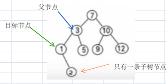

   1. 如果目标节点是 **父节点 的 left 节点**，那么将 目标节点的left 或 right 节点设置为 父节点的 left 节点
   2. 如果目标节点是 **父节点 的 right 节点**，那么将 目标节点的left 或 right 节点设置为父节点的 right 节点

   简单说：因为目标节点有一颗子节点，要目标节点删除，需将目标节点的子节点放到被删除的位置上。

   

3. 目标节点有 **两颗子节点**

   

   

   1. 以目标节点为根节点，**往右子树的**，**左子树**一直 **找到最小的节点min_node**，删除它，并持有它
   
      ```java
      min_node.parent.left = null
      // 此时min_node已经从二叉树中删除，且临时保存在内存中
      ```
   
      
   
   2. 把目标节点从父节点的 left 或 right 中删掉
      1. 删掉的位置：替换上第 1 步中删掉的最小节点min_node，也就是父节点指向
   
         ```java
         parent.right = min_node
         ```
   
      2. 将 **最小节点的 left 节点** 重置为 **目标节点的 left 节点**
   
         将最小节点的right节点重置为目标节点的right节点
   
         ```java
         min_node.left = target_node.left
         min_node.right = target_node.right
         ```
   
      
      简单来说，就是用被删除节点的前驱节点或者后继节点代替被删除的节点，但是要注意的是，被删除的前驱节点或者后继节点也要从原本的位置删除
      
      

**代码思路**

* 写个方法直接找到要删除的节点

* 写个方法找到要删除节点的父节点

* 删除二叉排序树主要需要考虑一下几点

  1. 删除的节点是根节点

     当前根节点无子树

     ​	直接置空

     当前根节点有一颗子树

     ​	将当前节点的子树代替当前节点

     当前根节点有两个子树

     ​	获取当前节点左子树的权值最大的节点代替要删除的节点

     ​	或者获取当前节点右子树小小的节点代替要删除的节点

  2. 删除的节点是叶子结点

     ​	将父节点对应的指针指向空

  3. 删除的节点只有一颗子树

     ​	将父节点对应的指针指向子树

  4. 删除的节点有两个子树

     ​	获取当前节点左子树的权值最大的节点代替要删除的节点

     ​    或者获取当前节点右子树小小的节点代替要删除的节点

#### 代码

##### Java

```java
package com.watermelon.tree;

import java.util.Arrays;
import java.util.List;
import java.util.Objects;
import java.util.stream.Collectors;

/**
 * 二叉排序树
 * 左<=根<=右
 */
public class A08BinarySortTree {
    public static void main(String[] args) {
        BinarySortTree tree = new BinarySortTree();
        List<Node> nodes = Arrays.asList(8, 3, 1, 5, 9, 2, 7, 15, 10, 4, 6, 11, 12, 13, 14)
                .stream()
                .map(number -> new Node(number))
                .collect(Collectors.toList());
        nodes.forEach(tree::add);
        tree.infixOrder();
        System.out.println("-----------");

        for (int i = 1; i <= 100; i++) {
            tree.delete(i);
            tree.infixOrder();
            System.out.println("------------");
        }
    }

    public static class BinarySortTree {
        private Node root;

        public void add(Node node) {
            if (root == null) {
                root = node;
            } else {
                root.add(node);
            }
        }

        public void infixOrder() {
            if (root == null) {
                return;
            }
            root.infixOrder();
        }

        public Node search(int value) {
            if (root == null) {
                return null;
            } else {
                return root.search(value);
            }
        }

        public Node searchParent(int value) {
            if (root == null) {
                return null;
            } else {
                if (root.value == value) {
                    return null;
                }
                return root.searchParent(value);
            }
        }

        public void delete(int value) {
            if (root == null) {
                return;
            }
            Node targetNode = root.search(value);
            if (targetNode == null) {
                return;
            }
            if (targetNode.equals(root)) {
                //如果要找的是根节点，则直接把根节点置空
                if (root.left == null && root.right == null) {
                    root = null;
                    return;
                } else if (root.left == null) {
                    //左边空，右边不空
                    root = root.right;
                    return;
                } else if (root.right == null) {
                    //右边空，左边不空
                    root = root.left;
                    return;
                } else {
                    //两边都不空
                    /**
                     * 查到最小的节点并将其删除
                     */
                    Node minNode = findMinAndDel(targetNode);

                    //代替连接子节点
                    minNode.left = targetNode.left;
                    if (minNode.right == null) {
                        minNode.right = targetNode.right;
                    }

                    root = minNode;
                    return;
                }
            }
            Node parentNode = root.searchParent(value);

            if (targetNode.left == null && targetNode.right == null) {
                /**
                 * 1. 如果targetNode是叶子结点
                 *     如果targetNode是parentNode的left节点,则parentNode.left = null
                 *     否则targetNode是parentNode的right节点，则parentNode.right = null
                 */
                if (targetNode.equals(parentNode.left)) {
                    parentNode.left = null;
                } else {
                    parentNode.right = null;
                }
            } else if (targetNode.left == null || targetNode.right == null) {
                /**
                 * 2. 如果targetNode有一个子节点，则targetNode的父节点与targetNode的子节点连接
                 *     如果targetNode是parentNode的left节点
                 *          如果targetNode有左子节点，则parentNode.left = targetNode.left
                 *          否则parentNode.left = targetNode.right
                 *     否则
                 *          如果targetNode有左子节点，则parentNode.right = targetNode.left
                 *          否则parentNode.right = targetNode.right
                 */
                if (targetNode.equals(parentNode.left)) {
                    if (targetNode.left != null) {
                        parentNode.left = targetNode.left;
                    } else {
                        parentNode.left = targetNode.right;
                    }
                } else {
                    if (targetNode.left != null) {
                        parentNode.right = targetNode.left;
                    } else {
                        parentNode.right = targetNode.right;
                    }
                }
            } else {
                /**
                 * 3. 如果targetNode有两个子节点
                 *     minNode = 从targetNode.right找最小的节点
                 *     根据minNode找到其父节点minNodeParent,判断minNode是minNodeParent的左节点还是右节点，直接置空
                 *     minNode.left = targetNode.left
                 *     minNode.right = targetNode.right
                 *     如果targetNode是parentNode的左节点
                 *          则parentNode.left = minNode
                 *     否则
                 *          parentNode.right = minNode
                 *
                 */
                Node minNode = findMinAndDel(targetNode);
                //代替连接父节点
                if (targetNode.equals(parentNode.left)) {
                    parentNode.left = minNode;
                } else {
                    parentNode.right = minNode;
                }
                //代替连接子节点
                minNode.left = targetNode.left;
                if (minNode.right == null) {
                    minNode.right = targetNode.right;
                }
            }
        }

        private Node findMinAndDel(Node targetNode) {
            Node minNode = targetNode.right.findMinNode();
            Node minNodeParent = this.searchParent(minNode.value);
            if (minNode.equals(minNodeParent.left)) {
                minNodeParent.left = null;
            } else {
                minNodeParent.right = null;
            }
            return minNode;
        }
    }

    public static class Node {
        private int value;
        private Node left;
        private Node right;

        public Node(int value) {
            this.value = value;
        }

        public Node getLeft() {
            return left;
        }

        public void setLeft(Node left) {
            this.left = left;
        }

        public Node getRight() {
            return right;
        }

        public void setRight(Node right) {
            this.right = right;
        }

        @Override
        public String toString() {
            return "Node{" +
                    "value=" + value +
                    '}';
        }

        @Override
        public boolean equals(Object o) {
            if (this == o) return true;
            if (o == null || getClass() != o.getClass()) return false;
            Node node = (Node) o;
            return value == node.value;
        }

        @Override
        public int hashCode() {
            return Objects.hash(value);
        }

        public Node search(int value) {
            if (this.value == value) {
                return this;
            } else if (this.value < value) {
                if (this.right != null) {
                    return this.right.search(value);
                }
                return null;
            } else {
                if (this.left != null) {
                    return this.left.search(value);
                }
                return null;
            }
        }

        public Node searchParent(int value) {
            boolean leftEquals = this.left != null && this.left.value == value;
            boolean rightEquals = this.right != null && this.right.value == value;
            if (leftEquals || rightEquals) {
                return this;
            } else if (this.value < value) {
                if (this.right != null) {
                    return this.right.searchParent(value);
                }
            } else {
                if (this.left != null) {
                    return this.left.searchParent(value);
                }
            }
            return null;
        }

        /**
         * 增加节点
         *
         * @param node
         */
        public void add(Node node) {
            if (node.value <= this.value) {
                if (this.left == null) {
                    this.left = node;
                } else {
                    this.left.add(node);
                }
            } else {
                if (this.right == null) {
                    this.right = node;
                } else {
                    this.right.add(node);
                }
            }
        }


        public void infixOrder() {
            infixOrder(this);
        }

        /**
         * 中序遍历
         */
        private static void infixOrder(Node node) {
            if (node.left != null) {
                infixOrder(node.left);
            }
            System.out.println(node);
            if (node.right != null) {
                infixOrder(node.right);
            }
        }

        /**
         * 获取当前排序二叉树中最小的节点
         * 最小的值肯定在当前节点的左子树
         * 如果当前节点没有左子树，则当前节点就是最小的节点
         *
         * @return
         */
        public Node findMinNode() {
            if (this.left == null && this.right == null) {
                return this;
            }
            if (this.left != null) {
                Node result = this.left.findMinNode();
                if (result != null) {
                    return result;
                }
            }
            return this;
        }
    }
}
```


##### Python

```python
class Node:
    def __init__(self, value):
        self.__value = value
        self.__left = None
        self.__right = None

    @property
    def left(self):
        return self.__left

    @left.setter
    def left(self, left):
        self.__left = left

    @property
    def right(self):
        return self.__right

    @right.setter
    def right(self, right):
        self.__right = right

    @property
    def value(self):
        return self.__value

    @value.setter
    def value(self, value):
        self.__value = value

    def __str__(self):
        return '{ value: %s }' % self.__value

    def add(self, node: 'Node'):
        if self.value >= node.value:
            if self.left is not None:
                self.left.add(node)
            else:
                self.left = node
        else:
            if self.right is not None:
                self.right.add(node)
            else:
                self.right = node

    def infix_order(self):
        if self.left is not None:
            self.left.infix_order()

        print(self)

        if self.right is not None:
            self.right.infix_order()

    def search(self, value):
        if self.value == value:
            return self
        elif self.value > value:
            if self.left is None:
                return
            return self.left.search(value)
        else:
            if self.right is None:
                return
            return self.right.search(value)

    def search_parent(self, node: 'Node'):
        if ((self.left is not None and self.left.value == node.value)
                or (self.right is not None and self.right.value == node.value)):
            return self
        elif self.value > node.value:
            if self.left is None:
                return
            return self.left.search_parent(node)
        else:
            if self.right is None:
                return
            return self.right.search_parent(node)

    def find_max(self):
        current = self
        while current.right is not None:
            current = current.right
        return current


class BinarySortTree:

    def __init__(self):
        self.__root = None

    @property
    def root(self):
        return self.__root

    @root.setter
    def root(self, node):
        self.__root = node

    def add(self, other: Node):
        if self.__root is None:
            self.__root = other
        else:
            self.__root.add(other)

    def infix_order(self):
        if self.__root is None:
            return
        self.__root.infix_order()

    def search(self, value) -> Node:
        return self.root.search(value)

    def search_parent(self, node) -> Node:
        return self.root.search_parent(node)

    def find_max_and_del(self, node) -> Node:
        max_node = node.find_max()
        self.delete(max_node)
        return max_node

    def delete(self, value):
        if self.root is None:
            return
        target_node = self.search(value)

        if target_node is self.root:
            # 处理根节点
            if target_node.left is None and target_node.right is None:
                self.root = None
            elif target_node.right is None:
                # 左节点不为空
                self.root = self.root.left
            elif target_node.left is None:
                self.root = self.root.right
            else:
                # 左右都不为空,查找左子树的最大值，将其放在根节点位置
                max_node = self.find_max_and_del(self.root.left)
                max_node.right = target_node.right
                if max_node.left is None:
                    max_node.left = target_node.left
                self.root = max_node
        else:
            # 处理非根结点
            parent_node = self.search_parent(target_node)

            if target_node.left is None and target_node.right is None:
                # 删除的是叶子结点
                if target_node is parent_node.left:
                    parent_node.left = None
                else:
                    parent_node.right = None

            elif target_node.left is not None or target_node.right is not None:
                # 有一棵子树
                if parent_node.left is target_node:
                    if target_node.left is not None:
                        parent_node.left = target_node.left
                    else:
                        parent_node.left = target_node.right
                else:
                    if target_node.left is not None:
                        parent_node.right = target_node.left
                    else:
                        parent_node.right = target_node.right
            else:
                # 有两个子树
                max_node = self.find_max_and_del(target_node.left)
                max_node.right = target_node.right
                if max_node.left is None:
                    max_node.left = target_node.left
                if target_node is parent_node.left:
                    parent_node.left = max_node
                else:
                    parent_node.right = max_node


def main():
    nodes = [Node(num) for num in [8, 3, 1, 5, 9, 2, 7, 15, 10, 4, 6, 11, 12, 13, 14]]

    tree = BinarySortTree()
    for node in nodes:
        tree.add(node)

    for i in range(1, 16):
        if i == 14:
            pass
        tree.delete(i)
        tree.infix_order()
        print('%s' % i + "-" * 20)


main()

```

### 查找并删除二叉树右子树的最小节点

#### 思路

右子树的最小节点，要么是当前节点的右节点，要么是右子树最左边的节点


通过改变被删节点父节点指针的方法删除

1. 先用递归的方式去右子树中找出最小的节点min_node

2. 如果被查找的节点min_node是该节点父节点的左子节点，则父节点的左子节点设置为最小节点的右节点

   ```java
   if (minNode.equals(minParentNode.left)) {
        minParentNode.left = minParentNode.left.right;
   }
   ```

3. 如果查找的节点min_node没有左子节点,那这个节点肯定是被删除节点的右节点，则直接跳过min_node这个节点即可

   ```java
   minNodeParent.right = minNodeParent.right.right;
   ```

#### Java

```java
        /**
         * 查找右子树最节点并将其删除
         *
         * @param targetNode
         * @return
         */
        private Node findMinAndDel(Node targetNode) {
            /**
             * 删除节点
             * 最小节点只可能有两种情况
             * 1.在右子树的最左节点
             *    这种情况，将最小节点的父节点指向最小节点的右节点即可
             * 2.在要删除节点的右子节点
             *    这种情况，将最小节点的父节点直接指向最小节点的右子节点即可
             */
            Node minNode = targetNode.right.findMinNode();
            Node minParentNode = searchParent(minNode.value);
            if (minNode.equals(minParentNode.left)) {
                minParentNode.left = minParentNode.left.right;
            } else {
                minParentNode.right = minParentNode.right.right;
            }
            return minNode;
        }

        /**
         * 获取当前排序二叉树中最小的节点
         * 最小的值肯定在当前节点的左子树
         * 如果当前节点没有左子树，则当前节点就是最小的节点
         *
         * @return
         */
        public Node findMinNode() {
            if (this.left == null && this.right == null) {
                return this;
            }
            if (this.left != null) {
                Node result = this.left.findMinNode();
                if (result != null) {
                    return result;
                }
            }
            return this;
        }
```


## 平衡二叉树(AVL树)

https://www.bilibili.com/video/BV1tZ421q72h/?spm_id_from=333.337.search-card.all.click&vd_source=b151a3d9d3902335a95fde17253afa9f

### 为什么会有平衡二叉树

一个数列 `{1,2,3,4,5,6}`，创建一颗二叉排序树（BST）


创建完成的树如上图所示，那么它存在的问题有以下几点：

创建完成的树如上图所示，那么它存在的问题有以下几点：

1. 左子树全部为空，从形式上看，更像一个单链表

2. 插入速度没有影响

3. 查询速度明显降低

   因为需要依次比较，不能利用二叉排序树的折半优势。而且每次都还要比较左子树，可能比单链表查询速度还慢。

那么解决这个劣势的方案就是：**平衡二叉树（AVL）**。


### 概念

平衡二叉树也叫 **平衡二叉搜索树（Self-balancing binary search tree）**，又被称为 AVL 树，可以保证 **查询效率较高**。它是解决 **二叉排序** 可能出现的查询问题。

它的特点：是一颗空树或它的 **左右两个子树的高度差的绝对值不超过 1**，并且左右两个子树都是一颗平衡二叉树。

平衡二叉树的常用实现方法有：

- 红黑树
- AVL（算法）
- 替罪羊树
- Treap
- 伸展树


如下所述，哪些是平衡二叉树？


1. 是平衡二叉树：

   - 左子树高度为 2
   - 右子树高度为 1

   他们差值为 1

2. 也是平衡二叉树

3. 不是平衡二叉树

   1. 左子树高度为 3
   2. 右子树高度为 1

   他们差值为 2，所以不是

#### 平衡因子

平衡因子 = 当前节点左子树高度 - 当前节点右子树高度

也就是

**balance = this.left.height() - this.right.height**

如果要二叉树平衡，则任意节点的**平衡因子**的**绝对值**都要**小于2**


### 旋转

当一颗二叉排序树在加入节点时，平衡因子的绝对值大于等于2了，则代表这棵树出现了失衡。

对于失衡的树如果要让他平衡，则需要对这棵树进行旋转。

旋转后的二叉树的中序遍历结果不会发生改变。

二叉树失衡的类型有: LL型，RR型, LR型,RL型。

二叉树的旋转可分为左旋和右旋。

我们先简述下插入时如何对失衡二叉树进行处理:

LL型失衡的二叉树，代表最后插入的节点是左孩子的左子树，需要对失衡节点进行右旋

RR型失衡的二叉树，代表最后插入的节点是右孩子的右子树，需要对失衡节点进行左旋

LR型失衡的二叉树，代表最后插入的节点是左孩子的右子树，需要先对失衡节点的左孩子节点进行左旋，再对失衡节点进行右旋

RL型失衡的二叉树，代表最后插入的节点是右孩子的左子树，需要先对失衡节点的右孩子节点进行右旋，再对失衡节点进行左旋


#### 左旋

如果二叉树失衡且需要向左旋转 ，左旋如果遇到冲突节点，则冲突的左孩变右孩

如下图是最简单的二叉树左旋


下图是有冲突的二叉树左旋


##### 编码思路


插入 40 时，发现10这个节点的平衡因子的绝对值为2，则失衡，这里进行左旋转：

1. 创建一个新的节点 `newNode`，值等于当前 **根节点** 的值（以 10 创建）

   把新节点的 **左子树** 设置为当前节点的 **左子树**

   ```java
   newNode.left = this.left
   ```

   把新节点的 **右子树** 设置为当前节点的 **右子树的左子树**

   ```java
   newNode.right = this.right.left
   ```

2. 把 **当前节点** 的值换为 **右子节点** 的值

   ```java
   value = this.right.value
   ```

   把 **当前节点** 的右子树设置为 **右子树的右子树**

   ```java
   right = this.right.right
   ```

3. 把 **当前节点** 的左子树设置为新节点

   ```java
   this.left = newNode
   ```

注：左图是调整期，右图是调整后。注意调整期的 20 那个节点，**调整之后，没有节点指向他了**。也就是说，遍历的时候它是不可达的。那么将会自动的被垃圾回收掉。

##### Java

```java
        /**
         * 给当前节点左旋
         */
        public void leftRotate() {
            /**
             * 1. 创建当前节点副本new_node
             *    new_node.left = this.left
             *    new_node.right = this.right.left
             * 2. 将右节点向上提(this = this.right)
             *    由于java是没法直接将this的指向，所以
             *    将this.right的内容value放到this中，也就是this.value = this.right.value
             *    this.right = this.right.right
             *    此时右节点就相当于this了
             * 3. this(右节点)的左指针指向new_node
             *    this.left = new_node
             */
            Node newNode = new Node(this.value);
            newNode.left = this.left;
            newNode.right = this.right.left;

            this.value = this.right.value;
            this.right = this.right.right;

            this.left = newNode;
        }
```


##### Python

```python
```


#### 右旋

如果二叉树失衡且需要向右旋转 ，右旋如果遇到冲突节点，则冲突的右孩变左孩

如下图是最简单的二叉树右旋


下图是有冲突的二叉树右旋


##### 编码思路


插入 0 时，发现20这个节点的平衡因子的绝对值为2，则失衡，这里进行右旋转：

1. 创建一个新的节点 `newNode`，值等于当前 **根节点** 的值（以 20 创建）

2. 把新节点的 **右子树** 设置为当前节点的 **右子树**

   ```java
   newNode.right = this.right
   ```

3. 把新节点的 **左子树** 设置为当前节点的 **左子树的右子树**

   ```java
   newNode.left = this.left.right
   ```

4. 把 **当前节点** 的值换为 **左子节点** 的值

   ```java
   this.value = this.left.value
   ```

5. 把 **当前节点** 的左子树设置为 **左子树的左子树**

   ```java
   this.left = this.left.left
   ```

6. 把 **当前节点** 的右子树设置为新节点

   ```java
   this.right = newNode
   ```

##### Java

```java
        /**
         * 给当前节点右旋
         */
        private void rightRotate() {
            /**
             *  1. 给当前节点创建个副本new_node
             *   new_node的右节点指向当前节点右节点
             *   new_node的左节点指向当前节点左节点的右节点
             *  2. 将当前节点的左节点上移
             *   this.value = this.left.value
             *   this.left = this.left.left
             *  3. 将当前节点的右节点指向new_node
             *   this.right = new_node
             */
            Node newNode = new Node(this.value);
            newNode.right = this.right;
            newNode.left = this.left.right;

            this.value = this.left.value;
            this.left = this.left.left;

            this.right = newNode;
        }
```


##### Python

```python
```


#### 失衡二叉树类型

上文介绍了什么是左旋和右旋，我们也介绍了二叉树的失衡条件是平衡因子的绝对值为2，下面我们开始介绍二叉树失衡有哪些类型，并介绍这些失衡类型需要怎么旋转才能再次平衡


##### LL型([2,1]/[2,0]右旋)

LL型失衡特点:

1. 最后插入的节点位置在左孩子的左子树上

2. 失衡节点平衡因子为**2**

3. 失衡节点左孩子的平衡因子是**1或者0**

   


当结点处于这种失衡类型时，我们需要将失衡节点进行**右旋**


##### LR型([2,-1]左孩子左旋，右旋)

LR型失衡特点:

1. 最后插入的节点位置在左孩子的右子树上
2. 失衡节点平衡因子为**2**
3. 失衡节点左孩子的平衡因子是**-1**


当结点处于这种失衡类型时，我们需要先将失衡节点的左孩子**左旋**，再将失衡节点**右旋**

如下图

先将50以90左旋，冲突的左孩70变50的右孩

再将100以90右旋


##### RR型([-2,-1]/[-2,0]左旋)

RR型失衡特点:

1. 最后插入的节点位置在右孩子的右子树上
2. 失衡节点平衡因子为**-2**
3. 失衡节点左孩子的平衡因子是**-1或者0**


当结点处于这种失衡类型时，我们需要将失衡节点进行**左旋**


##### RL型([-2,1]右孩子右旋，左旋)

RL型失衡特点:

1. 最后插入的节点位置在右孩子的左子树上
2. 失衡节点平衡因子为**-2**
3. 失衡节点左孩子的平衡因子是**1**


当结点处于这种失衡类型时，我们需要先将失衡节点的右孩子**右旋**，再将失衡节点**左旋**

如下图

先将100以60右旋，冲突的右孩70变100的左孩

再将50以60左旋


### 代码


#### 二叉树高度回溯算法

##### 思路


利用递归回溯算法

递归到叶子节点返回0

回溯到非叶子结点左右返回值相比，得到更大的返回值，然后返回值再自增1回溯返回

##### Java

```java
        /**
         * 当前节点的高度
         * 叶子结点回溯返回0，非叶子结点回溯时，返回更大的高度+1
         *
         * @return
         */
        public int height() {
            // 如果当前节点为叶子节点（即没有左子树和右子树），则返回高度为0
            if (this.left == null && this.right == null) {
                return 0;
            }

            // 计算左子树的高度
            int leftHeight = 0;
            if (this.left != null) {
                leftHeight = this.left.height();
            }

            // 计算右子树的高度
            int rightHeight = 0;
            if (this.right != null) {
                rightHeight = this.right.height();
            }
            // 返回左右子树中较大的高度加上当前节点的高度（1）
            if (leftHeight >= rightHeight) {
                return leftHeight + 1;
            } else {
                return rightHeight + 1;
            }
        }
```


##### Python

```python
```


#### AVL平衡算法

如果出现

​	当前平衡因子是2 L,x

​		当前左孩子的平衡因子为-1，则左孩子先左旋，当前节点再右旋 L,R

​		否则直接右旋 LL

​	当前平衡因子是-2 R,x

​		当前右孩子的平衡因子为1，则右孩子先右旋，当前节点再左旋  R,L

​	否则直接左旋 RR

##### Java

```java
        private void avl() {
            int balance = this.leftHeight() - this.rightHeight();
            if (balance == -2) {
                if (this.right != null) {
                    int childrenBalance = this.right.leftHeight() - this.right.rightHeight();
                    /**
                     * RR是左旋，平衡因子为-2，右孩子平衡因子-1
                     * RL:先右旋，再左旋
                     */
                    if (childrenBalance == 1) {
                        //RL:先右旋，再左旋
                        this.right.rightRotate();
                    }
                    this.leftRotate();
                }
            } else if (balance == 2) {
                if (this.left != null) {
                    int childrenBalance = this.left.leftHeight() - this.left.rightHeight();
                    if (childrenBalance == -1) {
                        //LR是左旋，平衡因子为2，左孩子平衡因子-1
                        this.left.leftRotate();
                    }
                    this.rightRotate();
                }
            }
        }
```

##### Python

```python
```


#### 平衡二叉树的插入

##### 思路

二叉排序树递归加入节点完成后，回溯每个节点的平衡因子进行avl


##### Java

```java
        /**
         * 增加节点
         *
         * @param node
         */
        public void add(Node node) {
            if (this.value >= node.value) {
                if (this.left == null) {
                    this.left = node;
                } else {
                    this.left.add(node);
                }
            } else {
                if (this.right == null) {
                    this.right = node;
                } else {
                    this.right.add(node);
                }
            }

            this.avl();
        }
```

##### Python

```python
```


#### 平衡二叉树的删除

##### 思路


删除节点后

删除节点，使用的思路是二叉排序树重新连接节点的方式

如果删除的是根节点，则删除后当前根节点直接进行avl

​	因为原本是平衡的，再删除，也只可能当前节点的平衡因子绝对值等于2

如果删除的是非根节点，则删除后从当前父节点开始循环获取当前父节点的父节点，每个父节点都要进行avl


删除时

如果当前节点的平衡因子是2，则代表是L[x]，则下一个要找的子节点一定是左子节点

如果当前节点的平衡因子是-2，则代表是R[x]，则下一个要找的子节点一定是右子节点

##### Java


```java
        /**
         * 删除节点
         *
         * @param value
         */
        public void delete(int value) {
            if (root == null) {
                return;
            }
            Node targetNode = search(value);
            if (targetNode == null) {
                return;
            }
            if (targetNode.equals(root)) {
                //如果要找的是根节点，则直接把根节点置空
                if (root.left == null && root.right == null) {
                    root = null;
                } else if (root.left == null) {
                    //左边空，右边不空
                    root = root.right;
                } else if (root.right == null) {
                    //右边空，左边不空
                    root = root.left;
                } else {
                    //两边都不空
                    /**
                     * 查到最小的节点并将其删除
                     */
                    Node minNode = findMinAndDel(targetNode);

                    //代替连接子节点
                    minNode.left = targetNode.left;
                    minNode.right = targetNode.right;

                    root = minNode;
                }
                if (root != null) {
                    root.avl();
                }
                return;
            }
            Node parentNode = searchParent(value);

            if (targetNode.left == null && targetNode.right == null) {
                /**
                 * 1. 如果targetNode是叶子结点
                 *     如果targetNode是parentNode的left节点,则parentNode.left = null
                 *     否则targetNode是parentNode的right节点，则parentNode.right = null
                 */
                if (targetNode.equals(parentNode.left)) {
                    parentNode.left = null;
                } else {
                    parentNode.right = null;
                }
            } else if (targetNode.left == null || targetNode.right == null) {
                /**
                 * 2. 如果targetNode有一个子节点，则targetNode的父节点与targetNode的子节点连接
                 *     如果targetNode是parentNode的left节点
                 *          如果targetNode有左子节点，则parentNode.left = targetNode.left
                 *          否则parentNode.left = targetNode.right
                 *     否则
                 *          如果targetNode有左子节点，则parentNode.right = targetNode.left
                 *          否则parentNode.right = targetNode.right
                 */
                if (targetNode.equals(parentNode.left)) {
                    if (targetNode.left != null) {
                        parentNode.left = targetNode.left;
                    } else {
                        parentNode.left = targetNode.right;
                    }
                } else {
                    if (targetNode.left != null) {
                        parentNode.right = targetNode.left;
                    } else {
                        parentNode.right = targetNode.right;
                    }
                }
            } else {
                /**
                 * 3. 如果targetNode有两个子节点
                 *     minNode = 从targetNode.right找最小的节点
                 *     根据minNode找到其父节点minNodeParent,判断minNode是minNodeParent的左节点还是右节点，直接置空
                 *     minNode.left = targetNode.left
                 *     minNode.right = targetNode.right
                 *     如果targetNode是parentNode的左节点
                 *          则parentNode.left = minNode
                 *     否则
                 *          parentNode.right = minNode
                 *
                 */
                Node minNode = findMinAndDel(targetNode);
                //代替连接父节点
                if (targetNode.equals(parentNode.left)) {
                    parentNode.left = minNode;
                } else {
                    parentNode.right = minNode;
                }
                //代替连接子节点
                minNode.left = targetNode.left;
                minNode.right = targetNode.right;
            }
            while (parentNode != null) {
                parentNode.avl();
                parentNode = searchParent(parentNode.value);
            }
        }
```

##### Python

```python

```


#### 完整代码
##### Java

```java
package com.watermelon.tree;

import java.util.Arrays;
import java.util.List;
import java.util.Objects;
import java.util.stream.Collectors;

/**
 * 二叉排序树
 * 左<=根<=右
 */
public class A09AVLTree {
    public static void main(String[] args) {
        AVLTree tree = new AVLTree();
        List<Node> nodes = Arrays.asList(7, 3, 9, 2, 5, 8, 1, 4, 6)
                .stream()
                .map(number -> new Node(number))
                .collect(Collectors.toList());
        nodes.forEach(tree::add);
        tree.infixOrder();
        System.out.println("-----------");
        tree.delete(8);
        tree.infixOrder();
//        tree.infixOrder();

//        for (int i = 1; i <= 100; i++) {
//            tree.delete(i);
//            tree.infixOrder();
//            System.out.println("------------");
//        }
    }

    public static class AVLTree {
        private Node root;

        /**
         * 加入节点
         *
         * @param node
         */
        public void add(Node node) {
            if (root == null) {
                root = node;
            } else {
                root.add(node);
            }
        }

        public void infixOrder() {
            if (root == null) {
                return;
            }
            root.infixOrder();
        }

        public Node search(int value) {
            if (root == null) {
                return null;
            } else {
                return root.search(value);
            }
        }

        public Node searchParent(int value) {
            if (root == null) {
                return null;
            } else {
                if (root.value == value) {
                    return null;
                }
                return root.searchParent(value);
            }
        }

        /**
         * 删除节点
         *
         * @param value
         */
        public void delete(int value) {
            if (root == null) {
                return;
            }
            Node targetNode = search(value);
            if (targetNode == null) {
                return;
            }
            if (targetNode.equals(root)) {
                //如果要找的是根节点，则直接把根节点置空
                if (root.left == null && root.right == null) {
                    root = null;
                } else if (root.left == null) {
                    //左边空，右边不空
                    root = root.right;
                } else if (root.right == null) {
                    //右边空，左边不空
                    root = root.left;
                } else {
                    //两边都不空
                    /**
                     * 查到最小的节点并将其删除
                     */
                    Node minNode = findMinAndDel(targetNode);

                    //代替连接子节点
                    minNode.left = targetNode.left;
                    minNode.right = targetNode.right;

                    root = minNode;
                }
                if (root != null) {
                    root.avl();
                }
                return;
            }
            Node parentNode = searchParent(value);

            if (targetNode.left == null && targetNode.right == null) {
                /**
                 * 1. 如果targetNode是叶子结点
                 *     如果targetNode是parentNode的left节点,则parentNode.left = null
                 *     否则targetNode是parentNode的right节点，则parentNode.right = null
                 */
                if (targetNode.equals(parentNode.left)) {
                    parentNode.left = null;
                } else {
                    parentNode.right = null;
                }
            } else if (targetNode.left == null || targetNode.right == null) {
                /**
                 * 2. 如果targetNode有一个子节点，则targetNode的父节点与targetNode的子节点连接
                 *     如果targetNode是parentNode的left节点
                 *          如果targetNode有左子节点，则parentNode.left = targetNode.left
                 *          否则parentNode.left = targetNode.right
                 *     否则
                 *          如果targetNode有左子节点，则parentNode.right = targetNode.left
                 *          否则parentNode.right = targetNode.right
                 */
                if (targetNode.equals(parentNode.left)) {
                    if (targetNode.left != null) {
                        parentNode.left = targetNode.left;
                    } else {
                        parentNode.left = targetNode.right;
                    }
                } else {
                    if (targetNode.left != null) {
                        parentNode.right = targetNode.left;
                    } else {
                        parentNode.right = targetNode.right;
                    }
                }
            } else {
                /**
                 * 3. 如果targetNode有两个子节点
                 *     minNode = 从targetNode.right找最小的节点
                 *     根据minNode找到其父节点minNodeParent,判断minNode是minNodeParent的左节点还是右节点，直接置空
                 *     minNode.left = targetNode.left
                 *     minNode.right = targetNode.right
                 *     如果targetNode是parentNode的左节点
                 *          则parentNode.left = minNode
                 *     否则
                 *          parentNode.right = minNode
                 *
                 */
                Node minNode = findMinAndDel(targetNode);
                //代替连接父节点
                if (targetNode.equals(parentNode.left)) {
                    parentNode.left = minNode;
                } else {
                    parentNode.right = minNode;
                }
                //代替连接子节点
                minNode.left = targetNode.left;
                minNode.right = targetNode.right;
            }
            while (parentNode != null) {
                parentNode.avl();
                parentNode = searchParent(parentNode.value);
            }
        }

        private Node findMinAndDel(Node targetNode) {
            Node minNode = targetNode.right.findMinNode();
            delete(minNode.value);
            return minNode;
        }
    }

    public static class Node {
        private int value;
        private Node left;
        private Node right;

        public Node(int value) {
            this.value = value;
        }

        public Node getLeft() {
            return left;
        }

        public void setLeft(Node left) {
            this.left = left;
        }

        public Node getRight() {
            return right;
        }

        public void setRight(Node right) {
            this.right = right;
        }

        @Override
        public String toString() {
            return "Node{" +
                    "value=" + value +
                    '}';
        }

        @Override
        public boolean equals(Object o) {
            if (this == o) return true;
            if (o == null || getClass() != o.getClass()) return false;
            Node node = (Node) o;
            return value == node.value;
        }

        @Override
        public int hashCode() {
            return Objects.hash(value);
        }

        public Node search(int value) {
            if (this.value == value) {
                return this;
            } else if (this.value < value) {
                if (this.right != null) {
                    return this.right.search(value);
                }
                return null;
            } else {
                if (this.left != null) {
                    return this.left.search(value);
                }
                return null;
            }
        }

        public Node searchParent(int value) {
            boolean leftEquals = this.left != null && this.left.value == value;
            boolean rightEquals = this.right != null && this.right.value == value;
            if (leftEquals || rightEquals) {
                return this;
            } else if (this.value < value) {
                if (this.right != null) {
                    return this.right.searchParent(value);
                }
            } else {
                if (this.left != null) {
                    return this.left.searchParent(value);
                }
            }
            return null;
        }

        /**
         * 增加节点
         *
         * @param node
         */
        public void add(Node node) {
            if (this.value >= node.value) {
                if (this.left == null) {
                    this.left = node;
                } else {
                    this.left.add(node);
                }
            } else {
                if (this.right == null) {
                    this.right = node;
                } else {
                    this.right.add(node);
                }
            }

            this.avl();
        }
        

        /**
         * 平衡当前二叉树
         * 当前平衡因子是2 L,x
         *  当前左孩子的平衡因子为-1，则左孩子先左旋，当前节点再右旋 L,R
         *  否则直接右旋 LL
         * 当前平衡因子是-2 R,x
         *  当前右孩子的平衡因子为1，则右孩子先右旋，当前节点再左旋  R,L
         *  否则直接左旋 RR
         */
        private void avl() {
            int balance = this.leftHeight() - this.rightHeight();
            if (balance == -2) {
                if (this.right != null) {
                    int childrenBalance = this.right.leftHeight() - this.right.rightHeight();
                    /**
                     * RR是左旋，平衡因子为-2，右孩子平衡因子-1
                     * RL:先右旋，再左旋
                     */
                    if (childrenBalance == 1) {
                        //RL:先右旋，再左旋
                        this.right.rightRotate();
                    }
                    this.leftRotate();
                }
            } else if (balance == 2) {
                if (this.left != null) {
                    int childrenBalance = this.left.leftHeight() - this.left.rightHeight();
                    if (childrenBalance == -1) {
                        //LR是左旋，平衡因子为2，左孩子平衡因子-1
                        this.left.leftRotate();
                    }
                    this.rightRotate();
                }
            }
        }

        /**
         * 当前节点左子树高度
         *
         * @return
         */
        public int leftHeight() {
            if (this.left == null) {
                return 0;
            }
            return this.left.height() + 1;
        }

        /**
         * 当前节点右子树高度
         *
         * @return
         */
        public int rightHeight() {
            if (this.right == null) {
                return 0;
            }
            return this.right.height() + 1;
        }

        /**
         * 当前节点的高度
         * 叶子结点回溯返回0，非叶子结点回溯时，返回更大的高度+1
         *
         * @return
         */
        public int height() {
            // 如果当前节点为叶子节点（即没有左子树和右子树），则返回高度为0
            if (this.left == null && this.right == null) {
                return 0;
            }

            // 计算左子树的高度
            int leftHeight = 0;
            if (this.left != null) {
                leftHeight = this.left.height();
            }

            // 计算右子树的高度
            int rightHeight = 0;
            if (this.right != null) {
                rightHeight = this.right.height();
            }
            // 返回左右子树中较大的高度加上当前节点的高度（1）
            if (leftHeight >= rightHeight) {
                return leftHeight + 1;
            } else {
                return rightHeight + 1;
            }
        }

        /**
         * 针对LL型节点
         * 给当前节点右旋
         */
        private void rightRotate() {
            /**
             *  1. 给当前节点创建个副本new_node
             *   new_node的右节点指向当前节点右节点
             *   new_node的左节点指向当前节点左节点的右节点
             *  2. 将当前节点的左节点上移
             *   this.value = this.left.value
             *   this.left = this.left.left
             *  3. 将当前节点的右节点指向new_node
             *   this.right = new_node
             */
            Node newNode = new Node(this.value);
            newNode.right = this.right;
            newNode.left = this.left.right;

            this.value = this.left.value;
            this.left = this.left.left;

            this.right = newNode;
        }

        /**
         * 针对RR型节点
         * 给当前节点左旋
         */
        public void leftRotate() {
            /**
             * 1. 创建当前节点副本new_node
             *    new_node.left = this.left
             *    new_node.right = this.right.left
             * 2. 将右节点向上提(this = this.right)
             *    由于java是没法直接将this的指向，所以
             *    将this.right的内容value放到this中，也就是this.value = this.right.value
             *    this.right = this.right.right
             *    此时右节点就相当于this了
             * 3. this(右节点)的左指针指向new_node
             *    this.left = new_node
             */
            Node newNode = new Node(this.value);
            newNode.left = this.left;
            newNode.right = this.right.left;

            this.value = this.right.value;
            this.right = this.right.right;

            this.left = newNode;
        }


        public void infixOrder() {
            infixOrder(this);
        }

        /**
         * 中序遍历
         */
        private static void infixOrder(Node node) {
            if (node.left != null) {
                infixOrder(node.left);
            }
            System.out.println(node);
            if (node.right != null) {
                infixOrder(node.right);
            }
        }

        /**
         * 获取当前排序二叉树中最小的节点
         * 最小的值肯定在当前节点的左子树
         * 如果当前节点没有左子树，则当前节点就是最小的节点
         *
         * @return
         */
        public Node findMinNode() {
            if (this.left == null && this.right == null) {
                return this;
            }
            if (this.left != null) {
                Node result = this.left.findMinNode();
                if (result != null) {
                    return result;
                }
            }
            return this;
        }
    }
}
```


##### Python

```python
```


## 2-3-4树

### 定义

2-3-4树是四阶的 B树(Balance Tree)，他属于一种多路查找树，它的结构有以下限制:

* 所有叶子节点都拥有**相同的深度**。 节点只能是 2-节点、3-节点、4-节点之一。

	* 2-节点:包含 1 个元素的节点，必须要有 2 个子节点，如果没有，则子节点内容用null表示;
	
	* 3-节点:包含 2 个元素的节点，必须要有 3 个子节点，如果没有，则子节点内容用null表示;
	
	* 4-节点:包含 3 个元素的节点，必须要有4 个子节点，如果没有，则子节点内容用null表示;
	
	* 所有节点必须至少包含1个元素，如果没有，则子节点内容用null表示;
	
	* 元素始终保持排序顺序，整体上保持二叉查找树的性质，即父结点大于左子结点，小于右子结点;
	
	   而且结点有多个元素时，每个元素必须大于它左边的和它的左子树中元素。


下图是一个典型的 2-3-4树(来自维基百科):

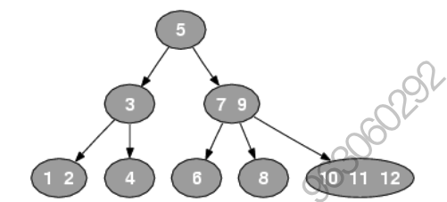

根据上面的定义

* 2-节点有:

​	[5] ,[3] ,[4] ,[6] ,[8]

​	其中[4] ,[6] ,[8]中每个节点都指向两个空的子节点

* 3-节点有:

​	[1,2] ,[7,9]

​	其中[1,2]会指向3个空的子节点

* 4-节点有:

​	[10,11,12]

​	它会指向4个空的子节点


234树同一节点不同元素内部其实是有指针的，但是这个指针没有严格规定谁指向谁。

2-3-4树的查询操作像普通的二叉搜索树一样，非常简单，但由于其结点元素数不确定，在一些编程语 言中实现起来并不方便，实现一般使用它的等同-->红黑树


### 234树与二叉树的等价关系


### 将234树转二叉树

根据上面的等价关系可知

1. 如果234树是2节点，则转二叉树时，无需转换

   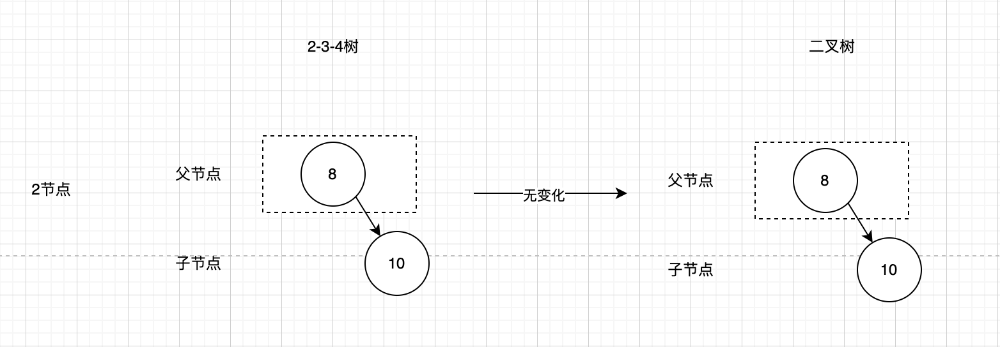

2. 如果234树是3节点，则转二叉树时，有两种转换方案

   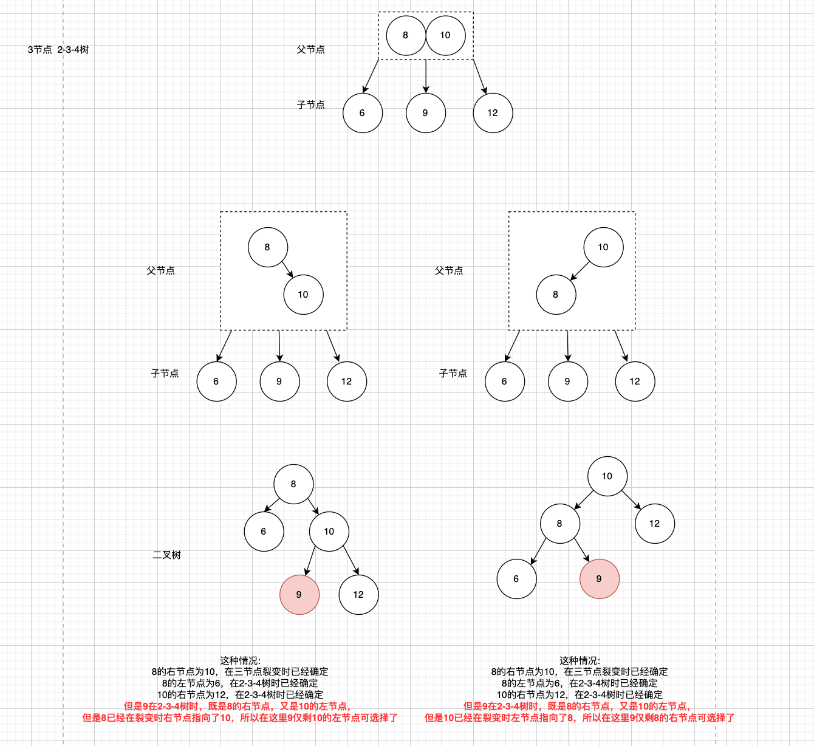

   方案1:

   ```text
   8的右节点为10，在三节点裂变时已经确定
   8的左节点为6，在2-3-4树时已经确定
   10的右节点为12，在2-3-4树时已经确定
   但是9在2-3-4树时，既是8的右节点，又是10的左节点，
   但是8已经在裂变时右节点指向了10，所以在这里9仅剩10的左节点可选择了
   ```

   方案2:

   ```text
   这种情况:
   8的右节点为10，在三节点裂变时已经确定
   8的左节点为6，在2-3-4树时已经确定
   10的右节点为12，在2-3-4树时已经确定
   但是9在2-3-4树时，既是8的右节点，又是10的左节点，
   但是10已经在裂变时左节点指向了8，所以在这里9仅剩8的右节点可选择了
   ```

   

3. 如果234树是4节点，则转二叉树时，有一种转换方案

   

   转换方案:

   ```text
   8的右节点为10，左节点为6，在四节点节点裂变时已经确定
   6的左节点为5，在2-3-4树时已经确定
   10的右节点为12，在2-3-4树时已经确定
   但是7在2-3-4树时，既是6的右节点，又是8的左节点，
   但是8已经在裂变时左节点指向了6，所以在这里7仅剩6的右节点可选择了
   9在2-3-4树时，既是8的右节点，又是10的左节点，
   但是8已经在裂变时右节点指向了10，所以在这里9仅剩10的左节点可选择了
   ```

   

### 234树与红黑树的等价关系

2节点黑色

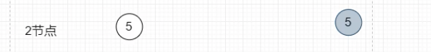

3节点上黑下红


4节点中间黑两边红


红黑树新增，一定是红色新增进来


红黑树转2-3-4树，就是红色上去找黑色即可


2-3-4树

一个2节点，必须要有两个子节点

一个3节点，必须要有三个子节点

一个4节点，必须要有四个子节点


## 红黑树

### 概念

红黑树来源于234树，红黑树的本质就是234树，234树与红黑树是一对多的关系。

红黑树是一种节点带有颜色属性的平衡二叉树，但他在平衡二叉树之外，还有以下5大性质

* 节点是红色或黑色

* 根是黑色

  *因为234树只有2节点，3节点，4节点，其对应红黑树的关系肯定是上黑下红，根结点在最上，所以肯定是黑色*

* 所有叶子节点都是黑色(叶子肯定是NIL节点(也就是空节点)，这类节点不可以忽视，否则代码会看不懂)

  *叶子结点肯定是NIL节点，NIL节点肯定是黑色*

* 每个红色节点必须有两个黑色的子节点。(从每个叶子到根的所有路径上不能有两个连续的红色节点)

  ```text
上面已经说过，红黑树和234树等价，则一个节点下面的子树即是红黑树，也是234树
  假设，取红节点下面的子树，我们先把这个子树等价的看成234树
如果这个子树对应的234树是:
  2节点: 2节点转红黑树肯定是黑色
3节点: 3节点转红黑树不管是左倾还是右倾上面的节点肯定是黑色
  4节点: 4节点转红黑树上面的节点肯定是黑色
所以，红节点下面的234树不管是哪种类型，变成红黑树后，肯定上面是黑节点，也就是说红节点下面的肯定是黑节点
  ```

* 从任一 节点到其每个叶子的所有简单路径都包含相同数目的黑色节点(黑色平衡)。

  ```text
  由于红黑树和234树等价，由于234树具有相同的深度，而在234树的节点中，节点转红黑树，肯定有且仅有一个黑色结点，则从234树的特点可以看出，每条路径的黑色节点个数都为234树的深度+1，所以不管怎么转红黑树，每条路径的黑色节点都是234树的深度+1,则黑色平衡成立
  ```


根据上面的概念我们还可以推导出

所有234树转红黑树时，如果有右子节点，红黑树的右子节点肯定是红色


红黑树的左右子树在最极端的情况下，高度相差1/2

比如左边全部是黑节点

右边每个黑节点间隔一个红节点


一棵红黑树，倒数第一层，倒数第二层可能出现没有左节点或者右节点

但是其他层，由于红黑平衡的关系，是一定会有左节点和右节点的

如果其他层出现没有左节点或者右节点，则代表当前红黑树不是一个平衡的红黑树


### 为什么会有红黑树

因为AVL树的插入和删除都要经过非常多的旋转，而红黑树旋转次数则相对较少。

Java8中HashMap的实现因为用红黑树代替链表(链表长度大于8时)，性能有所提升


### 红黑树的操作

**变色**: 节点的颜色由黑变红或者由红变黑

**左旋**: 与平衡二叉树的旋转一致，要旋转的节点以右子节点作为支点向左旋转，左旋时冲突的左孩变右孩

**右旋**: 与平衡二叉树的旋转一致，要旋转的节点以左子节点作为支点向右旋转，右旋时冲突的右孩变左孩


#### 左旋

##### 思路

红黑树的节点由于有parent指针，则可以不使用创建新node，移动支点 值的方式，这里可以使用改变指针的方式。

步骤:


1. 确定支点r

   ```java
   r = p.right
   ```

2. 确定p的右节点

   ```java
   p.right = r.left
   r.left.parent = p
   ```

3. 确定r的父节点

   ```java
   r.parent = p.parent
   r.parent.left或者r.parent.right = r
   ```

4. 确定r的左节点

   ```java
   r.left = p
   p.parent = r
   ```


##### 代码

###### Java

```java
        /**
         * 左旋
         */
        public void leftRotate(RBNode p) {
            if (p != null) {
                //1. 确定p.right为支点r
                RBNode r = p.right;

                //2. 处理p的右指针(冲突的左孩变友右孩)
                p.right = r.left;
                if (r.left != null) {
                    r.left.parent = p;
                }
                //3. 处理r的父节点
                r.parent = p.parent;
                if (p.parent == null) {
                    root = r;
                } else if (p.parent.left == p) {
                    p.parent.left = r;
                } else {
                    p.parent.right = r;
                }
                //4. 处理r的左指针
                r.left = p;
                p.parent = r;
            }
        }
```

###### Python

```python
```

#### 右旋
##### 思路

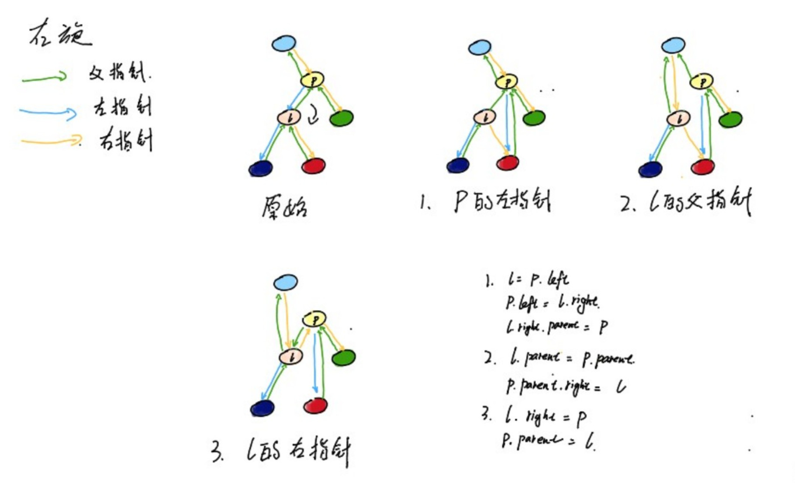

1. 确定支点l

   ```java
   l = p.left		
   ```

   

2. 确定p的左节点

   ```java
   p.left = l.right
   l.right.parent = p
   ```

   

3. 确定l的父节点

   ```java
   l.parent = p.parent
   p.parent.right或p.parent.left = l
   ```

   

4. 确定l的右节点

   ```java
   l.right = p
   p.parent = l
   ```

   

##### 代码

###### Java

```java
        /**
         * 右旋
         */
        public void rightRotate(RBNode p) {
            if (p != null) {
                //1. 确定p.left为支点l
                RBNode l = p.left;
                //2. 处理p的左节点
                p.left = l.right;
                if (l.right != null) {
                    l.right.parent = p;
                }
                //3. 处理l的父节点
                l.parent = p.parent;
                if (p.parent == null) {
                    root = l;
                } else if (p.parent.left == p) {
                    p.parent.left = l;
                } else {
                    p.parent.right = l;
                }
                //4.处理l的右节点
                l.right = p;
                p.parent = l;
            }
        }
    }
```


###### Python

```python
```


#### 二叉树的插入

##### 思路

和 二叉排序树插入思路其实是一样的

通过递归的方式，如果当前节点没有左节点，则直接加到左节点，否则左节点递归加入

插入后再循环进行红黑树平衡调整

##### 代码
###### Java
```java
        /**
         * 新增节点
         *
         * @param key
         * @param value
         */
        public void put(K key, V value) {
            RBNode t = this.root;

            if (key == null) {
                throw new NullPointerException("Empty key");
            }
            if (value == null) {
                value = value == null ? (V) key : value;
            }
            /**
             * 判断是否加入的是根节点
             */
            if (t == null) {
                this.root = new RBNode(key, value, null);
                return;
            }
            /**
             * 判断加入的节点的位置
             * 如果有一个已知节点key相同，则替换value
             */
            RBNode parent;
            int cpr;
            do {
                parent = t;
                cpr = key.compareTo((K) t.key);
                if (cpr < 0) {
                    t = t.left;
                } else if (cpr > 0) {
                    t = t.right;
                } else {
                    //存在key
                    t.setValue(value);
                    return;
                }
            } while (t != null);
            RBNode<K, V> e = new RBNode<>(key, value, parent);
            if (cpr < 0) {
                parent.left = e;
            } else {
                parent.right = e;
            }
            fixAfterPut(e);
        }
```

###### Python
```python

```


#### 插入后调整节点

##### 思路

```text
红黑树规则
1. 红黑树插入时，如果节点还没有插入到树中，一定是红色的。
2. 红黑树插入时，如果父节点是黑色，则不需要调整，直接插入，也就是说父节点是红色，一定要调整
   因为新加入的节点一定是红色节点，而红黑树同一路线不能出现两个连续红色节点，则父节点是红色一定要调整
3. 红黑树插入时变色，一定是参考234树与红黑树等价关系变色
```


红黑树的来源是根据 2-3-4 树，其中 2-3-4 树的节点可分为 2 节点、3 节点和 4 节点。因此，红黑树的父节点可以等价于 2 节点、3 节点和 4 节点，其中2节点加入新节点后转红黑树是没有爷爷节点的，3节点和4节点加入新节点转红黑树是有爷爷节点的。

当**父节点是 2 节点**时，此时没有爷爷节点，父节点等价于一个节点的平衡的红黑树。根据 2-3-4 树与红黑树的关系，父节点只能有一种情况，加入子节点后有两种情况：

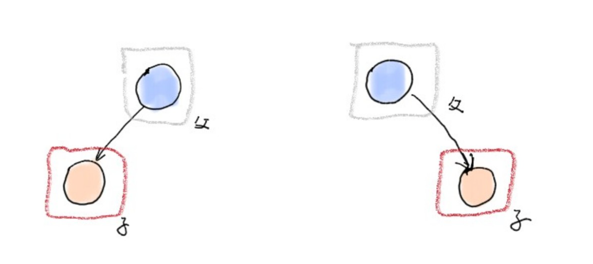

这两种情况属于无爷爷的情况，按照红黑树规则无需调整，所以数据插入后，无需考虑这两种情况

下面我们开始讨论有爷爷节点的情况。

先讨论父节点是爷爷的左节点情况，然后再讨论父节点是爷爷右节点的情况。


**父节点是爷爷左节点:**

当**父节点是 3 节点**时，父节点等价于平衡的两个节点的红黑树。根据 2-3-4 树与红黑树的关系，在父节点是爷爷左节点时，父节点(2节点)可分为一种情况，插入情况分两种：


  这种情况按照红黑树规则：

* 情况 a：需要进行爷爷节点的右旋操作，然后按照等价关系变色，将父节点变为黑色，兄弟节点变为红色。

  ​				也可以先变色，父节点变为黑色，爷爷节点变色红色，再右旋。

* 情况 b：需要先对父节点进行左旋操作，并将原父节点变为子节点。然后按照情况 a 的操作，进行爷爷节点的右旋操作，最后按照等价关系变色，将父节点变为黑色，兄弟节点变为红色。

当**父节点是 4 节点**时，父节点等价于平衡的三个节点的红黑树。根据 2-3-4 树与红黑树的关系，在父节点是爷爷的左节点时，父节点(3节点)可分为一种情况，插入情况分两种：


这种情况，按照红黑树规则

* 情况c:不管上面哪种添加方式，都是父节点叔叔节点变黑，爷爷节点变红


**父节点是爷爷右节点:**

当**父节点是 3 节点**时，父节点等价于平衡的两个节点的红黑树。根据 2-3-4 树与红黑树的关系，在父节点是爷爷右节点时，父节点(2节点)可分为一种情况，插入情况分两种：

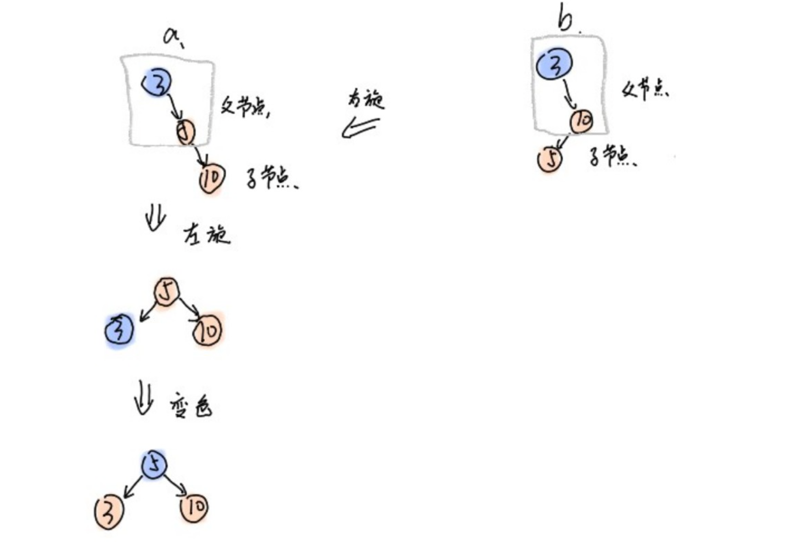

- 情况 a：需要进行爷爷节点的左旋操作，然后按照等价关系变色，将父节点变为黑色，兄弟节点变为红色。
- 情况 b：需要先对父节点进行右旋操作，并将原父节点变为子节点。然后按照情况 a 的操作，进行爷爷节点的左旋操作，最后按照等价关系变色，将父节点变为黑色，兄弟节点变为红色。

当**父节点是 4 节点**时，父节点等价于平衡的三个节点的红黑树。根据 2-3-4 树与红黑树的关系，在父节点是爷爷的左节点时，父节点(3节点)可分为一种情况，插入情况分两种：

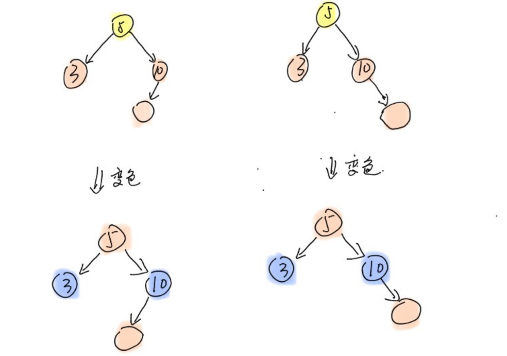


这种情况，按照红黑树规则

* 情况c:不管情况上面哪种添加方式，都是父节点变黑，爷爷节点变红


**循环调整条件**

由于父节点是2节点属于没有爷爷的节点，不需要调整

所以插入节点的父节点值可能是3节点和4节点。

如果插入节点的父节点是3节点，插入后会变成4节点，4节点等价的红黑树顶点一定是黑色，所以这个顶点肯定不会和顶点的父亲节点冲突，则不需要循环调整


如果插入节点的父节点是4节点，插入后会裂变，裂变的红黑树顶点一定是红色，但是我们无法保证这个顶点的父节点是否是红色，所以这种情况要循环调整


**根节点是黑色**

由于循环调整时，会把顶点设置为红色，如果顶点是根节点，按照红黑树性质，根节点要变成黑色。


##### 代码

###### 代码思路

  - 当没有爷爷节点时，不需要调整。

  - 当父节点是红节点时，需要按照红黑树规则调整二叉树，要调整的有三节点和四节点共a,b,c三种情况。

  - 父节点是红节点时有下面两种情况：
    - 父节点是爷爷的左节点 
      - 叔叔(爷爷的右节点)是红色(4节点)
        
         按照四节点插入规则变色
         
         再将爷爷节点设置为要调整的节点进行循环操作(4节点插入时要循环)
         
         ```java
         x.parent.color = BLACK;
         x.parent.parent.color = RED;
         x.parent.parent.right.color = BLACK;
         x = x.parent.parent
         ```
         
      - 叔叔是黑色或者空(3节点)
        
         * 如果插入的是父亲的右节点，则当前节点换成父亲，当前节点左旋
         
           ```text
           x = x.parent
           leftRotate(x)
           ```
         
         根据红黑树规则变色，爷爷节点右旋
         
         ```text
         x.color = RED;
         x.parent.color = BLACK;
         x.parent.parent.color = RED;
         rightRotate(x.parent.parent);
         ```
      
    - 父节点是爷爷的右节点
    
    - - 叔叔(爷爷的左节点)是红色(4节点)
    
        按照四节点插入规则变色
    
        再将爷爷节点设置为要调整的节点进行循环操作(4节点插入时要循环)
      
        ```java
        x.parent.color = BLACK;
        x.parent.parent.color = RED;
        x.parent.parent.left.color = BLACK;
        x = x.parent.parent
        ```
      
      - 叔叔是黑色或者空(3节点)
      
        * 如果插入的是父亲的左节点，则当前节点换成父亲，当前节点左旋
      
          ```text
          x = x.parent
          rightRotate(x)
          ```
      
        根据红黑树规则变色，爷爷节点左旋
      
        ```text
        x.color = RED;
        x.parent.color = BLACK;
        x.parent.parent.color = RED;
        leftRotate(x.parent.parent);
        ```
    


###### Java

```java
        /**
         * 按照红黑树规则调整
         * 包括旋转和变色
         *
         * @param x 要调整的节点
         */
        private void fixAfterPut(RBNode<K, V> x) {
            x.color = RED;
            /**
             * 当前节点为空，当前节点是根节点，当前节点的父节点为黑色时不需要调整
             */
            while (x != null && x != root && parentOf(x).color == RED) {
                /**
                 * 当前节点是红色,爷爷节点肯定存在
                 */
                if (parentOf(x) == leftOf(parentOf(parentOf(x)))) {
                    //当前父亲是左节点
                    RBNode y = rightOf(parentOf(parentOf(x)));//叔叔节点
                    if (colorOf(y) == RED) {
                        //4节点
                        setColor(parentOf(x), BLACK);
                        setColor(y, BLACK);
                        setColor(parentOf(parentOf(x)), RED);
                        //爷爷是红的,爷爷的爸爸也可能是红的，则要向上递归操作
                        x = parentOf(parentOf(x));
                    } else {
                        //3结点
                        if (parentOf(x).right == x) {
                            x = parentOf(x);
                            leftRotate(x);
                        }
                        setColor(parentOf(x), BLACK);
                        setColor(parentOf(parentOf(x)), RED);
                        rightRotate(parentOf(parentOf(x)));
                    }
                } else {
                    //当前父亲是右节点
                    RBNode y = leftOf(parentOf(parentOf(x)));//叔叔节点
                    if (colorOf(y) == RED) {
                        //4节点
                        setColor(parentOf(x), BLACK);
                        setColor(y, BLACK);
                        setColor(parentOf(parentOf(x)), RED);
                        //爷爷是红的,爷爷的爸爸也可能是红的，则要向上递归操作
                        x = parentOf(parentOf(x));
                    } else {
                        //3结点
                        if (parentOf(x).left == x) {
                            x = parentOf(x);
                            rightRotate(x);
                        }

                        setColor(parentOf(x), BLACK);
                        setColor(parentOf(parentOf(x)), RED);
                        leftRotate(parentOf(parentOf(x)));
                    }
                }
            }
            /**
             * 到这里就到根节点了，根节点一定是黑的
             */
            this.root.color = BLACK;
        }
```


###### Python

```python
```


##### 总结

插入时，如果父节点是红色，就去看叔叔节点是不是红色。

叔叔节点是红色，则直接父节点叔叔节点变黑，爷爷节点变红，再以爷爷节点为插入节点循环往上调整

叔叔节点是黑色或者Null，则要旋转变色再旋转

根节点一定要设置成黑色


#### 查找前驱节点和后继节点

##### 思路

方法和二叉排序树章节的查找并删除二叉树右子树的最小节点一样，但是这里并不是去左子树或右子树中找，而是直接找一个节点的中序前驱节点，一个节点的中序后继节点

这里只是查找，并不涉及删除，找到之后直接返回即可


右子树的最小节点，要么是当前节点的右节点，要么是右子树最左边的节点

* 查找前驱节点

  如果这个节点有左子树

  ​	如果左子树有右子节点，则循环的找到最右边的节点，这个节点就是前驱节点

  ​	如果左子树没有右子节点，当前节点就是前驱节点

  如果这个节点没有左子树

  ​	在当前节点的直系祖先节点中，找到离自己最近且其右子节点是当前节点的祖先节点的祖先节点，这个祖先节点就是当前节点的前驱节点。

  

* 查找后继节点

  如果这个节点有右子树

  ​	如果右子树有左子节点，则循环的找到最左边的节点，这个节点就是后继节点

  ​	如果右子树没有左子节点，则当前节点就是前驱节点

  如果这个节点没有右子树

  ​	在当前节点的直系祖先节点中，找到离自己最近且其左子结点是当前节点的祖先节点的组件节点，这个祖先节点就是当前节点的后继节点

  

##### 代码

###### Java

```java
        /**
         * 获取当前节点的前驱节点
         *
         * @return
         */
        private RBNode<K, V> predecessor(RBNode<K, V> node) {
            if (node == null) {
                return null;
            }
            if (node.left != null) {
                RBNode<K, V> childrenNode = node.left;
                while (childrenNode.right != null) {
                    childrenNode = childrenNode.right;
                }
                return childrenNode;
            } else {
                /**
                 * 	在当前节点的直系祖先节点中，找到离自
                 * 	己最近且其右子节点是当前节点的祖先节点的祖先节点，这个祖先节点就是当前节点的前驱节点。
                 */
                RBNode<K, V> parentNode = node.parent;
                RBNode<K, V> currentNode = node;
                while (parentNode != null && parentNode.left == currentNode) {
                    currentNode = parentNode;
                    parentNode = currentNode.parent;
                }
                return parentNode;
            }
        }

        /**
         * 获取当前节点的后继节点
         *
         * @return
         */
        private RBNode<K, V> successor(RBNode<K, V> node) {
            if (node == null) {
                return null;
            }
            if (node.right != null) {
                RBNode<K, V> currentNode = node.right;
                while (currentNode.left != null) {
                    currentNode = currentNode.left;
                }
                return currentNode;
            } else {
                RBNode<K, V> parentNode = node.parent;
                RBNode<K, V> currentNode = node;
                while (parentNode != null && parentNode.right == currentNode) {
                    currentNode = parentNode;
                    parentNode = currentNode.parent;
                }
                return parentNode;
            }

        }
```


###### Python

```python
```


##### 总结

查找前驱节点，就两种情况，一种是去左子树找比他小的最大值，一种是去直系祖先找比他小的最大值

查找后继节点，也就两种情况，一种是去右子树找比他大的最小值，一种是去直系祖先找比他大的最小值


#### 删除

##### 思路

在红黑树中，删除节点的思路其实和二叉排序树删除节点是一样的

如果被删除的节点有两个子节点，则删除后要用前驱节点或者后继节点代替该节点

如果被删除的节点有一个子节点，那需要把该节点的父节点指向子节点，这样当前节点会被GC回收

如果被删除的节点没有子节点，则直接把父节点对应的指针指向null即可

在这里和普通二叉排序树有点区别的是，如果被删除的节点有两个子节点，那只要将当前节点的内容设置为前驱节点或者后继节点的内容即可，然后再把前驱或后继节点删除，这样做的好处是可以少一些指针处理。


代码思路:

如果被删除的节点有两个子节点，则找到当前节点的后继节点，用当前节点的后继节点内容替代当前节点的内容，不删除当前节点，把当前节点指向后继节点

*(这样做了后，依旧删除当前节点，但是在这种情况下，当前节点其实就是后继节点了)*

*(后继节点只可能是叶子节点或者只有一个子节点的节点)*

如果当前节点是根节点(当前节点的父节点为null)，则直接把当前节点的值设置为null

否则

​	如果当前节点是只有一个子节点的节点，则将当前节点的父节点指向自己仅存的子节点(爷爷直接 指向孙子)

​		如果当前被删节点是黑色节点，则要做红黑树平衡调整

​	如果当前节点是叶子节点(当前节点没有子节点)，则将当前节点的父节点对应指针指向null

​	


##### 代码

###### Java

```java
        /**
         * 从红黑树中删除指定节点
         *
         * @param node
         */
        private void deleteNode(RBNode<K, V> node) {
            if (node.left != null && node.right != null) {
                RBNode<K, V> successor = successor(node);
                node.key = successor.key;
                node.value = successor.value;
                node = successor;
                /**
                 * 如果进入了这个方法，那node一定不可能有两个子节点了
                 */
            }

            RBNode<K, V> replaceNode = node.left != null ? node.left : node.right;
            if (replaceNode != null) {
                /**
                 * 仅有一个子节点的节点
                 * 1. 当前节点有右子节点(右子树)
                 * 2. 当前节点有左子节点(左子节点可能还会有右子树，但是不可能有左子树了)
                 */
                RBNode<K, V> parent = node.parent;
                if (parent.right == node) {
                    //有右子接地那
                    parent.right = replaceNode;
                } else {
                    //有左子节点
                    parent.left = replaceNode;
                }
                replaceNode.parent = parent;

                node.left = node.right = node.parent = null;
                if (node.color == BLACK) {
                    fixAfterDeletion(node);
                }
            } else if (node.parent == null) {
                //根节点
                root = null;
            } else {
                //叶子节点
                if (node.color == BLACK) {
                    fixAfterDeletion(node);
                }
                if (node.parent != null) {
                    //这里还要判断node是否是根节点的原因，是因为上面调整完，当前节点有可能变成根节点
                    //叶子节点
                    if (node == node.parent.left) {
                        node.parent.left = null;
                    } else {
                        node.parent.right = null;
                    }
                    node.parent = null;
                }
            }
        }
```


###### Python

```python
```


#### 删除后调整节点

##### 思路


由删除的逻辑可知删除后，要调整的节点位置一定在红黑树的倒数1、2层，这个位置等价与2-3-4树的叶子节点。

由2-3-4树性质可知，被删的节点可能是2-3-4树中的2节点中的元素，3节点中的元素，4节点中的元素，本文将对这几种节点元素的删除分开讨论。

(注意:当删除2节点时，由于2节点的特性，其删除操作相对于3、4节点更为复杂。因为2节点中只有一个元素，没有兄弟元素可供借位，与3、4节点不同。而且，2节点等价于红黑树中的一个黑色节点，因此，为了保持红黑树的平衡，在删除2节点时需要进行旋转调整。因此，删除2节点是最为复杂的情况。因此，我们在介绍删除操作时，先处理4节点中的元素，然后是3节点，最后是2节点。)

在2-3-4树叶子结点中删除元素:

* 删除4节点中的元素

  **4节点**：有三个元素，中间黑，两边红。

  - 删除两个红色节点：直接删除，无需调整。
  - 删除黑色节点：需要借位，此时自身有两个红色兄弟节点，可以选择其中一个红色兄弟节点（前驱或后继）顶替自身的位置，并将当前节点由红变为黑。

  

* 删除3节点中的元素

  **3节点**：有两个元素，上黑下红。

  - 删除红色节点：不需要调整。

  - 删除黑色节点（由兄弟替代）：需要调整，此时自身有一个红色兄弟节点，兄弟节点将占据自身位置并变成黑色。

    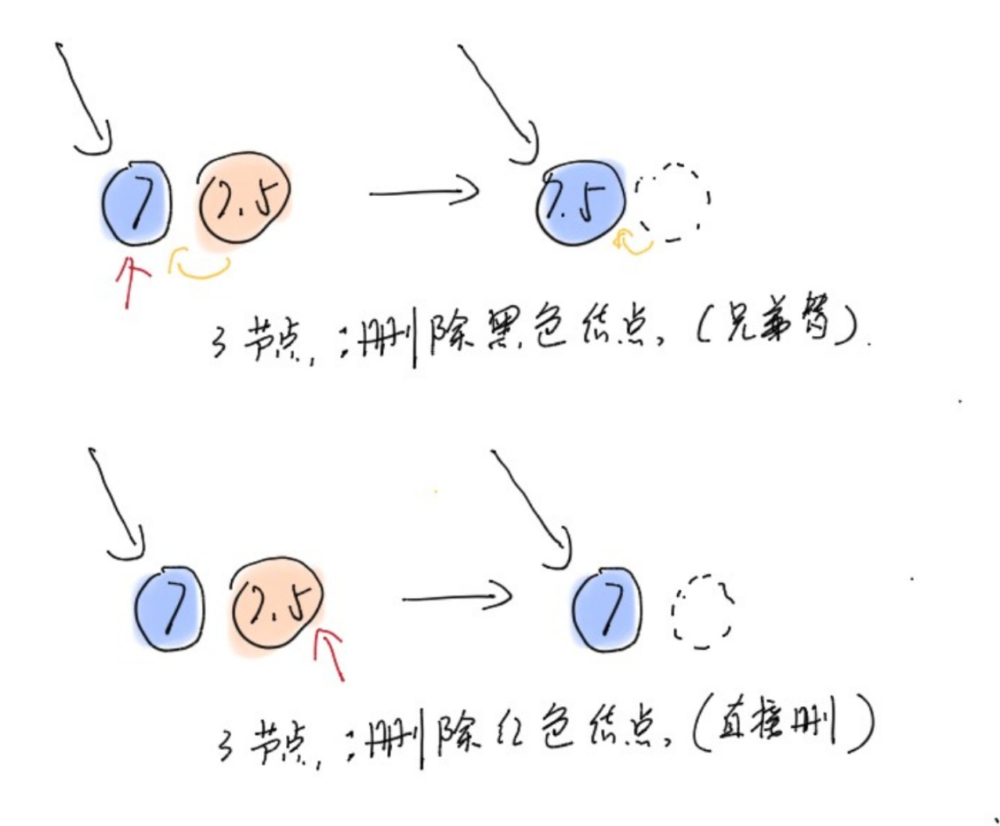

* 删除2节点中的元素

  **2节点**：只有一个元素，为黑色。

  - 删除黑色节点：

    **兄弟可借**:由于自身只有一个黑色元素，无法自行调整，需要父节点下来，兄弟节点上去顶替父节点的位置。

  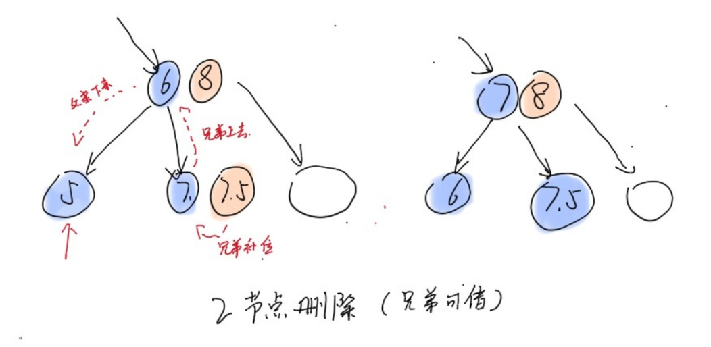

    **兄弟不可借**: 这种情况相当于所有不可借的节点都上去找父亲

  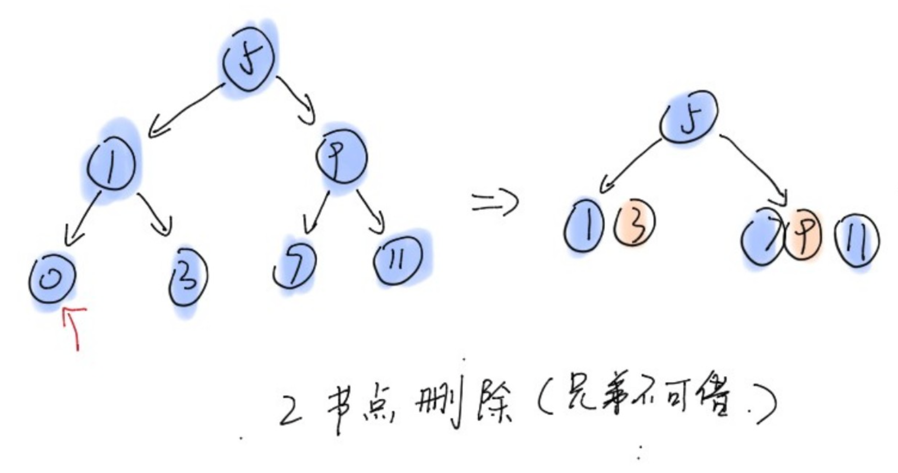


等价的在红黑树倒数1、2层中删除节点:

* 删除4节点中的元素

  4节点，上面黑两边红:

  删除红色节点：直接删除即可平衡

  删除黑色节点:  删除时会用红色叶子右节点(后继节点)的内容代替当前节点的内容，实际删除的是红色叶子右节点(后继节点)，所以只要直接删除红色叶子节点即可平衡

  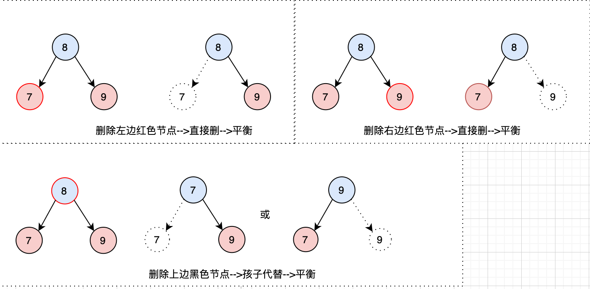

* 删除3节点中的元素

  - 删除红色节点：不需要调整。
  - 删除黑色节点（由兄弟替代）：需要调整，此时自身有一个红色兄弟节点，兄弟节点将占据自身位置并变成黑色。

  

  

* 删除2节点中的元素

  如果2节点是左节点，则按照下面的逻辑处理，如果2节点是右节点，则按照下面的逻辑反之

  * 兄弟可借的情况:

    有两种情况:

    1. 兄弟为红色

       如果兄弟为红色，则要进行调整，调整后兄弟就为黑色，然后按照 下一步兄弟为黑色进行处理

       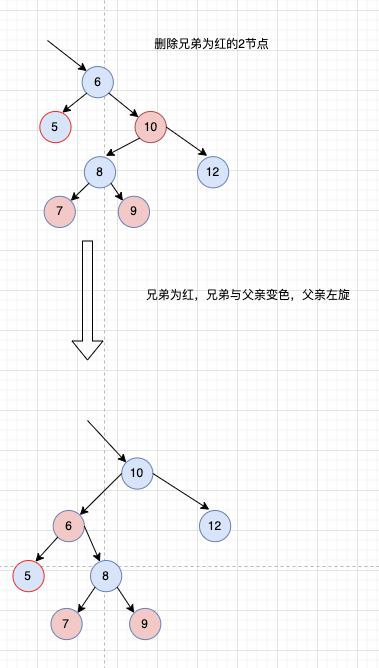

       

    2. 兄弟为黑色

       可分为兄弟有两个孩子，兄弟有左孩子，兄弟有右孩子

       * 有两个孩子

       

       

       * 有右孩子

         

         

       

       * 有左孩子

         
  
         

  * 兄弟不可借的情况:
  
    兄弟节点修改为红色(兄弟自损)
  
    将调整的节点设置为父亲节点，继续循环当前调整方法
  
    当前循环有两种可能:
  
    1. 当前调整节点为红色或者根节点
  
       设置调整节点为黑色即可平衡
  
       
  
       
  
    2. 当前调整节点为黑色
  
       则要向上循环的去调整，可能是当前调整节点兄弟自损，也可能是当前调整节点兄弟有替补孩子作为替补
  
       
  
       


红黑树删除时做调整的目的是希望删除后，红黑树经过调整后也能平衡。


问题:

删除有两个子节点的红色节点，要怎么操作

因为有两个子节点的节点肯定不是2-3-4树的叶子节点，也就不是红黑树的叶子节点和叶子节点上一层，而红黑树删除针对的是叶子节点和叶子节点上一层，所以删除其他层的红色节点，只需要在叶子节点和叶子节点上一层找到后继节点即可，找到后，用后继节点的值代替当前要删除的节点，然后处理后继节点被删的问题，后继节点被删，则要看后继节点是2节点，3节点，还是4节点，根据这几种节点的情况分别处理。


总结:

删除的节点一定在红黑树的最后两层

删除的是红色节点，不需要做任何平衡调整

删除的是黑色节点，才需要做平衡调整，调整的节点有两种:

1. 调整的是替代的红色节点颜色
2. 调整的是以被删除的黑色节点的父节点为根节点的红黑树。


##### 代码思路

* 调整的节点不是根节点且是黑色

  当前黑色节点有两种情况

  * 当前节点是父节点的左节点

    获取右兄弟节点sib

    * 如果当前节点的兄弟节点(父节点的右节点)是红色需要先做以下调整

      ```java
      x.parent.right.color = BLACK //兄弟节点的颜色变黑
      x.parent.color = RED //父节点变红
      leftRotate(x.parent) //父节点左旋
      sib = x.parent.right //兄弟节点变为旋转后的新兄弟
      ```

      调整完上面的还要进行以下面调整
      
      * 如果当前兄弟没有红色替补孩子
      
        ```java
        sib.color = RED //兄弟自损
        x = x.parent //向上循环
        ```
      
      * 当前兄弟有红孩子
      
        * 当前兄弟右孩子是空或者黑(代表左孩子是红)
      
          ```java
          sib.left.color = BLACK //兄弟左孩子变黑
          sib.color = RED //兄弟队变红
          rightRotate(sib) //兄弟右旋
          sib = x.parent.right //兄弟节点变为旋转后的新兄弟
          ```
      
        ```java
        sib.color = x.parent.color//兄弟的颜色变成父节点颜色
        x.parent.color = BLACK //父节点变黑
        sib.right.color = BLACK //兄弟节点的右孩子变黑，为了补充黑平衡
        leftRotate(x.parent) //父节点左旋
        x = root //将调整节点设置为根节点，相当于停止调整  
        ```
  
  * 当前节点是父节点的右节点
  
    * 获取左兄弟节点sib
  
      * 如果当前节点的兄弟节点(父节点的左节点)是红色需要先做以下调整
    
        ```java
        x.parent.left.color = BLACK //兄弟节点的颜色变黑
        x.parent.color = RED //父节点变红
        rightRotate(x.parent) //父节点右旋
        sib = x.parent.left //兄弟节点变为旋转后的新兄弟
        ```
    
        调整完上面的还要进行以下面调整
    
        * 如果当前兄弟没有替补红孩子
    
          ```java
          sib.color = RED //兄弟自损
          x = x.parent //向上循环
          ```
        
        * 当前兄弟有孩子
        
          * 当前兄弟左孩子是空的或者黑的(右孩子是红的)
        
            ```java
            sib.right.color = BLACK //兄弟左孩子变黑
            sib.color = RED //兄弟队变红
            leftRotate(sib) //兄弟右旋
            sib = x.parent.left //兄弟节点变为旋转后的新兄弟
            ```
        
          ```java
          sib.color = x.parent.color//兄弟的颜色变成父节点颜色
          x.parent.color = BLACK //父节点变黑
          sib.left.color = BLACK //兄弟节点的左孩子变黑，为了补充黑平衡
          rightRotate(x.parent) //父节点左旋
          x = root //将调整节点设置为根节点，相当于停止调整  
          ```
  
  现在调整的节点是根节点**或**是红色节点
  
  ```java
  x.color = BLACK
  ```


###### Java

```java
        /**
         * 删除时调整红黑平衡
         *
         * @param x
         */
        private void fixAfterDeletion(RBNode<K, V> x) {
            while (x != root && colorOf(x) == BLACK) {
                if (x == leftOf(parentOf(x))) {
                    //删除的是父节点的左节点
                    RBNode sib = rightOf(parentOf(x));
                    //查看兄弟节点是否为红色
                    if (colorOf(sib) == RED) {
                        setColor(sib, BLACK);
                        //变色旋转，获取真正的兄弟节点
                        setColor(parentOf(x), RED);
                        leftRotate(parentOf(x));
                        sib = rightOf(parentOf(x));
                    }
                    //此时兄弟节点为黑色

                    if (colorOf(leftOf(sib)) == BLACK && colorOf(rightOf(sib)) == BLACK) {
                        //兄弟没有红孩子作为替补
                        //TODO
                        setColor(sib, RED);
                        x = parentOf(x);
                    } else {
                        //兄弟节点有红孩子作为替补
                        if (colorOf(rightOf(sib)) == BLACK) {
                            //兄弟有左红孩子，则旋转为右孩子作为真正的替补兄弟
                            setColor(leftOf(sib), BLACK);
                            setColor(sib, RED);
                            rightOf(sib);
                            sib = rightOf(parentOf(x));
                        }
                        //当前兄弟有右红孩子作为替补
                        setColor(sib, colorOf(parentOf(x)));
                        setColor(parentOf(x), BLACK);
                        setColor(rightOf(sib), BLACK);
                        leftRotate(parentOf(x));
                        x = root;
                    }
                } else {
                    //删除的是父节点的右节点
                    RBNode sib = leftOf(parentOf(x));//兄弟节点
                    if (colorOf(sib) == RED) {
                        setColor(sib, BLACK);
                        setColor(parentOf(x), RED);
                        rightRotate(parentOf(x));
                        sib = leftOf(parentOf(x));
                    }
                    //判断兄弟是否有孩子可借
                    if (colorOf(leftOf(sib)) == BLACK && colorOf(rightOf(sib)) == BLACK) {
                        // TODO 无孩子可借
                        setColor(sib, RED);
                        x = parentOf(x);
                    } else {
                        //判断是否有左孩子
                        if (colorOf(leftOf(sib)) == BLACK) {
                            //左孩子为空，右孩子旋转
                            setColor(rightOf(sib), BLACK);
                            setColor(sib, RED);
                            leftRotate(sib);
                            sib = leftOf(parentOf(x));
                        }
                        setColor(sib, colorOf(parentOf(x)));
                        setColor(parentOf(x), BLACK);
                        setColor(leftOf(sib), BLACK);
                        rightRotate(parentOf(x));
                        x = root;
                    }
                }
            }
            //根节点或者替补红节点
            setColor(x, BLACK);
        }
```


###### Python

```python
```


注意：

​	传入参数为当前要调整的节点，所谓的调整就是变色或旋转，只有叶子节点和叶子节点上一层的节点才可能要使用这个方法做调整

要调用这个方法也就(叶子结点和叶子结点上一层)两个地方:

1. 红黑树最后两层上红下黑(3节点)删除上面的黑色节点，替代的节点红色需要调整颜色
2. 红黑树叶子节点(2节点)删除--->删除的是黑色

​	如果传入的参数是null，则使用调整方法后，会将根节点设置为黑色


